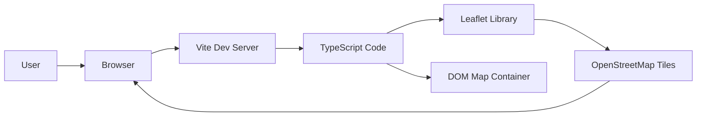
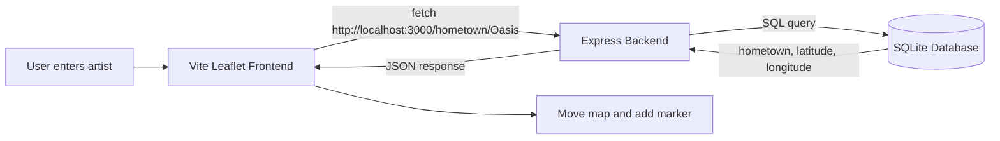

# QHO540 Web Application Development  
## Week 4 Seminar: Web Mapping from Scratch with Vite, TypeScript, Leaflet and OpenStreetMap

> **Teaching focus:** This README is designed for a seminar session. Start with the concepts first, then build the project step by step with students.  
> **Student level:** Beginner-friendly. Students have already seen backend REST APIs and AJAX.  
> **Recommended approach:** Build the web mapping part from scratch first, then connect the idea back to HitTastic/backend later.

---

## 0. What students should understand by the end

By the end of this seminar, students should be able to explain and build a simple web mapping application using:

- **Vite** as a development server and bundler
- **TypeScript** for safer frontend code
- **Leaflet** as a JavaScript mapping library
- **OpenStreetMap** as the map tile provider
- **Latitude and longitude** to represent real-world locations
- **Markers and popups** to display points on the map
- **Map click events** to make the map interactive

They should also understand how this mapping idea can later connect to the **HitTastic backend** using AJAX.

---

# Part 1: Quick Concept Recap

## 1.1 Where this week fits in

Before starting the coding, explain how Week 4 connects to the previous weeks.

```text
Week 2: Backend REST API
        ↓
Week 3: Frontend AJAX + DOM
        ↓
Week 4: Modules + Bundlers + Leaflet Web Mapping
```

### Teaching line

> Last week, we used AJAX to connect the frontend to our backend API. This week, we move into modern frontend project structure using modules and Vite, and then use an external library called Leaflet to build a real interactive map.

---

## 1.2 What is a module?

A **module** is a reusable file that can export code for other files to use.

A module can contain:

```text
functions
classes
interfaces
types
constants
objects
```

### Simple explanation

> A module is like a toolbox. Instead of putting every tool in one large file, we organise useful tools into separate files and import them when needed.

Example:

```ts
// mymaths.ts

export function square(n: number): number {
  return n * n;
}

export function cube(n: number): number {
  return n * n * n;
}
```

Using the module:

```ts
// index.ts

import { square, cube } from './mymaths';

console.log(square(3));
console.log(cube(2));
```

### Key terms

```text
export = make something available to another file
import = use something from another file
```

---

## 1.3 Why modules are important

Without modules:

```text
One huge file
Hard to read
Hard to debug
Hard to reuse
Difficult for teamwork
```

With modules:

```text
Smaller files
Cleaner code
Reusable functions
Easier teamwork
Better structure
```

### Analogy

> Imagine a kitchen. You do not keep spoons, knives, plates, spices and cleaning products in one big box. You organise them separately. Modules do the same thing for code.

---

## 1.4 What is a third-party library?

A third-party library is code written by other developers that we can use in our project.

Examples:

| Library | Purpose |
|---|---|
| Leaflet | Maps |
| React | User interfaces |
| Express | Backend APIs |
| Chart.js | Charts |
| Axios | HTTP requests |

### Teaching line

> Developers do not build everything from scratch. We use reliable libraries to save time and build better applications faster.

This week’s library is:

```text
Leaflet
```

Purpose:

```text
To create interactive web maps
```

---

## 1.5 What is npm?

npm is the package manager for JavaScript.

It helps us install libraries.

Example:

```bash
npm install leaflet
```

For TypeScript, we also install type definitions:

```bash
npm install -D @types/leaflet
```

### Teaching point

> TypeScript needs type definitions so it can understand the library and give us autocomplete and error checking.

---

## 1.6 The problem: browsers cannot directly understand npm imports

In modern TypeScript, we may write:

```ts
import * as L from 'leaflet';
```

But the browser does not naturally know where `leaflet` is.

The browser understands relative paths like:

```ts
import { square } from './mymaths';
```

But it does not directly understand npm package names like:

```ts
import * as L from 'leaflet';
```

This type of import is called a **bare module specifier**.

### Browser understands

```text
./mymaths.js
../utils/helper.js
/src/main.js
```

### Browser does not directly understand

```text
leaflet
react
express
```

That is why we need a build tool.

---

## 1.7 What is a bundler?

A bundler takes your code and your dependencies and prepares them for the browser.

```text
Your TypeScript files
        +
npm libraries
        +
CSS imports
        ↓
Bundler
        ↓
Browser-ready app
```

### Teaching line

> A bundler prepares modern JavaScript and TypeScript code so that the browser can run it properly.

Without a bundler:

```text
Browser gets confused by npm imports
```

With a bundler:

```text
Browser receives code in a format it can run
```

---

## 1.8 What is Vite?

Vite is a modern frontend development tool.

It helps with:

```text
running a development server
understanding TypeScript
loading npm packages
hot reloading
bundling for production
```

Vite usually runs on:

```text
http://localhost:5173
```

### Teaching line

> Vite is like a smart development server. It watches our files, processes TypeScript and npm imports, and refreshes the browser automatically when our code changes.

---

## 1.9 What is Hot Module Reloading?

Hot Module Reloading means:

> When you change your code and save the file, the browser updates automatically.

This is useful because students can quickly see changes without manually refreshing the page.

---

# Part 2: Web Mapping from Scratch with Leaflet

## 2.1 What are we building?

In this part, we will build a simple interactive web map.

We will use:

```text
Vite            → development server and bundler
TypeScript      → safer JavaScript
Leaflet         → JavaScript map library
OpenStreetMap   → map tiles/data
```

By the end, the map will:

```text
show a real map
centre on a location
display a marker
show a popup
respond to map clicks
add a marker where the user clicks
ask the user for popup text
```

---

## 2.2 Concept first: What is a web map?

A web map is an interactive map inside a website.

Examples:

```text
Google Maps
Uber live tracking
Deliveroo delivery map
Airbnb location map
university campus map
weather map
travel planner
```

A web map usually needs:

```text
map data
map display library
coordinates
user interactions
```

For our class:

```text
OpenStreetMap gives the map data
Leaflet displays and controls the map
```

---

## 2.3 OpenStreetMap vs Leaflet

| Tool | Purpose |
|---|---|
| OpenStreetMap | Provides map tiles/data |
| Leaflet | Displays and controls the map in the browser |

### Simple explanation

```text
OpenStreetMap = the actual map
Leaflet = the tool that lets us use the map inside our webpage
```

### Analogy

```text
OpenStreetMap = the road map
Leaflet = the map app/viewer
```

---

## 2.4 Why are we using Vite?

Normally, the browser does not understand imports like this directly:

```ts
import * as L from 'leaflet';
```

Because `leaflet` is an npm package.

So we use **Vite**.

Vite helps us:

```text
use npm packages in frontend code
write TypeScript directly
auto-refresh the browser
bundle code for production later
```

### Teaching line

> Vite is the tool that makes modern TypeScript frontend development easier.

---

## 2.5 Architecture diagram



### Explanation

```text
The browser loads the page from Vite.
Vite processes our TypeScript and Leaflet import.
Leaflet creates the map.
OpenStreetMap provides the map tiles.
The map appears inside a div on the page.
```

---

# Part 3: Create a Fresh Vite + Leaflet Project

## 3.1 Create a new folder

```bash
mkdir qho540-week4-leaflet-map
cd qho540-week4-leaflet-map
```

Create a Node project:

```bash
npm init -y
```

Install Vite, TypeScript and Leaflet:

```bash
npm install vite typescript leaflet
npm install -D @types/leaflet
```

Create the project structure:

```bash
mkdir src
```

Create these files:

```text
index.html
src/main.ts
tsconfig.json
```

Your project should look like this:

```text
qho540-week4-leaflet-map/
├── index.html
├── package.json
├── tsconfig.json
└── src/
    └── main.ts
```

---

## 3.2 Add scripts to package.json

Open `package.json`.

Replace the scripts section with:

```json
{
  "scripts": {
    "dev": "vite",
    "check": "tsc",
    "build": "vite build"
  }
}
```

Your full `package.json` may look like this:

```json
{
  "name": "qho540-week4-leaflet-map",
  "version": "1.0.0",
  "scripts": {
    "dev": "vite",
    "check": "tsc",
    "build": "vite build"
  },
  "dependencies": {
    "leaflet": "^1.9.4",
    "typescript": "^5.0.0",
    "vite": "^5.0.0"
  },
  "devDependencies": {
    "@types/leaflet": "^1.9.0"
  }
}
```

Do not worry if the version numbers are different.

---

## 3.3 Add TypeScript config

Open `tsconfig.json` and add:

```json
{
  "compilerOptions": {
    "strict": true,
    "target": "ESNext",
    "module": "ESNext",
    "moduleResolution": "Bundler",
    "esModuleInterop": true,
    "skipLibCheck": true,
    "noEmit": true
  },
  "include": ["src/**/*.ts"]
}
```

### Explain the important parts

| Option | Meaning |
|---|---|
| `strict` | TypeScript checks carefully |
| `target` | Use modern JavaScript |
| `moduleResolution: Bundler` | Works well with Vite |
| `noEmit` | TypeScript checks only; Vite runs/builds the app |

---

## 3.4 Create the HTML page

Open `index.html` and add:

```html
<!DOCTYPE html>
<html>
<head>
  <title>QHO540 Leaflet Map</title>
</head>
<body>
  <h1>QHO540 Leaflet Map</h1>

  <p>
    This page uses Leaflet and OpenStreetMap to display an interactive map.
  </p>

  <div id="map1" style="width: 800px; height: 600px;"></div>

  <script type="module" src="/src/main.ts"></script>
</body>
</html>
```

### Important teaching point

> The map div must have a width and height. If the map div has no height, the map may not appear.

This part is very important:

```html
<div id="map1" style="width: 800px; height: 600px;"></div>
```

Leaflet will place the map inside this div.

---

## 3.5 First TypeScript file

Open `src/main.ts`.

Add a simple test first:

```ts
console.log("Leaflet map project is running");
```

Run the project:

```bash
npm run dev
```

Open the link shown in the terminal, usually:

```text
http://localhost:5173
```

Open browser developer tools and check the console.

You should see:

```text
Leaflet map project is running
```

### Teaching point

> Before adding Leaflet, always confirm that the TypeScript file is connected properly.

---

# Part 4: Build the Leaflet Map Step by Step

## 4.1 Import Leaflet

Now replace `src/main.ts` with:

```ts
import * as L from 'leaflet';
import 'leaflet/dist/leaflet.css';

console.log("Leaflet imported successfully");
```

Explain:

```ts
import * as L from 'leaflet';
```

This imports everything from Leaflet into an object called `L`.

Leaflet commonly uses `L`.

```ts
import 'leaflet/dist/leaflet.css';
```

This imports Leaflet’s CSS.

### Teaching point

> Without Leaflet CSS, the map may display incorrectly.

---

## 4.2 Create the basic map

Update `src/main.ts`:

```ts
import * as L from 'leaflet';
import 'leaflet/dist/leaflet.css';

const map = L.map('map1');

const attribution = 'Map data copyright OpenStreetMap contributors';

L.tileLayer('https://{s}.tile.openstreetmap.org/{z}/{x}/{y}.png', {
  attribution: attribution
}).addTo(map);

const position = L.latLng(50.908, -1.4);

map.setView(position, 14);
```

Save the file.

The browser should update automatically.

Expected result:

```text
A map appears on the page.
```

---

## 4.3 Explain the map code line by line

```ts
const map = L.map('map1');
```

This creates a Leaflet map inside the HTML element with id `map1`.

```ts
const attribution = 'Map data copyright OpenStreetMap contributors';
```

This gives credit to OpenStreetMap.

### Teaching point

> Map data providers must be credited properly.

```ts
L.tileLayer('https://{s}.tile.openstreetmap.org/{z}/{x}/{y}.png', {
  attribution: attribution
}).addTo(map);
```

This adds OpenStreetMap tiles to the map.

```ts
const position = L.latLng(50.908, -1.4);
```

This creates a latitude/longitude position.

```ts
map.setView(position, 14);
```

This centres the map and sets the zoom level.

---

## 4.4 What are latitude and longitude?

Explain before moving further.

```text
Latitude = north/south position
Longitude = east/west position
```

Examples:

```text
Southampton:
Latitude: 50.908
Longitude: -1.4

New York:
Latitude: 40.75
Longitude: -74
```

In Leaflet:

```ts
L.latLng(50.908, -1.4)
```

The order is:

```text
latitude first, longitude second
```

---

## 4.5 What is zoom level?

Zoom controls how close the map is.

```text
Low zoom = world/country level
High zoom = street/building level
```

Try changing:

```ts
map.setView(position, 14);
```

to:

```ts
map.setView(position, 5);
```

Then:

```ts
map.setView(position, 18);
```

Ask students:

```text
What changed?
Which zoom is best for a city?
Which zoom is best for a building/campus?
```

---

## 4.6 Move the map to another location

Ask students to change:

```ts
const position = L.latLng(50.908, -1.4);
```

to:

```ts
const position = L.latLng(40.75, -74);
```

This moves the map to New York.

### Teaching point

> A map location is controlled by latitude, longitude and zoom level.

---

## 4.7 Add a marker

Now update `src/main.ts`:

```ts
import * as L from 'leaflet';
import 'leaflet/dist/leaflet.css';

const map = L.map('map1');

const attribution = 'Map data copyright OpenStreetMap contributors';

L.tileLayer('https://{s}.tile.openstreetmap.org/{z}/{x}/{y}.png', {
  attribution: attribution
}).addTo(map);

const position = L.latLng(50.908, -1.4);

map.setView(position, 14);

L.marker(position).addTo(map);
```

Teaching point:

```ts
L.marker(position).addTo(map);
```

means:

```text
Create a marker at this position and add it to the map.
```

---

## 4.8 Add a popup

Now change the marker code:

```ts
const marker = L.marker(position).addTo(map);

marker.bindPopup("This is my selected location");
```

Full code:

```ts
import * as L from 'leaflet';
import 'leaflet/dist/leaflet.css';

const map = L.map('map1');

const attribution = 'Map data copyright OpenStreetMap contributors';

L.tileLayer('https://{s}.tile.openstreetmap.org/{z}/{x}/{y}.png', {
  attribution: attribution
}).addTo(map);

const position = L.latLng(50.908, -1.4);

map.setView(position, 14);

const marker = L.marker(position).addTo(map);
marker.bindPopup("This is my selected location");
```

### Teaching point

> A popup appears when the user clicks a marker.

---

## 4.9 Add a map click event

Now add this at the bottom:

```ts
map.on('click', (event) => {
  alert(`You clicked at ${event.latlng.lat}, ${event.latlng.lng}`);
});
```

Full bottom section:

```ts
const marker = L.marker(position).addTo(map);
marker.bindPopup("This is my selected location");

map.on('click', (event) => {
  alert(`You clicked at ${event.latlng.lat}, ${event.latlng.lng}`);
});
```

Teaching point:

```text
map.on('click', ...)
```

means:

```text
When the user clicks on the map, run this function.
```

`event.latlng` contains the location clicked.

---

## 4.10 Add marker where the user clicks

Now replace the alert with marker creation:

```ts
map.on('click', (event) => {
  L.marker(event.latlng).addTo(map);
});
```

Now every click creates a marker.

This is a good “wow moment” for students.

### Teaching line

> Now our map is interactive. The user can create markers by clicking.

---

## 4.11 Ask user for popup text

Now improve the click event:

```ts
map.on('click', (event) => {
  const text = prompt('Enter popup text for this marker');

  if (text !== null) {
    const marker = L.marker(event.latlng).addTo(map);
    marker.bindPopup(text);
  }
});
```

Explain:

```text
prompt() asks the user for text
if user clicks Cancel, text is null
if text is not null, create marker and popup
```

---

## 4.12 Final simple mapping code

At this stage, `src/main.ts` should look like this:

```ts
import * as L from 'leaflet';
import 'leaflet/dist/leaflet.css';

const map = L.map('map1');

const attribution = 'Map data copyright OpenStreetMap contributors';

L.tileLayer('https://{s}.tile.openstreetmap.org/{z}/{x}/{y}.png', {
  attribution: attribution
}).addTo(map);

const position = L.latLng(50.908, -1.4);

map.setView(position, 14);

const marker = L.marker(position).addTo(map);
marker.bindPopup("This is my selected location");

map.on('click', (event) => {
  const text = prompt('Enter popup text for this marker');

  if (text !== null) {
    const clickedMarker = L.marker(event.latlng).addTo(map);
    clickedMarker.bindPopup(text);
  }
});
```

---

# Part 5: Student Tasks

## Task 1: Change the starting location

Change the map location to your hometown or favourite city.

They need to change:

```ts
const position = L.latLng(50.908, -1.4);
```

Example:

```ts
const position = L.latLng(51.5072, -0.1276);
```

This is London.

---

## Task 2: Change the zoom level

Try:

```ts
map.setView(position, 5);
map.setView(position, 10);
map.setView(position, 15);
map.setView(position, 18);
```

Write down what happens.

---

## Task 3: Add two fixed markers

Add two different markers manually.

Example:

```ts
const london = L.latLng(51.5072, -0.1276);
const manchester = L.latLng(53.4808, -2.2426);

L.marker(london).addTo(map).bindPopup("London");
L.marker(manchester).addTo(map).bindPopup("Manchester");
```

---

## Task 4: Add marker on click

Make sure clicking anywhere on the map adds a marker.

```ts
map.on('click', (event) => {
  L.marker(event.latlng).addTo(map);
});
```

---

## Task 5: Add popup text from user input

When the user clicks the map, ask for popup text.

```ts
map.on('click', (event) => {
  const text = prompt('Enter popup text');

  if (text !== null) {
    L.marker(event.latlng).addTo(map).bindPopup(text);
  }
});
```

---

# Part 6: Connect the Concept Back to HitTastic

After the fresh mapping project is working, explain how it can connect to the previous HitTastic backend.

## 6.1 Future full-stack goal

```text
User enters artist name
Frontend asks backend where artist is from
Backend returns latitude and longitude
Leaflet moves map to that location
Marker appears
Popup shows hometown
```

Flow:



This connects:

```text
Week 2 backend
Week 3 AJAX
Week 4 Leaflet map
```

---

## 6.2 Same-origin policy

If Vite frontend talks to Express backend, students may face a CORS issue.

Vite runs on:

```text
http://localhost:5173
```

Express backend runs on:

```text
http://localhost:3000
```

Even though both are localhost, the ports are different.

```text
localhost:5173 ≠ localhost:3000
```

The browser sees them as different origins.

### Teaching line

> The browser blocks frontend requests to a different origin unless the backend allows it.

This is called the **same-origin policy**.

---

## 6.3 What is CORS?

CORS means:

```text
Cross-Origin Resource Sharing
```

It allows the backend to say:

> I trust this frontend, so allow requests from it.

Install in the Express backend:

```bash
npm install cors
npm install -D @types/cors
```

In Express:

```ts
import cors from 'cors';

app.use(cors({
  origin: 'http://localhost:5173'
}));
```

### Teaching line

> CORS is the backend giving permission to a frontend running from another origin.

---

# Part 7: Common Errors and Fixes

## Error 1: Map does not show

Check the map div has height:

```html
<div id="map1" style="width: 800px; height: 600px;"></div>
```

Without height, the map may be invisible.

---

## Error 2: Leaflet CSS missing

Make sure this import exists:

```ts
import 'leaflet/dist/leaflet.css';
```

---

## Error 3: Cannot find module leaflet

Install Leaflet:

```bash
npm install leaflet
npm install -D @types/leaflet
```

---

## Error 4: Browser says bare specifier leaflet

This happens if you open the HTML directly or use normal Live Server without bundling.

Use Vite:

```bash
npm run dev
```

Open:

```text
http://localhost:5173
```

---

## Error 5: TypeScript check fails

Run:

```bash
npm run check
```

If there is no output, that means no TypeScript errors.

---

# Part 8: Final Recap

By the end of this seminar, students have learned:

```text
Modules help organise code into reusable files.
Vite helps us use TypeScript and npm packages in frontend projects.
Leaflet is a JavaScript library for interactive maps.
OpenStreetMap provides the map tiles.
Latitude and longitude represent real-world positions.
Markers show locations.
Popups show information.
Map click events make the map interactive.
CORS is needed when a Vite frontend talks to an Express backend on another port.
```

---

## Final confidence message for students

If you have reached this point, you have built a real interactive web map.

This is the same basic concept behind many real-world systems:

```text
Delivery tracking
Taxi apps
Campus maps
Travel apps
Hotel booking maps
Weather maps
Fitness route tracking
```

The scale may be bigger in industry, but the core idea is the same:

```text
Load a map
Use coordinates
Add markers
Handle user interaction
Connect to backend data when needed
```
