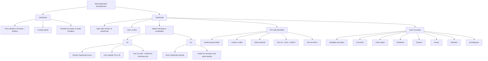
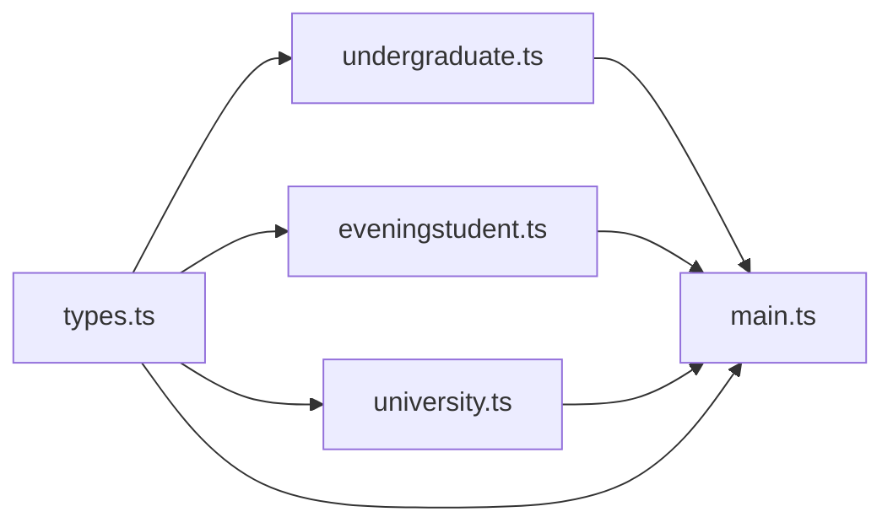

# QHO540 - Web Application Development  
## Week 1 Seminar: Introduction to TypeScript

> **Seminar focus:** Students are learning TypeScript for the first time.  
> The lecture introduces the theory: JavaScript typing problems, TypeScript typing, `tsc`, `tsx`, `tsconfig.json`, interfaces, classes, arrays, modules, and strict mode.  
> The seminar should make this practical inside **Visual Studio Code**.

---

## 1. Session Aim

By the end of this seminar, students should be able to:

- Explain the difference between **JavaScript** and **TypeScript**
- Understand why TypeScript is useful in modern web development
- Install and use **Node.js**, **TypeScript**, and **tsx**
- Create and run `.ts` files in Visual Studio Code
- Type-check code using `tsc`
- Run TypeScript using `tsx`
- Use basic TypeScript types: `string`, `number`, `boolean`, `null`, `undefined`
- Write functions with typed parameters and return values
- Use union types such as `string | number`
- Create interfaces, classes, arrays, and modules
- Build a small university/student TypeScript project

---

## 2. Big Picture Architecture Diagram



---

## 3. Simple Teaching Context

### What students already know

Students may already have seen:

```text
HTML = Structure
CSS = Styling
JavaScript = Behaviour
```

This week, introduce:

```text
TypeScript = Safer JavaScript
```

A simple way to explain it:

> JavaScript lets us write code quickly, but it can also allow mistakes quietly.  
> TypeScript helps us catch many of those mistakes before the code runs.

---

## 4. JavaScript vs TypeScript

### JavaScript Example

JavaScript allows this:

```js
let a = 1;
console.log(a);

a = "Hello World!";
console.log(a);
```

This is legal in JavaScript because JavaScript is **loosely typed**.

That means the same variable can first hold a number and later hold a string.

### Why this can be a problem

Imagine this in a real web app:

```js
let price = 100;
price = "Free";

let finalPrice = price + 20;
console.log(finalPrice);
```

Students may expect:

```text
120
```

But JavaScript may behave unexpectedly because `price` became a string.

### TypeScript Version

```ts
let price: number = 100;

price = "Free"; // Error
```

TypeScript stops this before the program runs.

---

## 5. Real-World Explanation

Use this analogy:

```text
JavaScript is like writing on a blank form.
You can write anything anywhere.

TypeScript is like a form with labelled boxes:
Name must be text.
Age must be a number.
Email must be text.
```

This makes TypeScript useful when building larger web applications where many developers work on the same codebase.

---

## 6. Tools Needed for the Seminar

Students need:

1. **Visual Studio Code**
2. **Node.js**
3. **npm**
4. **TypeScript**
5. **tsx**

---

## 7. Installation Guide

### Step 1: Install Visual Studio Code

Download and install Visual Studio Code:

```text
https://code.visualstudio.com/
```

After installing, open VS Code.

---

### Step 2: Install Node.js

Download the **LTS version** of Node.js:

```text
https://nodejs.org/
```

Install it using the default options.

---

### Step 3: Check Node.js and npm

Open the VS Code terminal:

```text
Terminal > New Terminal
```

Run:

```bash
node -v
```

Then run:

```bash
npm -v
```

If both commands show version numbers, Node.js and npm are installed correctly.

Example:

```text
v22.x.x
10.x.x
```

---

### Step 4: Install TypeScript and tsx Globally

Run this in the terminal:

```bash
npm install -g typescript tsx
```

This installs:

```text
typescript = gives us the tsc command
tsx        = lets us run TypeScript files directly
```

---

### Step 5: Check TypeScript Installation

Run:

```bash
tsc -v
```

Then run:

```bash
tsx --version
```

If both show version numbers, setup is complete.

---

## 8. First TypeScript Project in VS Code

### Step 1: Create a Folder

Create a folder called:

```text
qho540-typescript-week1
```

Open it in VS Code:

```text
File > Open Folder
```

---

### Step 2: Create a File

Create a file called:

```text
hello.ts
```

Add this code:

```ts
let message: string = "Hello TypeScript!";
console.log(message);
```

---

### Step 3: Type-check the file

Run:

```bash
tsc --strict --noEmit hello.ts
```

Explanation:

```text
tsc       = TypeScript compiler
--strict  = checks code more carefully
--noEmit  = does not create JavaScript output file
hello.ts  = file to check
```

If there is no output, that usually means there are no errors.

---

### Step 4: Run the TypeScript file

Run:

```bash
tsx hello.ts
```

Expected output:

```text
Hello TypeScript!
```

---

## 9. Important Difference: tsc vs tsx

| Tool | Purpose | Simple Meaning |
|---|---|---|
| `tsc` | Type-checks or compiles TypeScript | Checks whether the TypeScript code is valid |
| `tsx` | Runs TypeScript directly | Executes the TypeScript file |
| `node` | Runs JavaScript | Cannot directly understand TypeScript syntax |

Important teaching line:

> We use `tsc` to check the code.  
> We use `tsx` to run the code.

---

## 10. TypeScript Basic Types

```ts
let studentName: string = "Aisha";
let age: number = 21;
let isEnrolled: boolean = true;
let email: null = null;
let phone: undefined = undefined;
```

### Explain simply

```text
string    = text
number    = whole number or decimal number
boolean   = true or false
null      = intentionally empty
undefined = declared but not given a value yet
```

---

## 11. Type Inference

TypeScript can guess the type.

```ts
let moduleName = "Web Application Development";
```

TypeScript understands that `moduleName` is a string.

So this will fail:

```ts
moduleName = 540;
```

Why?

Because TypeScript inferred:

```text
moduleName is a string
```

---

## 12. Functions in TypeScript

### JavaScript function

```js
function cube(n) {
    return n * n * n;
}
```

Problem:

```js
cube("hello");
```

JavaScript may not stop this early.

---

### TypeScript function

```ts
function cube(n: number): number {
    return n * n * n;
}

console.log(cube(3));
```

Explanation:

```text
n: number       = input must be a number
: number        = output must be a number
```

---

## 13. Seminar Activity 1: Grade Calculator

Create a file:

```text
grade.ts
```

Add:

```ts
function calculateGrade(mark: number): string {
    if (mark >= 70 && mark <= 100) {
        return "A";
    } else if (mark >= 60) {
        return "B";
    } else if (mark >= 50) {
        return "C";
    } else if (mark >= 40) {
        return "D";
    } else {
        return "F";
    }
}

console.log(calculateGrade(85));
console.log(calculateGrade(62));
console.log(calculateGrade(48));
console.log(calculateGrade(25));
```

Type-check:

```bash
tsc --strict --noEmit grade.ts
```

Run:

```bash
tsx grade.ts
```

---

## 14. Improving the Grade Calculator with null

Problem:

What if the mark is invalid?

Example:

```text
-10
150
```

Update the function:

```ts
function calculateGrade(mark: number): string | null {
    if (mark < 0 || mark > 100) {
        return null;
    }

    if (mark >= 70) {
        return "A";
    } else if (mark >= 60) {
        return "B";
    } else if (mark >= 50) {
        return "C";
    } else if (mark >= 40) {
        return "D";
    } else {
        return "F";
    }
}

console.log(calculateGrade(85));
console.log(calculateGrade(150));
```

Explain:

```text
string | null means the function can return either:
- a string
- null
```

---

## 15. Union Types

Union types allow a value to be more than one possible type.

```ts
let studentId: string | number;

studentId = "QHO540";
studentId = 540;
```

Real-world example:

```text
Some systems use numeric IDs: 1001
Some systems use text IDs: STU1001
```

So TypeScript lets us write:

```ts
let id: string | number;
```

---

## 16. Interfaces

An interface describes the shape of an object.

```ts
interface Student {
    id: string | number;
    name: string;
    course: string;
    email?: string;
}
```

Explanation:

```text
id       = must exist and can be string or number
name     = must exist and must be string
course   = must exist and must be string
email?   = optional
```

The `?` means optional.

---

## 17. Using the Student Interface

```ts
interface Student {
    id: string | number;
    name: string;
    course: string;
    email?: string;
}

function printStudent(student: Student): void {
    console.log(`ID: ${student.id}`);
    console.log(`Name: ${student.name}`);
    console.log(`Course: ${student.course}`);
    console.log(`Email: ${student.email ?? "No email provided"}`);
}

const student1: Student = {
    id: 101,
    name: "Aisha",
    course: "Web Application Development",
    email: "aisha@example.com"
};

const student2: Student = {
    id: "STU102",
    name: "David",
    course: "Web Application Development"
};

printStudent(student1);
printStudent(student2);
```

Key concept:

```text
?? means:
Use the value on the left.
But if it is null or undefined, use the value on the right.
```

---

## 18. Arrays in TypeScript

```ts
const modules: string[] = [];

modules.push("WAD");
modules.push("OODD");
modules.push("MAD");

modules.forEach(module => {
    console.log(module);
});
```

Explanation:

```text
string[] = an array that can only contain strings
```

This would be wrong:

```ts
modules.push(123);
```

---

## 19. Mixed Arrays

```ts
const mixedData: (string | number)[] = [];

mixedData.push("WAD");
mixedData.push(540);
```

Important:

```text
(string | number)[] = array can contain strings and numbers
```

---

## 20. Classes in TypeScript

A class is a blueprint for creating objects.

```ts
class Undergraduate {
    id: string | number;
    name: string;
    course: string;
    modules: string[];

    constructor(id: string | number, name: string, course: string, modules: string[]) {
        this.id = id;
        this.name = name;
        this.course = course;
        this.modules = modules;
    }

    addModule(moduleName: string): void {
        this.modules.push(moduleName);
    }

    toString(): string {
        return `${this.name} studies ${this.course}. Modules: ${this.modules.join(", ")}`;
    }
}

const student = new Undergraduate(101, "Aisha", "Computing", ["WAD", "OODD"]);
student.addModule("MAD");

console.log(student.toString());
```

---

## 21. Modules: Splitting Code into Files

As projects grow, we do not keep everything in one file.

We split the code:

```text
types.ts
undergraduate.ts
eveningstudent.ts
university.ts
main.ts
```

Architecture:



---

## 22. Recommended Project Structure

```text
qho540-typescript-week1/
│
├── tsconfig.json
├── main.ts
├── types.ts
├── undergraduate.ts
├── eveningstudent.ts
└── university.ts
```

---

## 23. Create tsconfig.json

Create:

```text
tsconfig.json
```

Add:

```json
{
    "compilerOptions": {
        "strict": true,
        "noEmit": true,
        "allowImportingTsExtensions": true
    },
    "files": ["main.ts"]
}
```

Explanation:

```text
strict = stronger checking
noEmit = do not create JavaScript output files
allowImportingTsExtensions = allows imports using .ts extension
files = tells TypeScript which file to start checking from
```

---

## 24. types.ts

```ts
export interface Student {
    id: string | number;
    name: string;
    course: string;
    email?: string;
}
```

---

## 25. undergraduate.ts

```ts
import type { Student } from "./types.ts";

export class Undergraduate implements Student {
    id: string | number;
    name: string;
    course: string;
    email?: string;
    modules: string[];

    constructor(
        id: string | number,
        name: string,
        course: string,
        modules: string[],
        email?: string
    ) {
        this.id = id;
        this.name = name;
        this.course = course;
        this.modules = modules;
        this.email = email;
    }

    addModule(moduleName: string): void {
        this.modules.push(moduleName);
    }

    toString(): string {
        return `${this.name} studies ${this.course}. Modules: ${this.modules.join(", ")}. Email: ${this.email ?? "No email provided"}`;
    }
}
```

---

## 26. eveningstudent.ts

```ts
import type { Student } from "./types.ts";

export class EveningStudent implements Student {
    id: string | number;
    name: string;
    course: string;
    email?: string;

    constructor(
        id: string | number,
        name: string,
        course: string,
        email?: string
    ) {
        this.id = id;
        this.name = name;
        this.course = course;
        this.email = email;
    }

    toString(): string {
        return `ID: ${this.id}, Name: ${this.name}, Course: ${this.course}, Email: ${this.email ?? "No email provided"}`;
    }
}
```

---

## 27. university.ts

```ts
import type { Student } from "./types.ts";

export class University {
    students: Student[];

    constructor() {
        this.students = [];
    }

    enrolStudent(student: Student): void {
        this.students.push(student);
    }

    findStudentById(id: string | number): Student | null {
        for (const student of this.students) {
            if (student.id === id) {
                return student;
            }
        }

        return null;
    }
}
```

---

## 28. main.ts

```ts
import { Undergraduate } from "./undergraduate.ts";
import { EveningStudent } from "./eveningstudent.ts";
import { University } from "./university.ts";
import type { Student } from "./types.ts";

function printStudent(student: Student): void {
    console.log("-------------");
    console.log(`ID: ${student.id}`);
    console.log(`Name: ${student.name}`);
    console.log(`Course: ${student.course}`);
    console.log(`Email: ${student.email ?? "No email provided"}`);
}

const university = new University();

const student1 = new Undergraduate(
    101,
    "Aisha",
    "BSc Computing",
    ["WAD", "OODD"],
    "aisha@example.com"
);

const student2 = new EveningStudent(
    "EV202",
    "David",
    "Evening Web Development"
);

student1.addModule("MAD");

university.enrolStudent(student1);
university.enrolStudent(student2);

printStudent(student1);
printStudent(student2);

const foundStudent = university.findStudentById(101);

if (foundStudent !== null) {
    console.log("Student found:");
    console.log(foundStudent);
} else {
    console.log("Student not found");
}
```

---

## 29. Run the Project

Type-check the full project:

```bash
tsc
```

Run:

```bash
tsx main.ts
```

Expected result:

```text
Students should be printed in the terminal.
The university should be able to find a student by ID.
```

---

## 30. Seminar Teaching Plan

### Part 1: Lecture Recap - 10 minutes

Explain:

```text
JavaScript is flexible.
TypeScript is safer.
TypeScript helps us catch bugs early.
```

Show this:

```ts
let name: string = "Aisha";
name = 123; // Error
```

Ask students:

```text
Why is this useful in a real web application?
```

Expected discussion:

```text
It prevents incorrect data from entering the system.
```

---

### Part 2: Setup - 15 minutes

Students install/check:

```bash
node -v
npm -v
tsc -v
tsx --version
```

Install if needed:

```bash
npm install -g typescript tsx
```

---

### Part 3: First TypeScript File - 15 minutes

Create:

```text
hello.ts
```

Run:

```bash
tsc --strict --noEmit hello.ts
tsx hello.ts
```

Then deliberately break it:

```ts
let message: string = "Hello";
message = 123;
```

Ask:

```text
What error does TypeScript show?
```

---

### Part 4: Functions and Return Types - 20 minutes

Build the grade calculator.

Focus on:

```text
input type
return type
invalid marks
string | null
```

---

### Part 5: Interfaces and Objects - 20 minutes

Build the `Student` interface.

Explain:

```text
An interface is a contract.
If an object says it is a Student, it must have the Student properties.
```

---

### Part 6: Larger Project - 35 minutes

Build:

```text
University
Undergraduate
EveningStudent
Student interface
```

Students practise:

```text
imports
exports
interfaces
classes
arrays
optional properties
null handling
```

---

## 31. Common Student Errors

### Error 1: Node cannot run TypeScript directly

Wrong:

```bash
node hello.ts
```

Correct:

```bash
tsx hello.ts
```

---

### Error 2: Forgetting to install TypeScript

Fix:

```bash
npm install -g typescript tsx
```

---

### Error 3: Import path mistake

Wrong:

```ts
import { University } from "university.ts";
```

Correct:

```ts
import { University } from "./university.ts";
```

---

### Error 4: Missing allowImportingTsExtensions

If students import using `.ts`, make sure `tsconfig.json` includes:

```json
"allowImportingTsExtensions": true
```

---

### Error 5: Optional email issue

Wrong:

```ts
console.log(student.email.toLowerCase());
```

This can fail because `email` may be undefined.

Better:

```ts
console.log(student.email?.toLowerCase() ?? "No email provided");
```

---

## 32. Technical Fact

TypeScript does not replace JavaScript in the browser.

Browsers understand JavaScript, not TypeScript.

So TypeScript is usually checked and compiled into JavaScript before deployment.

For the seminar, `tsx` makes learning easier because students can run `.ts` files directly.

---

## 33. Fun Fact

TypeScript was created by Microsoft and is widely used in modern web development frameworks such as Angular, React projects, Vue projects, and Node.js back-end systems.

A lot of large companies prefer TypeScript because it helps teams reduce bugs in bigger codebases.

---

## 34. Student Challenge

Ask students to extend the university system:

1. Add a `removeStudentById()` method
2. Add a `listAllStudents()` method
3. Add a `findStudentsByCourse()` method
4. Add a new class called `InternationalStudent`
5. Add an optional property called `country`

Example:

```ts
interface Student {
    id: string | number;
    name: string;
    course: string;
    email?: string;
    country?: string;
}
```

---

## 35. End-of-Seminar Recap

Students should remember:

```text
JavaScript = flexible but can allow mistakes
TypeScript = JavaScript with types
tsc = checks TypeScript
tsx = runs TypeScript
interface = object structure
class = blueprint for objects
array = list of values
module = reusable file
tsconfig.json = TypeScript project settings
```

Final teaching line:

> TypeScript is not about writing more code for no reason.  
> It is about making mistakes easier to catch before the application breaks.
