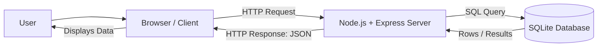
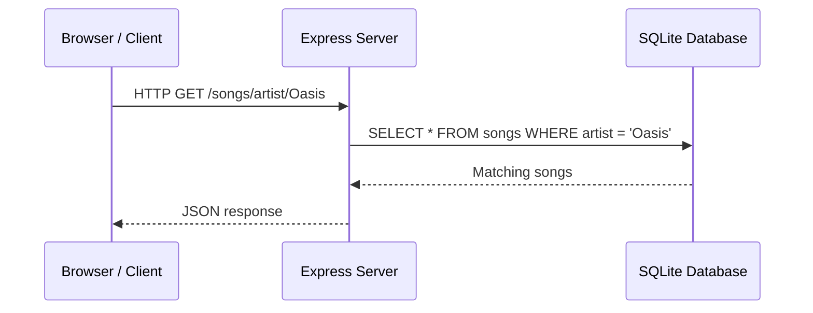
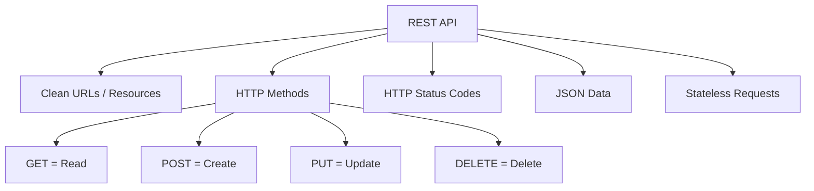
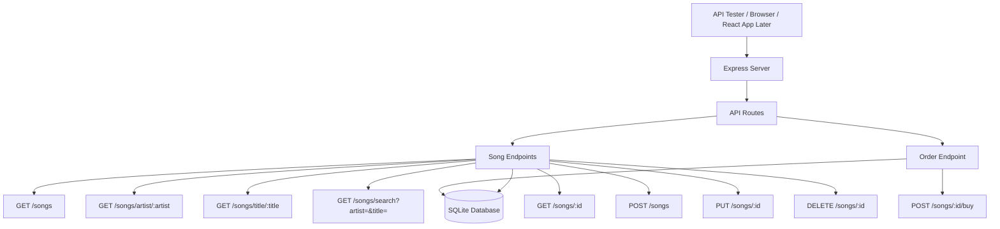
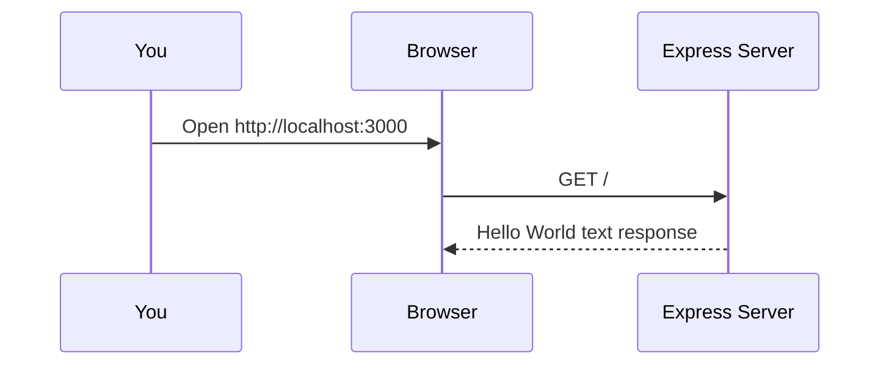
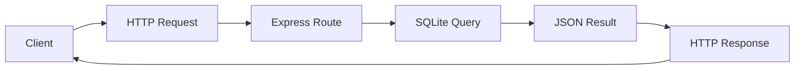

# QHO540 Web Application Development  
## Seminar: REST Web APIs with Node, Express, TypeScript and SQLite

> **Teaching focus:** You only teach the seminar, so this README starts with a quick lecture recap, then moves into a full coding walkthrough.  
> **Student level:** First time / beginner-friendly.  
> **Seminar pattern:** Explain → build together → test together → student tasks → extension challenges.

---

## 0. What students should understand by the end

By the end of this seminar, students should be able to explain and build a small REST API that:

- runs using **Node.js**
- uses **Express** to create API endpoints
- uses **TypeScript** for safer code
- uses **SQLite** as a simple database
- sends and receives **JSON**
- supports the main REST actions:
  - `GET` = read data
  - `POST` = create data
  - `PUT` = update data
  - `DELETE` = remove data

---

# Part 1: Quick Lecture Recap

## 1.1 The big picture: What is a web application?

A web application usually has two main sides:

```text
Client  →  the browser / frontend
Server  →  the backend application
Database → where the data is stored
```

### Architecture diagram



### Simple explanation

When a student opens a web app:

1. The **browser** asks the server for something.
2. The **server** processes the request.
3. The server may ask the **database** for data.
4. The database sends the data back to the server.
5. The server sends a response back to the browser.

---

## 1.2 Client vs Server

| Part | What it does | Examples |
|---|---|---|
| Client | Runs on the user's device/browser | HTML, CSS, JavaScript, React |
| Server | Runs backend logic | Node.js, Express |
| Database | Stores data | SQLite, MySQL, PostgreSQL |

### Teaching line

> The client is what the user sees. The server is where the real business logic happens. The database is where the information lives.

---

## 1.3 What is HTTP?

HTTP is the communication language between the browser and the server.

Example when visiting a page:

```http
GET /about.html HTTP/1.1
Host: www.example.com
```

Meaning:

```text
Browser: Please give me the about.html page.
Server: Here is the response.
```

---

## 1.4 HTTP request and response flow



---

## 1.5 HTTP status codes

Status codes tell the client what happened.

| Status code | Meaning | Simple explanation |
|---|---|---|
| `200 OK` | Success | The request worked |
| `201 Created` | Created | A new record was created |
| `400 Bad Request` | User mistake | The request data is wrong |
| `401 Unauthorized` | Not logged in / no access | User is not allowed |
| `404 Not Found` | Missing data | The requested item does not exist |
| `500 Internal Server Error` | Server error | Something broke on the backend |

### Fun fact

There is also a real HTTP status code called:

```text
418 I'm a teapot
```

It started as an April Fools' joke, but developers still use it as a fun example of HTTP status codes.

---

## 1.6 What is JSON?

JSON means **JavaScript Object Notation**.

It is a simple data format used by APIs.

Example JSON object:

```json
{
  "name": "Tim Smith",
  "username": "2smitt82",
  "course": "Computer Studies"
}
```

Example JSON array:

```json
[
  {
    "name": "Tim Smith",
    "course": "Computer Studies"
  },
  {
    "name": "Jamie Bailey",
    "course": "Computer Studies"
  }
]
```

### Teaching line

> HTML is for displaying pages. JSON is for sending clean data between systems.

---

## 1.7 Why do APIs return JSON instead of HTML?

### HTML response

Good for browsers:

```html
<h1>Wonderwall</h1>
<p>Artist: Oasis</p>
<p>Price: 0.99</p>
```

### JSON response

Good for other applications:

```json
{
  "title": "Wonderwall",
  "artist": "Oasis",
  "price": 0.99
}
```

### Simple explanation

```text
HTML = data + presentation
JSON = data only
```

A mobile app, React app, desktop app, or another website can easily use JSON.

---

## 1.8 What is a Web API?

A Web API is a backend system that provides data through URLs.

Example:

```text
GET /songs
GET /songs/artist/Oasis
GET /songs/1
POST /songs
PUT /songs/1
DELETE /songs/1
```

### Real-world API examples

| API type | Example use |
|---|---|
| Weather API | Weather app shows forecast |
| Airline API | Flight search websites compare prices |
| Music API | Streaming apps search songs |
| Maps API | Apps display locations and routes |
| University API | Student records, modules, marks |

---

## 1.9 What is REST?

REST is a style for designing clean Web APIs.

REST uses:

- clear URLs
- HTTP methods
- HTTP status codes
- JSON responses
- stateless requests

### REST architecture diagram



### Teaching line

> REST is not a programming language. It is a clean way of organising API endpoints.

---

## 1.10 REST method cheat sheet

| Action | HTTP method | Example endpoint | Meaning |
|---|---|---|---|
| Read all songs | `GET` | `/songs` | Get all songs |
| Read one song | `GET` | `/songs/1` | Get song with ID 1 |
| Create song | `POST` | `/songs` | Add a new song |
| Update song | `PUT` | `/songs/1` | Update song with ID 1 |
| Delete song | `DELETE` | `/songs/1` | Delete song with ID 1 |

---

# Part 2: Seminar Plan

## 2.1 How to run the seminar

Use this structure:

```text
1. Quick recap of lecture concepts
2. Explain what we are building
3. Set up the project together
4. Build Hello World Express API
5. Add SQLite database
6. Add GET endpoints
7. Students complete GET tasks
8. Add POST, PUT, DELETE endpoints
9. Students test using Thunder Client / RESTer / curl
10. Extension task: buy a song
```

---

## 2.2 What we are building today

We will build a small **Music Store REST API**.

The API will manage songs.

Each song will have:

```text
id
title
artist
price
quantity_in_stock
```

Later, we will also create orders when a user buys a song.

---

## 2.3 API endpoint architecture



---

# Part 3: Environment Setup

## 3.1 What students need installed

Students need:

1. **Visual Studio Code**
2. **Node.js LTS**
3. **npm**
4. **TypeScript**
5. **tsx**
6. **Thunder Client** VS Code extension, RESTer, or curl/Postman

---

## 3.2 Check Node.js and npm

Open VS Code terminal and run:

```bash
node -v
```

Then:

```bash
npm -v
```

If both show versions, Node and npm are installed.

Example:

```text
v22.0.0
10.0.0
```

If Node is not installed, download the **LTS version** from the official Node.js website.

---

## 3.3 Install TypeScript and tsx globally

Run:

```bash
npm install -g typescript tsx
```

Check TypeScript:

```bash
tsc --version
```

Check tsx:

```bash
tsx --version
```

---

## 3.4 Core difference between `tsc` and `tsx`

```text
tsc = checks / compiles TypeScript
tsx = runs TypeScript directly
```

### Beginner explanation

```text
tsc checks if the TypeScript code is correct.
tsx runs the TypeScript code and shows console output.
```

Example:

```bash
tsc --noEmit server.ts
```

Means:

```text
Check the file, but do not create JavaScript output.
```

Example:

```bash
tsx server.ts
```

Means:

```text
Run the TypeScript file.
```

---

# Part 4: Create the Project from Scratch

## 4.1 Create a folder

```bash
mkdir qho540-rest-api-seminar
cd qho540-rest-api-seminar
```

Open the folder in VS Code:

```bash
code .
```

If `code .` does not work, open VS Code manually and choose:

```text
File → Open Folder → qho540-rest-api-seminar
```

---

## 4.2 Create a Node project

```bash
npm init -y
```

This creates:

```text
package.json
```

`package.json` keeps track of project settings and installed packages.

---

## 4.3 Install Express and SQLite package

```bash
npm install express better-sqlite3
```

### What these do

| Package | Purpose |
|---|---|
| `express` | Creates the web server and API routes |
| `better-sqlite3` | Lets Node.js talk to SQLite database files |

---

## 4.4 Install TypeScript development packages

```bash
npm install -D typescript tsx @types/node @types/express @types/better-sqlite3
```

### What these do

| Package | Purpose |
|---|---|
| `typescript` | TypeScript compiler/checker |
| `tsx` | Runs TypeScript files directly |
| `@types/node` | Type definitions for Node.js |
| `@types/express` | Type definitions for Express |
| `@types/better-sqlite3` | Type definitions for better-sqlite3 |

### Core tech fact

> TypeScript needs type definitions to understand third-party libraries properly.

For many JavaScript packages, the type information lives in packages starting with:

```text
@types/
```

---

## 4.5 Create TypeScript config file

Create a file called:

```text
tsconfig.json
```

Add:

```json
{
  "compilerOptions": {
    "target": "ES2022",
    "module": "ESNext",
    "moduleResolution": "Bundler",
    "strict": true,
    "noEmit": true,
    "esModuleInterop": true,
    "skipLibCheck": true
  },
  "include": ["src/**/*.ts"]
}
```

### Explain the important parts

| Option | Meaning |
|---|---|
| `strict` | TypeScript checks more carefully |
| `noEmit` | Do not create `.js` files when checking |
| `esModuleInterop` | Makes Express import work nicely with TypeScript |
| `include` | TypeScript checks files inside `src` |

---

## 4.6 Update package.json scripts

Open `package.json` and update the scripts section:

```json
{
  "scripts": {
    "dev": "tsx src/server.ts",
    "check": "tsc",
    "start": "tsx src/server.ts"
  }
}
```

Your full `package.json` will also contain dependencies, so do not delete those.

### How students will use this

```bash
npm run check
```

Checks TypeScript.

```bash
npm run dev
```

Runs the server.

---

## 4.7 Create source folder

```bash
mkdir src
```

Create this file:

```text
src/server.ts
```

---

# Part 5: First API - Hello World with Express

## 5.1 Add Hello World server

Put this inside `src/server.ts`:

```ts
import express from 'express';

const app = express();
const PORT = 3000;

app.get('/', (req, res) => {
  res.send('Hello World from Express and TypeScript!');
});

app.listen(PORT, () => {
  console.log(`Server listening on http://localhost:${PORT}`);
});
```

---

## 5.2 Check the TypeScript

Run:

```bash
npm run check
```

If there is no output, that is good.

### Important teaching point

```text
No output from tsc usually means no TypeScript errors.
```

---

## 5.3 Run the server

Run:

```bash
npm run dev
```

Expected terminal output:

```text
Server listening on http://localhost:3000
```

---

## 5.4 Test in browser

Open:

```text
http://localhost:3000
```

Expected output:

```text
Hello World from Express and TypeScript!
```

---

## 5.5 What just happened?



---

# Part 6: Build the Music Store API

Stop the server first:

```text
CTRL + C
```

Now replace `src/server.ts` with the full version below.

---

## 6.1 Full server code

```ts
import express from 'express';
import Database from 'better-sqlite3';

const app = express();
const PORT = 3000;

// This allows Express to read JSON from request bodies
app.use(express.json());

// Create or open the SQLite database file
const db = new Database('music.db');

// TypeScript type for a song
interface Song {
  id: number;
  title: string;
  artist: string;
  price: number;
  quantity_in_stock: number;
}

// Create tables if they do not already exist
db.exec(`
  CREATE TABLE IF NOT EXISTS songs (
    id INTEGER PRIMARY KEY AUTOINCREMENT,
    title TEXT NOT NULL,
    artist TEXT NOT NULL,
    price REAL NOT NULL,
    quantity_in_stock INTEGER NOT NULL
  );

  CREATE TABLE IF NOT EXISTS orders (
    id INTEGER PRIMARY KEY AUTOINCREMENT,
    song_id INTEGER NOT NULL,
    quantity INTEGER NOT NULL,
    created_at TEXT DEFAULT CURRENT_TIMESTAMP,
    FOREIGN KEY(song_id) REFERENCES songs(id)
  );
`);

// Seed starter data only if the table is empty
const songCount = db.prepare('SELECT COUNT(*) AS count FROM songs').get() as { count: number };

if (songCount.count === 0) {
  const insert = db.prepare(`
    INSERT INTO songs (title, artist, price, quantity_in_stock)
    VALUES (?, ?, ?, ?)
  `);

  insert.run('Wonderwall', 'Oasis', 0.99, 10);
  insert.run('Shape of You', 'Ed Sheeran', 1.29, 15);
  insert.run('Blinding Lights', 'The Weeknd', 1.19, 8);
  insert.run('Hello', 'Adele', 1.09, 12);
  insert.run('Don\'t Look Back in Anger', 'Oasis', 0.99, 5);
}

// Home route
app.get('/', (req, res) => {
  res.json({
    message: 'QHO540 Music Store REST API',
    endpoints: [
      'GET /songs',
      'GET /songs/artist/:artist',
      'GET /songs/title/:title',
      'GET /songs/search?artist=Oasis&title=Wonderwall',
      'GET /songs/:id',
      'POST /songs',
      'PUT /songs/:id',
      'DELETE /songs/:id',
      'POST /songs/:id/buy'
    ]
  });
});

// GET all songs
app.get('/songs', (req, res) => {
  try {
    const stmt = db.prepare('SELECT * FROM songs');
    const results = stmt.all() as Song[];
    res.json(results);
  } catch (error) {
    console.error(error);
    res.status(500).json({ error: 'Internal server error' });
  }
});

// GET songs by artist
app.get('/songs/artist/:artist', (req, res) => {
  try {
    const stmt = db.prepare('SELECT * FROM songs WHERE artist = ?');
    const results = stmt.all(req.params.artist) as Song[];
    res.json(results);
  } catch (error) {
    console.error(error);
    res.status(500).json({ error: 'Internal server error' });
  }
});

// GET songs by title
app.get('/songs/title/:title', (req, res) => {
  try {
    const stmt = db.prepare('SELECT * FROM songs WHERE title = ?');
    const results = stmt.all(req.params.title) as Song[];
    res.json(results);
  } catch (error) {
    console.error(error);
    res.status(500).json({ error: 'Internal server error' });
  }
});

// GET songs by artist AND title using query string
// Example: /songs/search?artist=Oasis&title=Wonderwall
app.get('/songs/search', (req, res) => {
  try {
    const artist = req.query.artist;
    const title = req.query.title;

    if (typeof artist !== 'string' || typeof title !== 'string') {
      return res.status(400).json({
        error: 'Please provide artist and title as query parameters.'
      });
    }

    const stmt = db.prepare('SELECT * FROM songs WHERE artist = ? AND title = ?');
    const results = stmt.all(artist, title) as Song[];
    res.json(results);
  } catch (error) {
    console.error(error);
    res.status(500).json({ error: 'Internal server error' });
  }
});

// GET one song by ID
// Important: this route should come after /songs/search, /songs/artist and /songs/title
app.get('/songs/:id', (req, res) => {
  try {
    const stmt = db.prepare('SELECT * FROM songs WHERE id = ?');
    const result = stmt.get(req.params.id) as Song | undefined;

    if (!result) {
      return res.status(404).json({ error: 'Song not found' });
    }

    res.json(result);
  } catch (error) {
    console.error(error);
    res.status(500).json({ error: 'Internal server error' });
  }
});

// POST create a new song
app.post('/songs', (req, res) => {
  try {
    const { title, artist, price, quantity_in_stock } = req.body;

    if (!title || !artist || typeof price !== 'number' || typeof quantity_in_stock !== 'number') {
      return res.status(400).json({
        error: 'title, artist, price and quantity_in_stock are required.'
      });
    }

    const stmt = db.prepare(`
      INSERT INTO songs (title, artist, price, quantity_in_stock)
      VALUES (?, ?, ?, ?)
    `);

    const info = stmt.run(title, artist, price, quantity_in_stock);

    res.status(201).json({
      message: 'Song created successfully',
      id: info.lastInsertRowid
    });
  } catch (error) {
    console.error(error);
    res.status(500).json({ error: 'Internal server error' });
  }
});

// PUT update price and quantity of a song
app.put('/songs/:id', (req, res) => {
  try {
    const { price, quantity_in_stock } = req.body;

    if (typeof price !== 'number' || typeof quantity_in_stock !== 'number') {
      return res.status(400).json({
        error: 'price and quantity_in_stock must be numbers.'
      });
    }

    const stmt = db.prepare(`
      UPDATE songs
      SET price = ?, quantity_in_stock = ?
      WHERE id = ?
    `);

    const info = stmt.run(price, quantity_in_stock, req.params.id);

    if (info.changes === 1) {
      res.json({ success: true, message: 'Song updated successfully' });
    } else {
      res.status(404).json({ error: 'Song not found' });
    }
  } catch (error) {
    console.error(error);
    res.status(500).json({ error: 'Internal server error' });
  }
});

// DELETE a song
app.delete('/songs/:id', (req, res) => {
  try {
    const stmt = db.prepare('DELETE FROM songs WHERE id = ?');
    const info = stmt.run(req.params.id);

    if (info.changes === 1) {
      res.json({ success: true, message: 'Song deleted successfully' });
    } else {
      res.status(404).json({ error: 'Song not found' });
    }
  } catch (error) {
    console.error(error);
    res.status(500).json({ error: 'Internal server error' });
  }
});

// POST buy one physical copy of a song
app.post('/songs/:id/buy', (req, res) => {
  try {
    const song = db.prepare('SELECT * FROM songs WHERE id = ?').get(req.params.id) as Song | undefined;

    if (!song) {
      return res.status(404).json({ error: 'Song not found' });
    }

    if (song.quantity_in_stock <= 0) {
      return res.status(400).json({ error: 'Song is out of stock' });
    }

    const updateStock = db.prepare(`
      UPDATE songs
      SET quantity_in_stock = quantity_in_stock - 1
      WHERE id = ?
    `);

    const createOrder = db.prepare(`
      INSERT INTO orders (song_id, quantity)
      VALUES (?, ?)
    `);

    const transaction = db.transaction(() => {
      updateStock.run(req.params.id);
      const orderInfo = createOrder.run(req.params.id, 1);
      return orderInfo.lastInsertRowid;
    });

    const orderId = transaction();

    res.status(201).json({
      success: true,
      message: 'Song purchased successfully',
      orderId
    });
  } catch (error) {
    console.error(error);
    res.status(500).json({ error: 'Internal server error' });
  }
});

app.listen(PORT, () => {
  console.log(`Server listening on http://localhost:${PORT}`);
});
```

---

## 6.2 Check and run

Check TypeScript:

```bash
npm run check
```

Run server:

```bash
npm run dev
```

Open browser:

```text
http://localhost:3000
```

Then:

```text
http://localhost:3000/songs
```

---

# Part 7: Testing GET Endpoints in Browser

GET requests are easy to test in the browser.

## 7.1 Test all songs

Open:

```text
http://localhost:3000/songs
```

Expected: JSON array of songs.

---

## 7.2 Test songs by artist

Open:

```text
http://localhost:3000/songs/artist/Oasis
```

Expected: Oasis songs.

---

## 7.3 Test songs by title

Open:

```text
http://localhost:3000/songs/title/Wonderwall
```

Expected: Wonderwall song.

---

## 7.4 Test artist AND title

Open:

```text
http://localhost:3000/songs/search?artist=Oasis&title=Wonderwall
```

Expected: songs where both artist and title match.

---

## 7.5 Test song by ID

Open:

```text
http://localhost:3000/songs/1
```

Expected: song with ID 1.

Try a missing song:

```text
http://localhost:3000/songs/999
```

Expected:

```json
{
  "error": "Song not found"
}
```

---

# Part 8: Testing POST, PUT and DELETE

## 8.1 Why browser is not enough

When you type a URL in the browser, the browser normally sends a `GET` request.

But for API testing, we also need:

```text
POST
PUT
DELETE
```

So students should use one of these:

- Thunder Client extension in VS Code
- RESTer browser extension
- Postman
- curl from terminal

For university lab computers, Thunder Client or curl may be easier depending on what is installed.

---

## 8.2 Recommended: Thunder Client in VS Code

Install extension:

```text
VS Code → Extensions → Search Thunder Client → Install
```

Open Thunder Client:

```text
Left sidebar → Thunder Client → New Request
```

---

## 8.3 Test POST: Add a song

Method:

```text
POST
```

URL:

```text
http://localhost:3000/songs
```

Headers:

```text
Content-Type: application/json
```

Body → JSON:

```json
{
  "title": "Yellow",
  "artist": "Coldplay",
  "price": 1.25,
  "quantity_in_stock": 20
}
```

Expected response:

```json
{
  "message": "Song created successfully",
  "id": 6
}
```

Now test again:

```text
GET http://localhost:3000/songs
```

The new song should appear.

---

## 8.4 Test PUT: Update price and stock

Method:

```text
PUT
```

URL:

```text
http://localhost:3000/songs/1
```

Headers:

```text
Content-Type: application/json
```

Body:

```json
{
  "price": 1.49,
  "quantity_in_stock": 30
}
```

Expected response:

```json
{
  "success": true,
  "message": "Song updated successfully"
}
```

Check:

```text
GET http://localhost:3000/songs/1
```

---

## 8.5 Test DELETE: Delete a song

Method:

```text
DELETE
```

URL:

```text
http://localhost:3000/songs/2
```

Expected response:

```json
{
  "success": true,
  "message": "Song deleted successfully"
}
```

Check:

```text
GET http://localhost:3000/songs/2
```

Expected:

```json
{
  "error": "Song not found"
}
```

---

## 8.6 Test buy endpoint

Method:

```text
POST
```

URL:

```text
http://localhost:3000/songs/1/buy
```

No body needed.

Expected response:

```json
{
  "success": true,
  "message": "Song purchased successfully",
  "orderId": 1
}
```

Then check the stock:

```text
GET http://localhost:3000/songs/1
```

The `quantity_in_stock` should reduce by 1.

---

# Part 9: curl Testing Option

If Thunder Client is not available, use terminal.

## 9.1 GET all songs

```bash
curl http://localhost:3000/songs
```

---

## 9.2 POST create song

```bash
curl -X POST http://localhost:3000/songs \
  -H "Content-Type: application/json" \
  -d '{"title":"Yellow","artist":"Coldplay","price":1.25,"quantity_in_stock":20}'
```

---

## 9.3 PUT update song

```bash
curl -X PUT http://localhost:3000/songs/1 \
  -H "Content-Type: application/json" \
  -d '{"price":1.49,"quantity_in_stock":30}'
```

---

## 9.4 DELETE song

```bash
curl -X DELETE http://localhost:3000/songs/2
```

---

## 9.5 Buy song

```bash
curl -X POST http://localhost:3000/songs/1/buy
```

---

# Part 10: Explain the Code Simply

## 10.1 What does `express()` do?

```ts
const app = express();
```

This creates the Express application.

Teaching line:

> `app` is our server application. We attach routes to it.

---

## 10.2 What is a route?

```ts
app.get('/songs', (req, res) => {
  res.json(results);
});
```

A route connects:

```text
HTTP method + URL + function
```

Example:

```text
GET + /songs + return all songs
```

---

## 10.3 What are `req` and `res`?

| Name | Meaning | Purpose |
|---|---|---|
| `req` | Request | Data coming from client |
| `res` | Response | Data sent back to client |

Example:

```ts
req.params.id
```

Gets the `id` from the URL.

Example:

```ts
req.body.title
```

Gets `title` from JSON sent by the client.

Example:

```ts
res.json(data)
```

Sends JSON back to the client.

---

## 10.4 What does `app.use(express.json())` do?

```ts
app.use(express.json());
```

It allows Express to read JSON from the request body.

Without it, this may not work:

```ts
req.body.title
```

Teaching line:

> If your POST body is coming as undefined, check whether `app.use(express.json())` is included.

---

## 10.5 What is a prepared statement?

```ts
const stmt = db.prepare('SELECT * FROM songs WHERE artist = ?');
const results = stmt.all(req.params.artist);
```

The `?` is a placeholder.

The real value is safely inserted later.

### Security fact

Prepared statements help protect against **SQL injection**.

Bad approach:

```ts
const sql = "SELECT * FROM songs WHERE artist = '" + artist + "'";
```

Better approach:

```ts
const stmt = db.prepare('SELECT * FROM songs WHERE artist = ?');
stmt.all(artist);
```

Teaching line:

> Never build SQL by joining user input directly into a string.

---

## 10.6 `.all()`, `.get()` and `.run()`

| Method | Used for | Returns |
|---|---|---|
| `.all()` | SELECT many rows | Array |
| `.get()` | SELECT one row | One object or undefined |
| `.run()` | INSERT, UPDATE, DELETE | Info about changes |

Example:

```ts
stmt.all()
```

Use when expecting many records.

```ts
stmt.get()
```

Use when expecting one record.

```ts
stmt.run()
```

Use when changing the database.

---

# Part 11: Student Tasks

## Task 1: Confirm project works

Students must show:

```text
GET http://localhost:3000
GET http://localhost:3000/songs
```

They should see JSON.

---

## Task 2: Add one more sample song

Add another song to the seed data:

```ts
insert.run('Bad Habits', 'Ed Sheeran', 1.15, 7);
```

Then delete `music.db` and restart the server so the seed runs again.

---

## Task 3: Create a new GET endpoint

Create:

```text
GET /songs/cheap/:maxPrice
```

It should return songs where the price is less than or equal to the given max price.

Hint:

```sql
SELECT * FROM songs WHERE price <= ?
```

Test:

```text
http://localhost:3000/songs/cheap/1.00
```

---

## Task 4: Create a stock endpoint

Create:

```text
GET /songs/stock/low
```

It should return songs where:

```text
quantity_in_stock < 10
```

---

## Task 5: Improve validation

In the `POST /songs` endpoint, block negative prices.

Bad request example:

```json
{
  "title": "Test Song",
  "artist": "Test Artist",
  "price": -1,
  "quantity_in_stock": 5
}
```

Expected response:

```json
{
  "error": "Price cannot be negative"
}
```

---

## Task 6: Test errors properly

Students should intentionally test:

```text
GET /songs/999
DELETE /songs/999
PUT /songs/999
POST /songs with missing fields
```

They should check that the API returns correct error messages and status codes.

---

# Part 12: Extension Challenge

## Challenge 1: Add orders endpoint

Create:

```text
GET /orders
```

It should return all orders.

SQL:

```sql
SELECT * FROM orders
```

---

## Challenge 2: Show orders with song details

Create:

```text
GET /orders/details
```

It should return order details with song title and artist.

SQL idea:

```sql
SELECT orders.id, songs.title, songs.artist, orders.quantity, orders.created_at
FROM orders
JOIN songs ON orders.song_id = songs.id
```

---

## Challenge 3: Buy more than one quantity

Currently, buying a song always buys quantity `1`.

Improve it so the request body can send:

```json
{
  "quantity": 3
}
```

Then reduce stock by 3 and create an order with quantity 3.

---

# Part 13: Common Errors and Fixes

## Error 1: `Cannot find module 'express'`

Fix:

```bash
npm install express
npm install -D @types/express
```

---

## Error 2: `Cannot find module 'better-sqlite3'`

Fix:

```bash
npm install better-sqlite3
npm install -D @types/better-sqlite3
```

---

## Error 3: Server already running on port 3000

You may see:

```text
EADDRINUSE: address already in use :::3000
```

Fix:

1. Stop the old server using `CTRL + C`
2. Or change the port:

```ts
const PORT = 3001;
```

---

## Error 4: POST body is undefined

Make sure this exists before routes:

```ts
app.use(express.json());
```

Also make sure the request header is:

```text
Content-Type: application/json
```

---

## Error 5: Route order problem

This route:

```ts
app.get('/songs/:id', ...)
```

should come after more specific routes like:

```ts
app.get('/songs/search', ...)
app.get('/songs/artist/:artist', ...)
app.get('/songs/title/:title', ...)
```

Why?

Because Express checks routes from top to bottom.

If `/songs/:id` appears too early, Express might treat `search` as an ID.

---

## Error 6: No output after `npm run check`

This is good.

```text
No output from TypeScript usually means no errors.
```

To run the code:

```bash
npm run dev
```

---

# Part 14: Fun and Core Tech Facts

## Fact 1: `localhost` means your own computer

When you open:

```text
http://localhost:3000
```

You are not visiting the internet.

You are visiting a server running on your own machine.

Teaching line:

> localhost is your laptop talking to itself.

---

## Fact 2: Browsers mostly test GET requests only

When you type a URL into a browser, it sends a `GET` request.

That is why we need tools like Thunder Client, RESTer or Postman for:

```text
POST
PUT
DELETE
```

---

## Fact 3: JSON is used almost everywhere

JSON is used by:

```text
Web apps
Mobile apps
APIs
Cloud services
AI tools
Payment systems
Maps
Weather apps
```

Teaching line:

> If students understand JSON, they understand how modern apps exchange data.

---

## Fact 4: REST reuses existing web rules

REST does not invent a new protocol.

It uses existing HTTP features:

```text
GET
POST
PUT
DELETE
Status codes
URLs
Headers
Bodies
```

Teaching line:

> REST is basically good manners for designing APIs.

---

## Fact 5: Prepared statements are a security feature

Prepared statements are not just cleaner code.

They help protect against SQL injection.

SQL injection is when attackers try to send SQL code through user input.

Teaching line:

> Treat all user input as suspicious until validated.

---

## Fact 6: TypeScript helps before the server runs

TypeScript catches errors while coding.

Example:

```ts
let price: number = 1.99;
price = 'free';
```

TypeScript blocks this.

Teaching line:

> JavaScript may fail while running. TypeScript warns while writing.

---

## Fact 7: APIs are the backbone of modern apps

When students use apps like:

```text
Uber
Amazon
Netflix
Spotify
Instagram
University portals
Banking apps
```

They are constantly using APIs in the background.

Teaching line:

> A modern app is often just a nice interface talking to many APIs.

---

# Part 15: Suggested Teaching Script

## Opening explanation

> Today we are going to build a real backend API. Before coding, remember the big idea: the browser or frontend is the client, Node and Express form the server, and SQLite stores the data. The client sends HTTP requests, the server responds with HTTP responses, and instead of returning HTML, our API will return JSON. This is useful because JSON can be used by a browser, mobile app, React app, or another system.

## Before coding

> We are not building a full website today. We are building the backend API that a website or React app could use later.

## While showing GET

> GET is used when we want to read data. It should not change the database.

## While showing POST

> POST is used when we want to create something new. That is why adding a song uses POST.

## While showing PUT

> PUT is used when we want to update an existing thing. We already have the song, but we are changing its price or stock.

## While showing DELETE

> DELETE is used when we want to remove something from the database.

## While explaining status codes

> The JSON body tells us the message, but the status code tells the client whether the request succeeded or failed.

---

# Part 16: Final Recap for Students

```text
Client sends request
Server receives request
Express route handles request
Database query runs
Server sends JSON response
Client displays or uses the data
```



## Final one-line summary

> A REST API is a clean backend system that exposes data through URLs using HTTP methods and JSON responses.

---

# Part 17: Submission / Evidence Checklist

Students should be able to show:

- Project folder created
- `package.json` exists
- `tsconfig.json` exists
- `src/server.ts` exists
- Server runs using `npm run dev`
- TypeScript passes using `npm run check`
- Browser can test GET endpoints
- Thunder Client / curl can test POST, PUT and DELETE
- Database file `music.db` is created
- At least one student task completed

---

# Part 18: Quick Command Summary

```bash
mkdir qho540-rest-api-seminar
cd qho540-rest-api-seminar
code .
npm init -y
npm install express better-sqlite3
npm install -D typescript tsx @types/node @types/express @types/better-sqlite3
mkdir src
```

Create:

```text
tsconfig.json
src/server.ts
```

Run checks:

```bash
npm run check
```

Run server:

```bash
npm run dev
```

Test:

```text
http://localhost:3000
http://localhost:3000/songs
```

---

# Part 19: What to say at the end

> Today you built the backend part of a real web application. This is the same pattern used in many real systems: a frontend sends requests, a backend processes them, a database stores the data, and JSON carries the result back. Next time you use a website or mobile app, remember there are API requests happening behind almost every button click.

