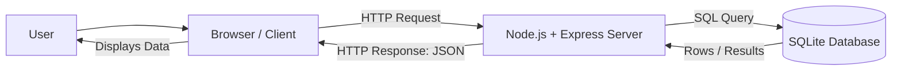
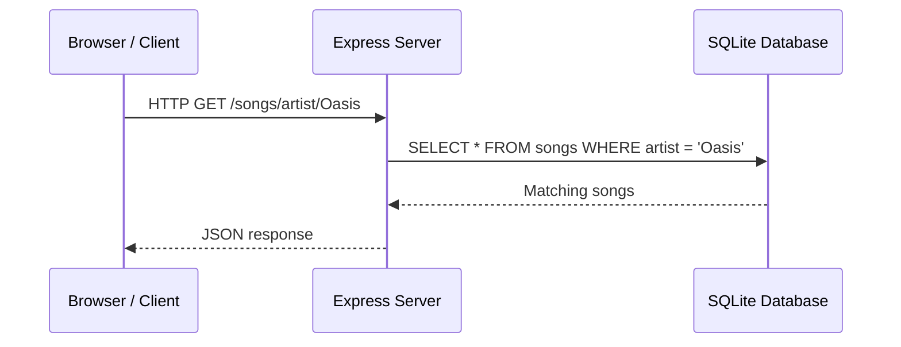
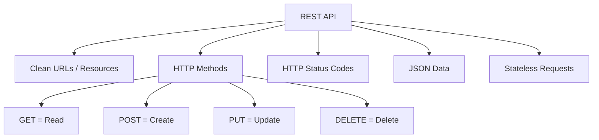
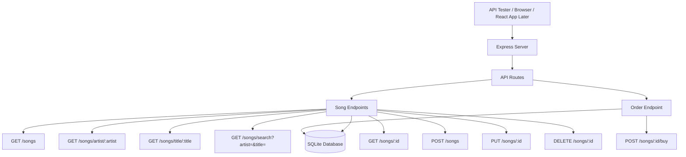
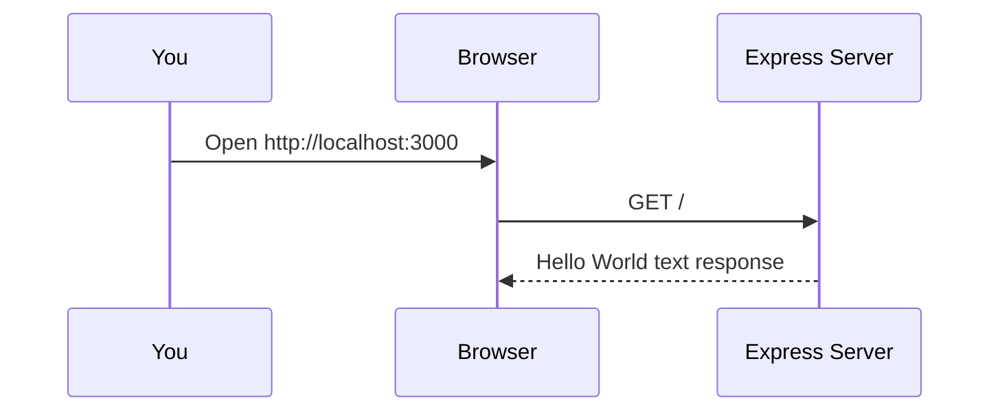
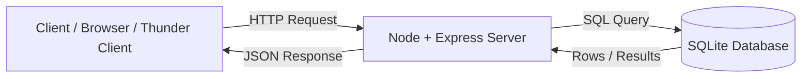
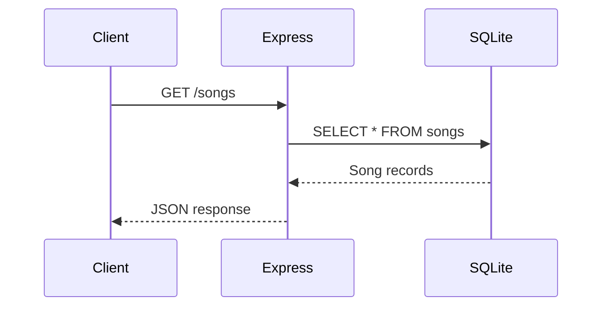
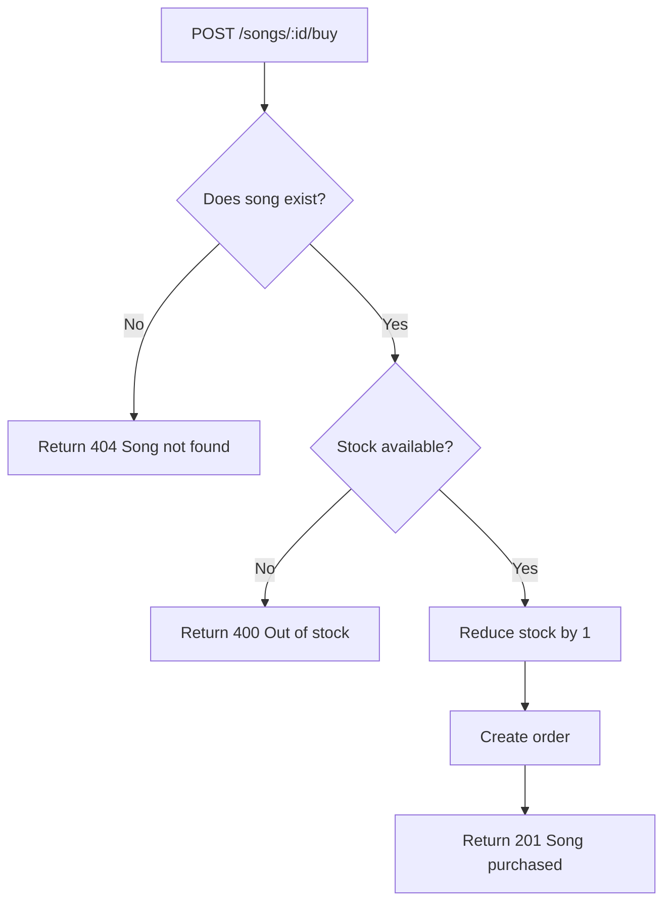
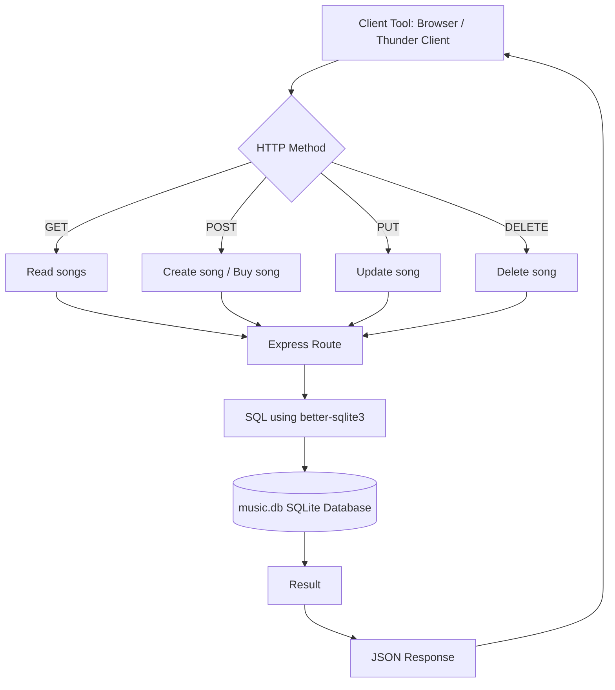

# QHO540 Web Application Development  
## Seminar: REST Web APIs with Node, Express, TypeScript and SQLite

> **Teaching focus:** You only teach the seminar, so this README starts with a quick lecture recap, then moves into a full coding walkthrough.  
> **Student level:** First time / beginner-friendly.  
> **Seminar pattern:** Explain → build together → test together → student tasks → extension challenges.

---

## 0. What students should understand by the end

By the end of this seminar, students should be able to explain and build a small REST API that:

- runs using **Node.js**
- uses **Express** to create API endpoints
- uses **TypeScript** for safer code
- uses **SQLite** as a simple database
- sends and receives **JSON**
- supports the main REST actions:
  - `GET` = read data
  - `POST` = create data
  - `PUT` = update data
  - `DELETE` = remove data

---

# Part 1: Quick Lecture Recap

## 1.1 The big picture: What is a web application?

A web application usually has two main sides:

```text
Client  →  the browser / frontend
Server  →  the backend application
Database → where the data is stored
```

### Architecture diagram



### Simple explanation

When a student opens a web app:

1. The **browser** asks the server for something.
2. The **server** processes the request.
3. The server may ask the **database** for data.
4. The database sends the data back to the server.
5. The server sends a response back to the browser.

---

## 1.2 Client vs Server

| Part | What it does | Examples |
|---|---|---|
| Client | Runs on the user's device/browser | HTML, CSS, JavaScript, React |
| Server | Runs backend logic | Node.js, Express |
| Database | Stores data | SQLite, MySQL, PostgreSQL |

### Teaching line

> The client is what the user sees. The server is where the real business logic happens. The database is where the information lives.

---

## 1.3 What is HTTP?

HTTP is the communication language between the browser and the server.

Example when visiting a page:

```http
GET /about.html HTTP/1.1
Host: www.example.com
```

Meaning:

```text
Browser: Please give me the about.html page.
Server: Here is the response.
```

---

## 1.4 HTTP request and response flow



---

## 1.5 HTTP status codes

Status codes tell the client what happened.

| Status code | Meaning | Simple explanation |
|---|---|---|
| `200 OK` | Success | The request worked |
| `201 Created` | Created | A new record was created |
| `400 Bad Request` | User mistake | The request data is wrong |
| `401 Unauthorized` | Not logged in / no access | User is not allowed |
| `404 Not Found` | Missing data | The requested item does not exist |
| `500 Internal Server Error` | Server error | Something broke on the backend |

### Fun fact

There is also a real HTTP status code called:

```text
418 I'm a teapot
```

It started as an April Fools' joke, but developers still use it as a fun example of HTTP status codes.

---

## 1.6 What is JSON?

JSON means **JavaScript Object Notation**.

It is a simple data format used by APIs.

Example JSON object:

```json
{
  "name": "Tim Smith",
  "username": "2smitt82",
  "course": "Computer Studies"
}
```

Example JSON array:

```json
[
  {
    "name": "Tim Smith",
    "course": "Computer Studies"
  },
  {
    "name": "Jamie Bailey",
    "course": "Computer Studies"
  }
]
```

### Teaching line

> HTML is for displaying pages. JSON is for sending clean data between systems.

---

## 1.7 Why do APIs return JSON instead of HTML?

### HTML response

Good for browsers:

```html
<h1>Wonderwall</h1>
<p>Artist: Oasis</p>
<p>Price: 0.99</p>
```

### JSON response

Good for other applications:

```json
{
  "title": "Wonderwall",
  "artist": "Oasis",
  "price": 0.99
}
```

### Simple explanation

```text
HTML = data + presentation
JSON = data only
```

A mobile app, React app, desktop app, or another website can easily use JSON.

---

## 1.8 What is a Web API?

A Web API is a backend system that provides data through URLs.

Example:

```text
GET /songs
GET /songs/artist/Oasis
GET /songs/1
POST /songs
PUT /songs/1
DELETE /songs/1
```

### Real-world API examples

| API type | Example use |
|---|---|
| Weather API | Weather app shows forecast |
| Airline API | Flight search websites compare prices |
| Music API | Streaming apps search songs |
| Maps API | Apps display locations and routes |
| University API | Student records, modules, marks |

---

## 1.9 What is REST?

REST is a style for designing clean Web APIs.

REST uses:

- clear URLs
- HTTP methods
- HTTP status codes
- JSON responses
- stateless requests

### REST architecture diagram



### Teaching line

> REST is not a programming language. It is a clean way of organising API endpoints.

---

## 1.10 REST method cheat sheet

| Action | HTTP method | Example endpoint | Meaning |
|---|---|---|---|
| Read all songs | `GET` | `/songs` | Get all songs |
| Read one song | `GET` | `/songs/1` | Get song with ID 1 |
| Create song | `POST` | `/songs` | Add a new song |
| Update song | `PUT` | `/songs/1` | Update song with ID 1 |
| Delete song | `DELETE` | `/songs/1` | Delete song with ID 1 |

---

# Part 2: Seminar Plan

## 2.1 How to run the seminar

Use this structure:

```text
1. Quick recap of lecture concepts
2. Explain what we are building
3. Set up the project together
4. Build Hello World Express API
5. Add SQLite database
6. Add GET endpoints
7. Students complete GET tasks
8. Add POST, PUT, DELETE endpoints
9. Students test using Thunder Client / RESTer / curl
10. Extension task: buy a song
```

---

## 2.2 What we are building today

We will build a small **Music Store REST API**.

The API will manage songs.

Each song will have:

```text
id
title
artist
price
quantity_in_stock
```

Later, we will also create orders when a user buys a song.

---

## 2.3 API endpoint architecture



---

# Part 3: Environment Setup

## 3.1 What students need installed

Students need:

1. **Visual Studio Code**
2. **Node.js LTS**
3. **npm**
4. **TypeScript**
5. **tsx**
6. **Thunder Client** VS Code extension, RESTer, or curl/Postman

---

## 3.2 Check Node.js and npm

Open VS Code terminal and run:

```bash
node -v
```

Then:

```bash
npm -v
```

If both show versions, Node and npm are installed.

Example:

```text
v22.0.0
10.0.0
```

If Node is not installed, download the **LTS version** from the official Node.js website.

---

## 3.3 Install TypeScript and tsx globally

Run:

```bash
npm install -g typescript tsx
```

Check TypeScript:

```bash
tsc --version
```

Check tsx:

```bash
tsx --version
```

---

## 3.4 Core difference between `tsc` and `tsx`

```text
tsc = checks / compiles TypeScript
tsx = runs TypeScript directly
```

### Beginner explanation

```text
tsc checks if the TypeScript code is correct.
tsx runs the TypeScript code and shows console output.
```

Example:

```bash
tsc --noEmit server.ts
```

Means:

```text
Check the file, but do not create JavaScript output.
```

Example:

```bash
tsx server.ts
```

Means:

```text
Run the TypeScript file.
```

---

# Part 4: Create the Project from Scratch

## 4.1 Create a folder

```bash
mkdir qho540-rest-api-seminar
cd qho540-rest-api-seminar
```

Open the folder in VS Code:

```bash
code .
```

If `code .` does not work, open VS Code manually and choose:

```text
File → Open Folder → qho540-rest-api-seminar
```

---

## 4.2 Create a Node project

```bash
npm init -y
```

This creates:

```text
package.json
```

`package.json` keeps track of project settings and installed packages.

---

## 4.3 Install Express and SQLite package

```bash
npm install express better-sqlite3
```

### What these do

| Package | Purpose |
|---|---|
| `express` | Creates the web server and API routes |
| `better-sqlite3` | Lets Node.js talk to SQLite database files |

---

## 4.4 Install TypeScript development packages

```bash
npm install -D typescript tsx @types/node @types/express @types/better-sqlite3
```

### What these do

| Package | Purpose |
|---|---|
| `typescript` | TypeScript compiler/checker |
| `tsx` | Runs TypeScript files directly |
| `@types/node` | Type definitions for Node.js |
| `@types/express` | Type definitions for Express |
| `@types/better-sqlite3` | Type definitions for better-sqlite3 |

### Core tech fact

> TypeScript needs type definitions to understand third-party libraries properly.

For many JavaScript packages, the type information lives in packages starting with:

```text
@types/
```

---

## 4.5 Create TypeScript config file

Create a file called:

```text
tsconfig.json
```

Add:

```json
{
  "compilerOptions": {
    "target": "ES2022",
    "module": "ESNext",
    "moduleResolution": "Bundler",
    "strict": true,
    "noEmit": true,
    "esModuleInterop": true,
    "skipLibCheck": true
  },
  "include": ["src/**/*.ts"]
}
```

### Explain the important parts

| Option | Meaning |
|---|---|
| `strict` | TypeScript checks more carefully |
| `noEmit` | Do not create `.js` files when checking |
| `esModuleInterop` | Makes Express import work nicely with TypeScript |
| `include` | TypeScript checks files inside `src` |

---

## 4.6 Update package.json scripts

Open `package.json` and update the scripts section:

```json
{
  "scripts": {
    "dev": "tsx src/server.ts",
    "check": "tsc",
    "start": "tsx src/server.ts"
  }
}
```

Your full `package.json` will also contain dependencies, so do not delete those.

### How students will use this

```bash
npm run check
```

Checks TypeScript.

```bash
npm run dev
```

Runs the server.

---

## 4.7 Create source folder

```bash
mkdir src
```

Create this file:

```text
src/server.ts
```

---

# Part 5: First API - Hello World with Express

## 5.1 Add Hello World server

Put this inside `src/server.ts`:

```ts
import express from 'express';

const app = express();
const PORT = 3000;

app.get('/', (req, res) => {
  res.send('Hello World from Express and TypeScript!');
});

app.listen(PORT, () => {
  console.log(`Server listening on http://localhost:${PORT}`);
});
```

---

## 5.2 Check the TypeScript

Run:

```bash
npm run check
```

If there is no output, that is good.

### Important teaching point

```text
No output from tsc usually means no TypeScript errors.
```

---

## 5.3 Run the server

Run:

```bash
npm run dev
```

Expected terminal output:

```text
Server listening on http://localhost:3000
```

---

## 5.4 Test in browser

Open:

```text
http://localhost:3000
```

Expected output:

```text
Hello World from Express and TypeScript!
```

---

## 5.5 What just happened?



---

# Part 6: Build the Music Store API Step by Step

In this part, we will build the Music Store REST API slowly.

We will **not** paste one huge server file at the beginning.

Instead, we will build it like LEGO blocks:

```text
Step 1  → Start a basic Express server
Step 2  → Return JSON
Step 3  → Connect SQLite
Step 4  → Create a songs table
Step 5  → Add sample songs
Step 6  → Create GET routes
Step 7  → Create POST route
Step 8  → Create PUT route
Step 9  → Create DELETE route
Step 10 → Optional buy route
```

This is easier for beginners because after each small step, we can run the server and see a result.

---

## What are we building?

We are building a simple **Music Store API**.

The API will allow us to:

```text
View all songs
Search songs by artist
Search songs by title
Find one song by ID
Add a new song
Update a song
Delete a song
Buy a song
```

---

## Simple Architecture Diagram



### Explanation

The client sends a request.

The Express server receives the request.

The server talks to the SQLite database.

The database sends results back to the server.

The server sends JSON back to the client.

---

## REST API Request Flow



---

# 6.1 Stop the server first

Before editing the server code, stop the running server.

In the terminal, press:

```bash
CTRL + C
```

Now open this file:

```text
src/server.ts
```

We will rebuild it slowly.

---

# 6.2 Step 1 — Create a basic Express server

First, replace `src/server.ts` with this very simple code:

```ts
import express from 'express';

const app = express();
const PORT = 3000;

app.get('/', (req, res) => {
  res.send('Music Store API is running!');
});

app.listen(PORT, () => {
  console.log(`Server running on http://localhost:${PORT}`);
});
```

Now run the server:

```bash
npm run dev
```

Open this in the browser:

```text
http://localhost:3000
```

Expected output:

```text
Music Store API is running!
```

---

## Teaching point

This is our first Express route.

```ts
app.get('/', (req, res) => {
  res.send('Music Store API is running!');
});
```

Meaning:

```text
When the user visits /
send back this message
```

---

## Quick class question

Ask students:

```text
What is the client here?
What is the server here?
What is the response?
```

Expected discussion:

```text
Client = Browser
Server = Express app
Response = Music Store API is running!
```

---

# 6.3 Step 2 — Return JSON instead of plain text

A Web API usually returns **JSON**, not HTML or plain text.

Change the home route to this:

```ts
app.get('/', (req, res) => {
  res.json({
    message: 'Music Store API is running!',
    module: 'QHO540 Web Application Development'
  });
});
```

Your full code should now look like this:

```ts
import express from 'express';

const app = express();
const PORT = 3000;

app.get('/', (req, res) => {
  res.json({
    message: 'Music Store API is running!',
    module: 'QHO540 Web Application Development'
  });
});

app.listen(PORT, () => {
  console.log(`Server running on http://localhost:${PORT}`);
});
```

Now test again:

```text
http://localhost:3000
```

Expected output:

```json
{
  "message": "Music Store API is running!",
  "module": "QHO540 Web Application Development"
}
```

---

## Teaching point

A normal website often returns HTML.

A Web API usually returns JSON.

```text
Website response = HTML for humans
API response = JSON for apps
```

---

## Fun tech fact

Most modern apps use APIs.

When you open apps like Spotify, Uber, Netflix, Amazon, or a university portal, the front-end usually asks the back-end API for data.

The data is commonly sent as JSON.

---

# 6.4 Step 3 — Add SQLite database connection

Now we will connect our Express server to SQLite.

At the top of `src/server.ts`, add this import:

```ts
import Database from 'better-sqlite3';
```

Then below the `PORT` line, add:

```ts
const db = new Database('music.db');
```

Your code should now look like this:

```ts
import express from 'express';
import Database from 'better-sqlite3';

const app = express();
const PORT = 3000;

const db = new Database('music.db');

app.get('/', (req, res) => {
  res.json({
    message: 'Music Store API is running!',
    module: 'QHO540 Web Application Development'
  });
});

app.listen(PORT, () => {
  console.log(`Server running on http://localhost:${PORT}`);
});
```

Run:

```bash
npm run dev
```

---

## Teaching point

This line creates or opens a SQLite database file:

```ts
const db = new Database('music.db');
```

If `music.db` does not exist, it will be created.

---

## Simple explanation

SQLite is a small database stored as a file.

```text
music.db = our database file
```

It is good for learning because we do not need to install a full database server.

---

# 6.5 Step 4 — Create the songs table

Now we will create a table to store songs.

Add this code after the database connection:

```ts
db.exec(`
  CREATE TABLE IF NOT EXISTS songs (
    id INTEGER PRIMARY KEY AUTOINCREMENT,
    title TEXT NOT NULL,
    artist TEXT NOT NULL,
    price REAL NOT NULL,
    quantity_in_stock INTEGER NOT NULL
  );
`);
```

Your code should now look like this:

```ts
import express from 'express';
import Database from 'better-sqlite3';

const app = express();
const PORT = 3000;

const db = new Database('music.db');

db.exec(`
  CREATE TABLE IF NOT EXISTS songs (
    id INTEGER PRIMARY KEY AUTOINCREMENT,
    title TEXT NOT NULL,
    artist TEXT NOT NULL,
    price REAL NOT NULL,
    quantity_in_stock INTEGER NOT NULL
  );
`);

app.get('/', (req, res) => {
  res.json({
    message: 'Music Store API is running!',
    module: 'QHO540 Web Application Development'
  });
});

app.listen(PORT, () => {
  console.log(`Server running on http://localhost:${PORT}`);
});
```

Run:

```bash
npm run dev
```

---

## Teaching point

This creates a table called `songs`.

Each song will have:

```text
id
title
artist
price
quantity_in_stock
```

---

## Table structure

| Column            | Type    | Meaning                             |
| ----------------- | ------- | ----------------------------------- |
| id                | INTEGER | Unique song ID                      |
| title             | TEXT    | Song title                          |
| artist            | TEXT    | Artist name                         |
| price             | REAL    | Song price                          |
| quantity_in_stock | INTEGER | Number of physical copies available |

---

## Important explanation

```sql
CREATE TABLE IF NOT EXISTS
```

means:

```text
Create this table only if it does not already exist.
```

So the table will not be recreated every time we restart the server.

---

# 6.6 Step 5 — Add sample songs

At the moment, the database has a table, but no data.

Now add sample songs.

Place this after the table creation code:

```ts
const songCount = db.prepare('SELECT COUNT(*) AS count FROM songs').get() as { count: number };

if (songCount.count === 0) {
  const insert = db.prepare(`
    INSERT INTO songs (title, artist, price, quantity_in_stock)
    VALUES (?, ?, ?, ?)
  `);

  insert.run('Wonderwall', 'Oasis', 0.99, 10);
  insert.run('Shape of You', 'Ed Sheeran', 1.29, 15);
  insert.run('Blinding Lights', 'The Weeknd', 1.19, 8);
  insert.run('Hello', 'Adele', 1.09, 12);
}
```

---

## What does this do?

This line checks how many songs are currently in the table:

```ts
const songCount = db.prepare('SELECT COUNT(*) AS count FROM songs').get() as { count: number };
```

This condition checks whether the table is empty:

```ts
if (songCount.count === 0) {
```

If the table is empty, we insert sample songs.

---

## Why do we check if the table is empty?

If we do not check this, every time we restart the server, the same songs will be inserted again.

That would create duplicates.

```text
Without checking:
Restart 1 → 4 songs
Restart 2 → 8 songs
Restart 3 → 12 songs
```

So we only insert starter data once.

---

# 6.7 Step 6 — Create a TypeScript interface for Song

Now we will tell TypeScript what a song should look like.

Add this before the routes:

```ts
interface Song {
  id: number;
  title: string;
  artist: string;
  price: number;
  quantity_in_stock: number;
}
```

---

## Teaching point

An interface is like a contract.

It says:

```text
If something is a Song,
it should have these properties.
```

```text
id must be a number
title must be a string
artist must be a string
price must be a number
quantity_in_stock must be a number
```

---

## Real-world analogy

An interface is like a form.

For example, a student registration form may require:

```text
student ID
name
course
email
```

If required information is missing, the form is incomplete.

Similarly, a `Song` should follow the structure we define.

---

# 6.8 Current code checkpoint

At this stage, your `src/server.ts` should look like this:

```ts
import express from 'express';
import Database from 'better-sqlite3';

const app = express();
const PORT = 3000;

const db = new Database('music.db');

interface Song {
  id: number;
  title: string;
  artist: string;
  price: number;
  quantity_in_stock: number;
}

db.exec(`
  CREATE TABLE IF NOT EXISTS songs (
    id INTEGER PRIMARY KEY AUTOINCREMENT,
    title TEXT NOT NULL,
    artist TEXT NOT NULL,
    price REAL NOT NULL,
    quantity_in_stock INTEGER NOT NULL
  );
`);

const songCount = db.prepare('SELECT COUNT(*) AS count FROM songs').get() as { count: number };

if (songCount.count === 0) {
  const insert = db.prepare(`
    INSERT INTO songs (title, artist, price, quantity_in_stock)
    VALUES (?, ?, ?, ?)
  `);

  insert.run('Wonderwall', 'Oasis', 0.99, 10);
  insert.run('Shape of You', 'Ed Sheeran', 1.29, 15);
  insert.run('Blinding Lights', 'The Weeknd', 1.19, 8);
  insert.run('Hello', 'Adele', 1.09, 12);
}

app.get('/', (req, res) => {
  res.json({
    message: 'Music Store API is running!',
    module: 'QHO540 Web Application Development'
  });
});

app.listen(PORT, () => {
  console.log(`Server running on http://localhost:${PORT}`);
});
```

Run:

```bash
npm run dev
```

Open:

```text
http://localhost:3000
```

Expected output:

```json
{
  "message": "Music Store API is running!",
  "module": "QHO540 Web Application Development"
}
```

---

# 6.9 Step 7 — GET all songs

Now we will create our first real API endpoint.

Add this route before `app.listen()`:

```ts
app.get('/songs', (req, res) => {
  const stmt = db.prepare('SELECT * FROM songs');
  const songs = stmt.all() as Song[];

  res.json(songs);
});
```

---

## Full section with the new route

```ts
app.get('/', (req, res) => {
  res.json({
    message: 'Music Store API is running!',
    module: 'QHO540 Web Application Development'
  });
});

app.get('/songs', (req, res) => {
  const stmt = db.prepare('SELECT * FROM songs');
  const songs = stmt.all() as Song[];

  res.json(songs);
});
```

Restart the server if needed:

```bash
npm run dev
```

Open in the browser:

```text
http://localhost:3000/songs
```

Expected output:

```json
[
  {
    "id": 1,
    "title": "Wonderwall",
    "artist": "Oasis",
    "price": 0.99,
    "quantity_in_stock": 10
  },
  {
    "id": 2,
    "title": "Shape of You",
    "artist": "Ed Sheeran",
    "price": 1.29,
    "quantity_in_stock": 15
  }
]
```

The exact IDs may be different depending on your database.

---

## Teaching point

This is the route:

```ts
app.get('/songs', (req, res) => {
```

It means:

```text
When the client sends GET /songs,
run this function.
```

This line prepares the SQL:

```ts
const stmt = db.prepare('SELECT * FROM songs');
```

This line runs the SQL:

```ts
const songs = stmt.all() as Song[];
```

This line sends the result as JSON:

```ts
res.json(songs);
```

---

## Request-response flow

```mermaid
flowchart TD
    A[Browser requests /songs] --> B[Express route: app.get('/songs')]
    B --> C[SQL: SELECT * FROM songs]
    C --> D[SQLite returns song rows]
    D --> E[Express sends JSON]
    E --> F[Browser displays JSON]
```

---

## Good moment to make them happy

Tell students:

```text
You have now built your first database-powered REST API endpoint.
```

This is a big checkpoint.

---

# 6.10 Step 8 — GET songs by artist

Now we will search songs by artist.

Add this route before `app.listen()`:

```ts
app.get('/songs/artist/:artist', (req, res) => {
  const stmt = db.prepare('SELECT * FROM songs WHERE artist = ?');
  const songs = stmt.all(req.params.artist) as Song[];

  res.json(songs);
});
```

Test in browser:

```text
http://localhost:3000/songs/artist/Oasis
```

Expected output:

```json
[
  {
    "id": 1,
    "title": "Wonderwall",
    "artist": "Oasis",
    "price": 0.99,
    "quantity_in_stock": 10
  }
]
```

---

## Teaching point

In this route:

```ts
app.get('/songs/artist/:artist', ...)
```

`:artist` is a route parameter.

It means this part of the URL is dynamic.

Example:

```text
/songs/artist/Oasis
```

So:

```ts
req.params.artist
```

contains:

```text
Oasis
```

---

## Mini diagram

```text
URL:
http://localhost:3000/songs/artist/Oasis

Express reads:
artist = Oasis

SQL becomes:
SELECT * FROM songs WHERE artist = 'Oasis'
```

---

## Very important security point

We use this:

```ts
WHERE artist = ?
```

Instead of building SQL like this:

```ts
"SELECT * FROM songs WHERE artist = " + req.params.artist
```

The `?` is a placeholder.

It helps protect the database from SQL injection attacks.

---

## Tech fact

SQL injection is one of the most famous web security problems.

Prepared statements help prevent this by separating the SQL command from the user input.

---

# 6.11 Step 9 — GET songs by title

Now we will search songs by title.

Add this route:

```ts
app.get('/songs/title/:title', (req, res) => {
  const stmt = db.prepare('SELECT * FROM songs WHERE title = ?');
  const songs = stmt.all(req.params.title) as Song[];

  res.json(songs);
});
```

Test:

```text
http://localhost:3000/songs/title/Wonderwall
```

Expected output:

```json
[
  {
    "id": 1,
    "title": "Wonderwall",
    "artist": "Oasis",
    "price": 0.99,
    "quantity_in_stock": 10
  }
]
```

---

## Teaching point

This is the same pattern as searching by artist.

Only the field changes:

```text
artist search → WHERE artist = ?
title search  → WHERE title = ?
```

---

# 6.12 Step 10 — GET one song by ID

Now we will search for one song using its ID.

Add this route after the artist and title routes:

```ts
app.get('/songs/:id', (req, res) => {
  const stmt = db.prepare('SELECT * FROM songs WHERE id = ?');
  const song = stmt.get(req.params.id) as Song | undefined;

  if (!song) {
    return res.status(404).json({
      error: 'Song not found'
    });
  }

  res.json(song);
});
```

Test a valid ID:

```text
http://localhost:3000/songs/1
```

Expected output:

```json
{
  "id": 1,
  "title": "Wonderwall",
  "artist": "Oasis",
  "price": 0.99,
  "quantity_in_stock": 10
}
```

Test an invalid ID:

```text
http://localhost:3000/songs/999
```

Expected output:

```json
{
  "error": "Song not found"
}
```

---

## Teaching point

Here we use:

```ts
stmt.get()
```

instead of:

```ts
stmt.all()
```

Simple rule:

```text
stmt.all() = many rows, returns an array
stmt.get() = one row, returns one object
stmt.run() = used for INSERT, UPDATE, DELETE
```

---

## Why do we use 404?

If a song does not exist, we send:

```ts
res.status(404)
```

404 means:

```text
Not Found
```

This is the correct REST response when a resource cannot be found.

---

# 6.13 Important route order warning

This route:

```ts
app.get('/songs/:id', ...)
```

should come **after** these routes:

```ts
app.get('/songs/artist/:artist', ...)
app.get('/songs/title/:title', ...)
```

Why?

Because `/songs/:id` is very general.

Express may treat anything after `/songs/` as an ID.

So keep the route order like this:

```text
/songs
/songs/artist/:artist
/songs/title/:title
/songs/:id
```

---

# 6.14 Mini checkpoint

At this point, students can test all these endpoints in the browser:

```text
GET http://localhost:3000/
GET http://localhost:3000/songs
GET http://localhost:3000/songs/artist/Oasis
GET http://localhost:3000/songs/title/Wonderwall
GET http://localhost:3000/songs/1
GET http://localhost:3000/songs/999
```

---

## Pause and ask students

```text
What does GET do?
What does :artist mean?
What is req.params.artist?
What is JSON?
What does 404 mean?
What does SQLite do here?
```

---

# 6.15 Step 11 — Add simple error handling with try/catch

The code works, but real servers should handle errors.

For example, change the `/songs` route to this:

```ts
app.get('/songs', (req, res) => {
  try {
    const stmt = db.prepare('SELECT * FROM songs');
    const songs = stmt.all() as Song[];

    res.json(songs);
  } catch (error) {
    console.error(error);
    res.status(500).json({
      error: 'Internal server error'
    });
  }
});
```

---

## Teaching point

```text
try = try to run this code
catch = if something breaks, handle the error
```

500 means:

```text
Internal Server Error
```

This usually means something went wrong on the server.

---

## Do we need to add try/catch to every route now?

For learning, not immediately.

First understand the route logic.

Then slowly add error handling.

---

# 6.16 Step 12 — Allow Express to read JSON request bodies

So far, we have used GET routes.

Now we will create a POST route.

POST is used to create new data.

But first, we must tell Express to read JSON from the request body.

Add this near the top, after creating the app:

```ts
app.use(express.json());
```

So the top part should look like this:

```ts
const app = express();
const PORT = 3000;

app.use(express.json());
```

---

## Teaching point

Without this line:

```ts
app.use(express.json());
```

Express cannot read JSON sent in the request body.

---

## GET vs POST

```text
GET  = retrieve data
POST = create new data
```

Example:

```text
GET /songs       → show all songs
POST /songs      → add a new song
```

---

# 6.17 Step 13 — POST add a new song

Add this route before `app.listen()`:

```ts
app.post('/songs', (req, res) => {
  const { title, artist, price, quantity_in_stock } = req.body;

  const stmt = db.prepare(`
    INSERT INTO songs (title, artist, price, quantity_in_stock)
    VALUES (?, ?, ?, ?)
  `);

  const info = stmt.run(title, artist, price, quantity_in_stock);

  res.status(201).json({
    message: 'Song created',
    id: info.lastInsertRowid
  });
});
```

---

## Testing POST

You cannot properly test POST by typing the URL in the browser.

A browser address bar sends a GET request.

For POST, use one of these tools:

```text
Thunder Client in VS Code
RESTer
Postman
curl
```

For class, Thunder Client is usually the easiest inside VS Code.

---

## Thunder Client setup

In VS Code:

```text
Extensions → Search Thunder Client → Install
```

Then open:

```text
Thunder Client → New Request
```

Use:

```text
Method: POST
URL: http://localhost:3000/songs
```

Go to Body → JSON and enter:

```json
{
  "title": "Perfect",
  "artist": "Ed Sheeran",
  "price": 1.25,
  "quantity_in_stock": 20
}
```

Click:

```text
Send
```

Expected response:

```json
{
  "message": "Song created",
  "id": 5
}
```

Now test in the browser:

```text
http://localhost:3000/songs
```

You should see the new song in the list.

---

## Teaching point

This line reads data from the request body:

```ts
const { title, artist, price, quantity_in_stock } = req.body;
```

This line inserts the song into the database:

```ts
const info = stmt.run(title, artist, price, quantity_in_stock);
```

This sends a success response:

```ts
res.status(201).json({
  message: 'Song created',
  id: info.lastInsertRowid
});
```

201 means:

```text
Created
```

---

# 6.18 Step 14 — Add simple validation

The POST route works, but it currently trusts the user too much.

What if the user sends incomplete data?

For example:

```json
{
  "title": "Bad Song"
}
```

We should reject this.

Replace the POST route with this improved version:

```ts
app.post('/songs', (req, res) => {
  const { title, artist, price, quantity_in_stock } = req.body;

  if (!title || !artist || typeof price !== 'number' || typeof quantity_in_stock !== 'number') {
    return res.status(400).json({
      error: 'title, artist, price and quantity_in_stock are required.'
    });
  }

  const stmt = db.prepare(`
    INSERT INTO songs (title, artist, price, quantity_in_stock)
    VALUES (?, ?, ?, ?)
  `);

  const info = stmt.run(title, artist, price, quantity_in_stock);

  res.status(201).json({
    message: 'Song created',
    id: info.lastInsertRowid
  });
});
```

Now test with bad data:

```json
{
  "title": "Bad Song"
}
```

Expected response:

```json
{
  "error": "title, artist, price and quantity_in_stock are required."
}
```

---

## Teaching point

400 means:

```text
Bad Request
```

This means the client sent invalid or incomplete data.

---

# 6.19 Step 15 — PUT update a song

PUT is used to update existing data.

Add this route before `app.listen()`:

```ts
app.put('/songs/:id', (req, res) => {
  const { price, quantity_in_stock } = req.body;

  if (typeof price !== 'number' || typeof quantity_in_stock !== 'number') {
    return res.status(400).json({
      error: 'price and quantity_in_stock must be numbers.'
    });
  }

  const stmt = db.prepare(`
    UPDATE songs
    SET price = ?, quantity_in_stock = ?
    WHERE id = ?
  `);

  const info = stmt.run(price, quantity_in_stock, req.params.id);

  if (info.changes === 1) {
    res.json({
      message: 'Song updated'
    });
  } else {
    res.status(404).json({
      error: 'Song not found'
    });
  }
});
```

---

## Testing PUT

Use Thunder Client:

```text
Method: PUT
URL: http://localhost:3000/songs/1
```

Body JSON:

```json
{
  "price": 1.49,
  "quantity_in_stock": 50
}
```

Expected response:

```json
{
  "message": "Song updated"
}
```

Now check in the browser:

```text
http://localhost:3000/songs/1
```

You should see the updated price and quantity.

---

## Teaching point

PUT updates existing data.

```text
POST = create new data
PUT  = update existing data
```

This line tells us whether anything was updated:

```ts
info.changes
```

If one row changed, update was successful.

If zero rows changed, the song ID was not found.

---

# 6.20 Step 16 — DELETE a song

DELETE is used to remove data.

Add this route before `app.listen()`:

```ts
app.delete('/songs/:id', (req, res) => {
  const stmt = db.prepare('DELETE FROM songs WHERE id = ?');
  const info = stmt.run(req.params.id);

  if (info.changes === 1) {
    res.json({
      message: 'Song deleted'
    });
  } else {
    res.status(404).json({
      error: 'Song not found'
    });
  }
});
```

---

## Testing DELETE

Use Thunder Client:

```text
Method: DELETE
URL: http://localhost:3000/songs/5
```

Expected response:

```json
{
  "message": "Song deleted"
}
```

Now check:

```text
http://localhost:3000/songs
```

The deleted song should no longer appear.

---

## Teaching point

DELETE usually uses the ID in the URL.

```text
DELETE /songs/5
```

means:

```text
Delete the song with ID 5
```

---

# 6.21 GET, POST, PUT, DELETE Summary

| Method | Purpose       | Example           | Meaning               |
| ------ | ------------- | ----------------- | --------------------- |
| GET    | Read data     | GET `/songs`      | Get all songs         |
| GET    | Read one item | GET `/songs/1`    | Get song with ID 1    |
| POST   | Create data   | POST `/songs`     | Add a new song        |
| PUT    | Update data   | PUT `/songs/1`    | Update song with ID 1 |
| DELETE | Delete data   | DELETE `/songs/1` | Delete song with ID 1 |

---

## Simple memory trick

```text
GET    = give me data
POST   = create this
PUT    = update this
DELETE = remove this
```

---

# 6.22 Step 17 — Optional challenge: Buy a song

This route is slightly more advanced.

Only do this if students are comfortable with GET, POST, PUT and DELETE.

The goal:

```text
When a user buys a song:
1. Check if the song exists
2. Check if stock is available
3. Reduce quantity_in_stock by 1
4. Create an order record
```

---

## First, create the orders table

Update your `db.exec()` section to include this second table:

```ts
db.exec(`
  CREATE TABLE IF NOT EXISTS songs (
    id INTEGER PRIMARY KEY AUTOINCREMENT,
    title TEXT NOT NULL,
    artist TEXT NOT NULL,
    price REAL NOT NULL,
    quantity_in_stock INTEGER NOT NULL
  );

  CREATE TABLE IF NOT EXISTS orders (
    id INTEGER PRIMARY KEY AUTOINCREMENT,
    song_id INTEGER NOT NULL,
    quantity INTEGER NOT NULL,
    created_at TEXT DEFAULT CURRENT_TIMESTAMP
  );
`);
```

---

## Add the buy route

Add this route before `app.listen()`:

```ts
app.post('/songs/:id/buy', (req, res) => {
  const song = db.prepare('SELECT * FROM songs WHERE id = ?').get(req.params.id) as Song | undefined;

  if (!song) {
    return res.status(404).json({
      error: 'Song not found'
    });
  }

  if (song.quantity_in_stock <= 0) {
    return res.status(400).json({
      error: 'Song is out of stock'
    });
  }

  db.prepare(`
    UPDATE songs
    SET quantity_in_stock = quantity_in_stock - 1
    WHERE id = ?
  `).run(req.params.id);

  const orderInfo = db.prepare(`
    INSERT INTO orders (song_id, quantity)
    VALUES (?, ?)
  `).run(req.params.id, 1);

  res.status(201).json({
    message: 'Song purchased',
    orderId: orderInfo.lastInsertRowid
  });
});
```

---

## Testing the buy route

Use Thunder Client:

```text
Method: POST
URL: http://localhost:3000/songs/1/buy
```

No body is needed for now.

Expected response:

```json
{
  "message": "Song purchased",
  "orderId": 1
}
```

Now check:

```text
GET http://localhost:3000/songs/1
```

The `quantity_in_stock` should reduce by 1.

---

## Buy route flowchart



---

# 6.23 Student practice tasks

After you demonstrate the main parts, ask students to complete these tasks.

---

## Task 1 — Add one more sample song

Add this inside the starter data section:

```ts
insert.run('Someone Like You', 'Adele', 1.15, 7);
```

Then restart the server and check:

```text
http://localhost:3000/songs
```

---

## Task 2 — Search for Adele

Test:

```text
http://localhost:3000/songs/artist/Adele
```

Expected result:

```text
Only Adele songs should appear.
```

---

## Task 3 — Search for a song that does not exist

Test:

```text
http://localhost:3000/songs/999
```

Expected result:

```json
{
  "error": "Song not found"
}
```

---

## Task 4 — Add a new song using POST

Use Thunder Client:

```text
POST http://localhost:3000/songs
```

Body:

```json
{
  "title": "Counting Stars",
  "artist": "OneRepublic",
  "price": 1.35,
  "quantity_in_stock": 9
}
```

Then check:

```text
GET http://localhost:3000/songs
```

---

## Task 5 — Update the song price

Use Thunder Client:

```text
PUT http://localhost:3000/songs/1
```

Body:

```json
{
  "price": 1.99,
  "quantity_in_stock": 30
}
```

Then check:

```text
GET http://localhost:3000/songs/1
```

---

## Task 6 — Delete a song

Use Thunder Client:

```text
DELETE http://localhost:3000/songs/2
```

Then check:

```text
GET http://localhost:3000/songs
```

---

# 6.24 Extension challenges

Give these to students who finish early.

---

## Challenge 1 — Search by artist and title

Create this endpoint:

```text
GET /songs/search?artist=Oasis&title=Wonderwall
```

Starter code:

```ts
app.get('/songs/search', (req, res) => {
  const artist = req.query.artist;
  const title = req.query.title;

  if (typeof artist !== 'string' || typeof title !== 'string') {
    return res.status(400).json({
      error: 'Please provide artist and title.'
    });
  }

  const stmt = db.prepare('SELECT * FROM songs WHERE artist = ? AND title = ?');
  const songs = stmt.all(artist, title) as Song[];

  res.json(songs);
});
```

Important:

This route should be placed before:

```ts
app.get('/songs/:id', ...)
```

---

## Challenge 2 — Add GET orders route

Create an endpoint to view all orders:

```text
GET /orders
```

Starter code:

```ts
app.get('/orders', (req, res) => {
  const orders = db.prepare('SELECT * FROM orders').all();
  res.json(orders);
});
```

---

## Challenge 3 — Improve validation

Improve the POST route so that:

```text
price cannot be less than 0
quantity_in_stock cannot be less than 0
title cannot be empty
artist cannot be empty
```

---

# 6.25 Common errors and fixes

## Error 1 — Cannot find module express

Install Express:

```bash
npm install express
npm install -D @types/express
```

---

## Error 2 — Cannot find module better-sqlite3

Install better-sqlite3:

```bash
npm install better-sqlite3
npm install -D @types/better-sqlite3
```

---

## Error 3 — Port already in use

You may already have a server running.

Stop it with:

```bash
CTRL + C
```

Then run again:

```bash
npm run dev
```

---

## Error 4 — POST body is undefined

Make sure this line exists near the top:

```ts
app.use(express.json());
```

Without it, Express cannot read JSON from the request body.

---

## Error 5 — Browser cannot test POST, PUT or DELETE

Typing a URL in the browser sends a GET request.

Use:

```text
Thunder Client
RESTer
Postman
curl
```

---

# 6.26 Final recap

By the end of this part, we have created a working REST API.

We used:

```text
Node.js to run JavaScript/TypeScript on the server
Express to create API routes
SQLite to store data
better-sqlite3 to connect Node with SQLite
JSON to send data back to the client
HTTP methods to control what action happens
```

---

## Final architecture



---

## What students should remember

```text
GET    = read data
POST   = create data
PUT    = update data
DELETE = remove data
```

```text
Express route = URL + function
SQLite = database file
JSON = data format sent back to client
TypeScript = safer JavaScript
```

---

## Final confidence message

If you have reached this point, you have built a real REST API.

This is the same basic idea behind many real-world systems:

```text
Music apps
Food delivery apps
Booking systems
University portals
Shopping websites
Banking dashboards
```

The scale may be bigger, but the core idea is the same:

```text
Client sends request
Server processes it
Database stores or returns data
Server sends JSON response
```
