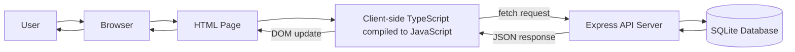
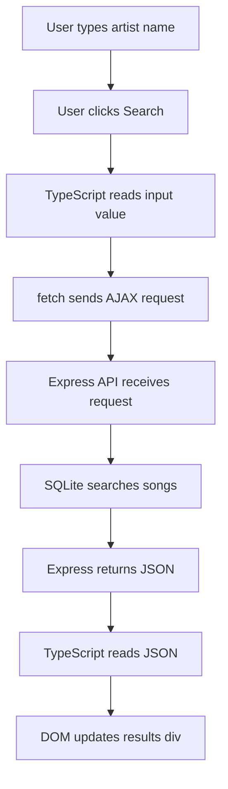
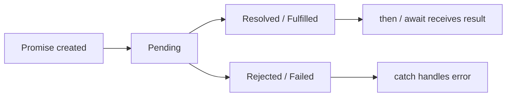
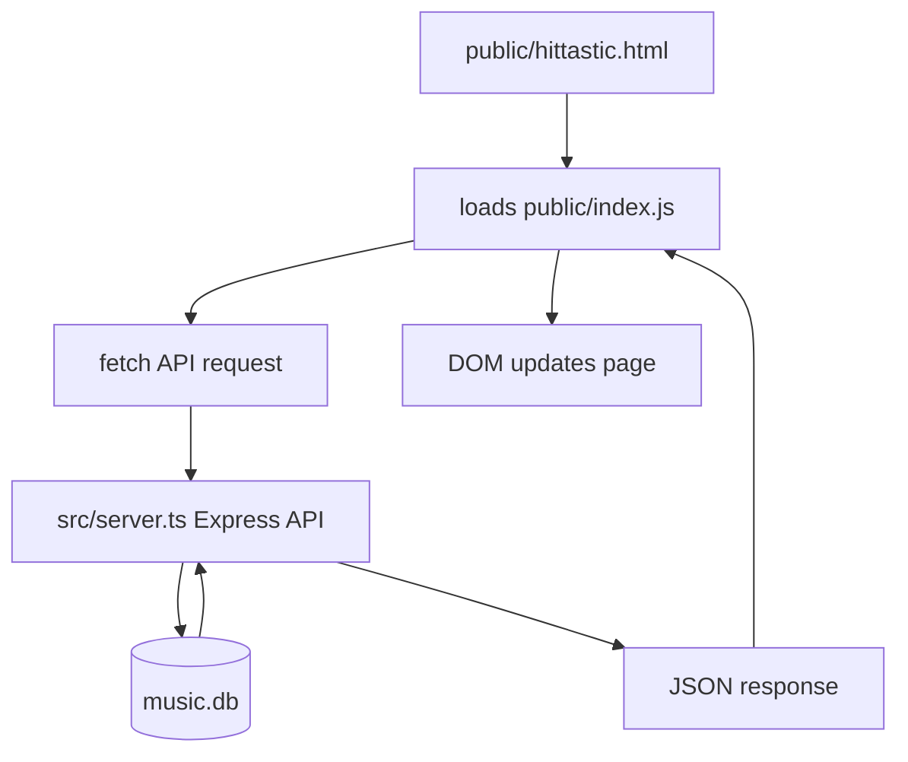
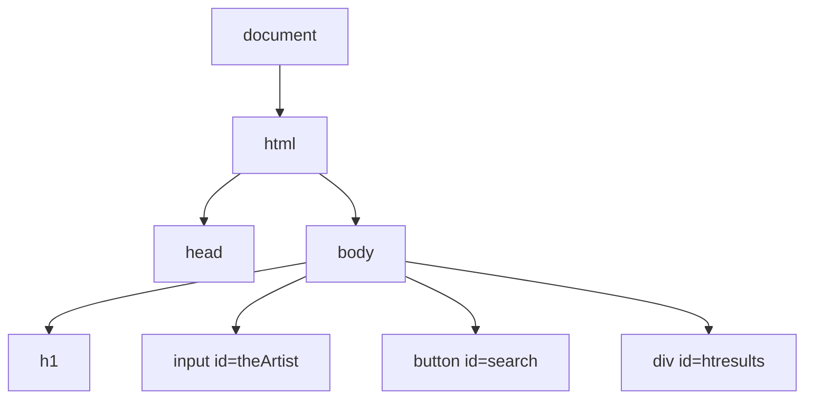
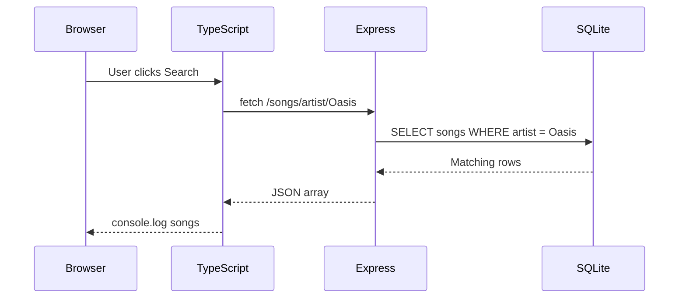
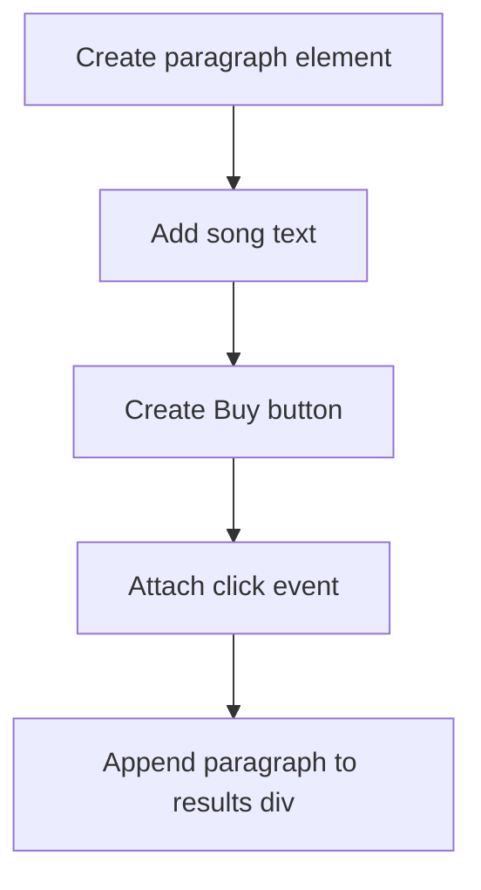
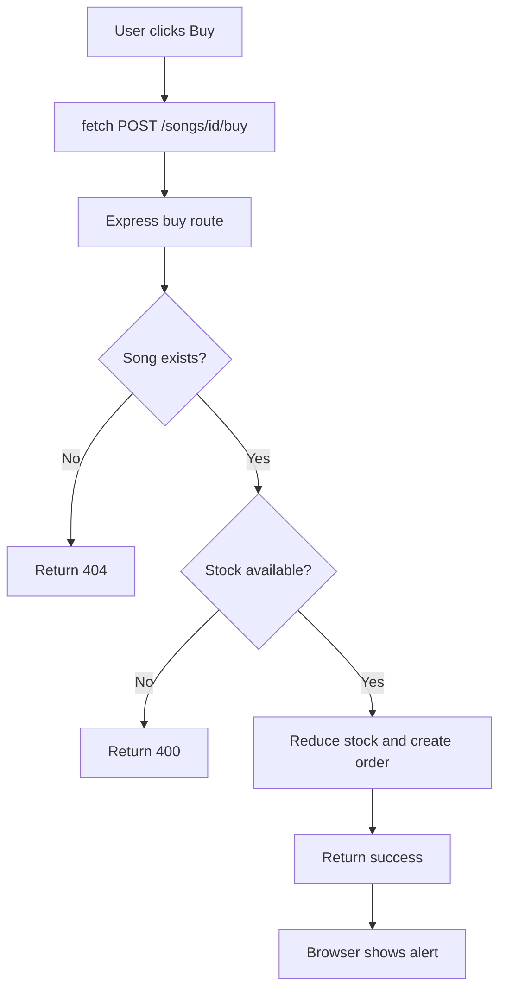
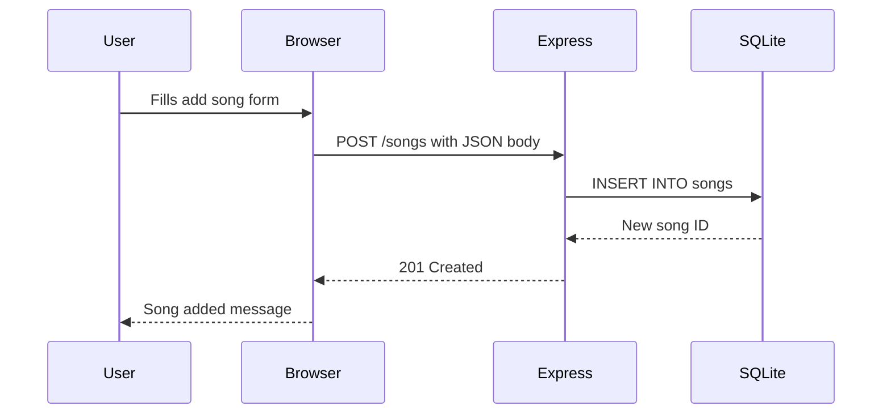
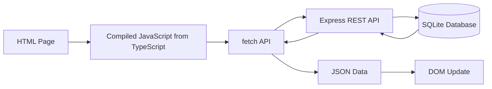

# QHO540 - Web Application Development  
# Week 3 Seminar README: Promises, AJAX, Fetch and DOM with TypeScript

## Seminar Theme

This week is about connecting the **front-end** to the **back-end API** built in Week 2.

In Week 2, we created a REST API using:

```text
Node.js + Express + SQLite + TypeScript
```

In Week 3, we will create a simple browser front-end that talks to that API using:

```text
HTML + TypeScript + AJAX/fetch + DOM
```

The main idea is simple:

```text
The page should not reload every time we need data.
Instead, JavaScript/TypeScript should fetch data in the background
and update only part of the page.
```

---

## What students should understand by the end

By the end of this seminar, students should be able to explain and build:

```text
1. What AJAX means
2. Why fetch() returns a Promise
3. How async/await makes asynchronous code easier
4. How to call a REST API from the browser
5. How to display JSON results on a webpage
6. Why TypeScript gives DOM-related errors
7. How to fix common TypeScript DOM errors
8. How to create HTML elements dynamically using the DOM
9. How to send POST requests from the browser
10. How the front-end and back-end work together
```

---

# Part 1: Quick Lecture Recap Before Coding

Start the seminar with this explanation before touching the code.

## 1.1 What did we build last week?

Last week, we built a **Music Store REST API**.

The server could respond to routes such as:

```text
GET    /songs
GET    /songs/artist/:artist
GET    /songs/:id
POST   /songs
PUT    /songs/:id
DELETE /songs/:id
POST   /songs/:id/buy
```

That server returns **JSON data**, not a full webpage.

Example:

```json
[
  {
    "id": 1,
    "title": "Wonderwall",
    "artist": "Oasis",
    "price": 0.99,
    "quantity_in_stock": 10
  }
]
```

Important recap line:

```text
Week 2 was about building the API.
Week 3 is about building the browser front-end that uses the API.
```

---

## 1.2 The full architecture



### Simple explanation

The user interacts with the webpage.

The browser runs JavaScript generated from TypeScript.

That JavaScript sends a request to the Express API.

The Express server talks to SQLite.

The server sends JSON back.

The browser updates the page using the DOM.

---

## 1.3 Website vs Web API

| Normal Website | Web API |
|---|---|
| Returns HTML | Returns JSON |
| Mainly for humans | Mainly for apps/front-ends |
| Browser displays whole page | JavaScript decides how to display data |
| Page may reload | Page can update without reload |

Simple teaching line:

```text
A website gives you a ready-made page.
An API gives you raw data.
```

---

## 1.4 What is AJAX?

AJAX means:

```text
Asynchronous JavaScript and XML
```

But today, we mostly use **JSON** instead of XML.

AJAX allows the browser to talk to the server **in the background**.

That means:

```text
The page does not need to reload.
Only part of the page changes.
```

Example:

```text
User searches for Oasis
        ↓
Browser sends request in the background
        ↓
Server sends JSON results
        ↓
Browser updates only the results area
```

---

## 1.5 AJAX flowchart



---

## 1.6 Fun tech fact

AJAX is the reason modern websites feel fast.

When you use:

```text
Google search suggestions
Instagram likes
YouTube comments
Amazon product filtering
Spotify search
University portals
```

The whole page usually does not reload. The front-end quietly talks to an API in the background.

---

# Part 2: Promises, fetch and async/await

## 2.1 Why do we need promises?

Some tasks take time.

Examples:

```text
Calling an API
Downloading data
Reading a file
Waiting for a server response
Loading an image
```

JavaScript cannot stop the whole webpage while waiting.

So it uses **asynchronous programming**.

---

## 2.2 What is a Promise?

A Promise is an object that represents a task that will finish later.

Simple explanation:

```text
A Promise is JavaScript saying:
I do not have the result yet, but I promise to give it later.
```

A promise can be:

```text
Pending   → still waiting
Resolved  → completed successfully
Rejected  → failed
```

---

## 2.3 Promise lifecycle diagram



---

## 2.4 fetch returns a Promise

When we write:

```ts
fetch('http://localhost:3000/songs')
```

The result does not come back instantly.

So `fetch()` returns a Promise.

---

## 2.5 Old style: then()

```ts
fetch('http://localhost:3000/songs')
  .then(response => response.json())
  .then(data => {
    console.log(data);
  })
  .catch(error => {
    console.log(error);
  });
```

This works, but for beginners it can feel nested.

---

## 2.6 Modern style: async/await

```ts
async function loadSongs() {
  try {
    const response = await fetch('http://localhost:3000/songs');
    const data = await response.json();
    console.log(data);
  } catch (error) {
    console.log(error);
  }
}
```

Teaching line:

```text
async/await lets us write asynchronous code in a more step-by-step way.
```

---

## 2.7 Key rule

```text
await can only be used inside an async function.
```

Example:

```ts
async function searchSongs() {
  const response = await fetch('http://localhost:3000/songs');
}
```

---

# Part 3: What are we building today?

We are building a simple front-end for the Music Store API.

The front-end will allow the user to:

```text
1. Open a webpage served by Express
2. Search songs by artist
3. Display results without reloading the page
4. Add new songs using a form
5. Use DOM methods to create result cards
6. Add a Buy button for each song
```

---

## 3.1 Project structure

By the end, the project should look like this:

```text
music-store-api/
│
├── src/
│   └── server.ts
│
├── public/
│   ├── hittastic.html
│   ├── index.ts
│   ├── index.js
│   ├── tsconfig.json
│   └── images/
│       └── hittastic.png
│
├── music.db
├── package.json
├── tsconfig.json
└── README.md
```

Important explanation:

```text
src/server.ts = backend/server code
public/hittastic.html = frontend page
public/index.ts = frontend TypeScript code
public/index.js = compiled JavaScript loaded by browser
```

---

## 3.2 Front-end and back-end diagram



---

# Part 4: Preparation Checklist

Before starting Week 3 coding, make sure Week 2 server is working.

Run the server:

```bash
npm run dev
```

Test in the browser:

```text
http://localhost:3000/songs
```

You should see JSON data.

Example:

```json
[
  {
    "id": 1,
    "title": "Wonderwall",
    "artist": "Oasis",
    "price": 0.99,
    "quantity_in_stock": 10
  }
]
```

If this does not work, fix Week 2 API first.

---

# Part 5: Serve static files with Express

## 5.1 Concept first

Currently, Express serves API routes such as:

```text
/songs
/songs/artist/Oasis
```

But now we also want Express to serve normal front-end files:

```text
HTML
CSS
Images
JavaScript
```

To do this, we use:

```ts
app.use(express.static('public'));
```

This tells Express:

```text
Any files inside the public folder can be accessed from the browser.
```

---

## 5.2 Add static file support

Open:

```text
src/server.ts
```

Find the top part:

```ts
const app = express();
const PORT = 3000;

app.use(express.json());
```

Add this line below it:

```ts
app.use(express.static('public'));
```

Now it should look like this:

```ts
const app = express();
const PORT = 3000;

app.use(express.json());
app.use(express.static('public'));
```

---

## 5.3 Teaching point

```text
express.json() lets Express read JSON from request bodies.
express.static('public') lets Express serve front-end files.
```

---

# Part 6: Create the front-end HTML page

## 6.1 Create the public folder

In the project root, create a folder:

```text
public
```

Inside `public`, create:

```text
hittastic.html
```

---

## 6.2 Add starter HTML

Paste this into:

```text
public/hittastic.html
```

```html
<!DOCTYPE html>
<html>
<head>
  <title>HitTastic Music Store</title>
  <script type="module" src="index.js"></script>
  <style>
    body {
      font-family: Arial, sans-serif;
      background-color: #c0c0ff;
      color: black;
      padding: 20px;
    }

    h1 {
      color: #202060;
    }

    #htresults {
      border: 1px solid black;
      background-color: #e0e0ff;
      width: 70%;
      min-height: 150px;
      padding: 10px;
      margin-top: 20px;
    }

    .song-card {
      background-color: white;
      border: 1px solid #999;
      padding: 10px;
      margin-bottom: 10px;
    }

    button {
      margin-left: 5px;
      cursor: pointer;
    }

    input {
      margin: 5px;
      padding: 5px;
    }
  </style>
</head>
<body>
  <h1>Welcome to HitTastic!</h1>

  <p>
    Search and shop for your favourite hits. This page connects to the Music Store REST API using AJAX.
  </p>

  <h2>Search Songs by Artist</h2>

  <div>
    Artist:
    <input id="theArtist" placeholder="Example: Oasis">
    <button id="search">Search</button>
  </div>

  <div id="htresults">
    Results will appear here.
  </div>

  <h2>Add a New Song</h2>

  <div>
    <input id="newTitle" placeholder="Song title">
    <input id="newArtist" placeholder="Artist">
    <input id="newPrice" placeholder="Price" type="number" step="0.01">
    <input id="newQuantity" placeholder="Quantity" type="number">
    <button id="addSong">Add Song</button>
  </div>

  <div id="message"></div>
</body>
</html>
```

---

## 6.3 Test the HTML page

Run your server:

```bash
npm run dev
```

Open:

```text
http://localhost:3000/hittastic.html
```

You should see the HitTastic page.

The buttons will not work yet. That is normal.

---

## 6.4 Teaching point

This line loads the compiled JavaScript file:

```html
<script type="module" src="index.js"></script>
```

Important:

```text
The browser loads JavaScript, not TypeScript.
```

So we write:

```text
index.ts
```

But the browser loads:

```text
index.js
```

---

# Part 7: Create client-side TypeScript

## 7.1 Create index.ts

Inside the `public` folder, create:

```text
index.ts
```

Add this simple test code first:

```ts
console.log('HitTastic frontend loaded');
```

---

## 7.2 Create public TypeScript config

Inside the `public` folder, create:

```text
tsconfig.json
```

Paste this:

```json
{
  "compilerOptions": {
    "strict": true,
    "target": "esnext",
    "module": "esnext",
    "noEmit": false,
    "skipLibCheck": true
  },
  "files": ["index.ts"]
}
```

---

## 7.3 Why do we need a second tsconfig?

The main project TypeScript config is for the server.

This new one is for the browser/front-end TypeScript.

```text
Server TypeScript → src/server.ts
Client TypeScript → public/index.ts
```

---

## 7.4 Compile client-side TypeScript

From the project root, run:

```bash
tsc -p public
```

This will create:

```text
public/index.js
```

Now refresh:

```text
http://localhost:3000/hittastic.html
```

Open browser DevTools:

```text
Right click → Inspect → Console
```

You should see:

```text
HitTastic frontend loaded
```

---

## 7.5 Important command explanation

```bash
tsc -p public
```

Means:

```text
Use the tsconfig.json inside the public folder.
```

---

# Part 8: First DOM interaction

## 8.1 Concept first

DOM means:

```text
Document Object Model
```

The DOM is how JavaScript/TypeScript sees the HTML page.

The browser turns HTML into a tree of objects.

Then TypeScript can:

```text
Find elements
Read input values
Change text
Change styles
Create new elements
Remove elements
Add event listeners
```

---

## 8.2 DOM tree diagram



---

## 8.3 Add click event

Replace `public/index.ts` with:

```ts
const searchButton = document.getElementById('search')!;

searchButton.addEventListener('click', () => {
  console.log('Search button clicked');
});
```

Compile:

```bash
tsc -p public
```

Refresh the browser.

Open DevTools Console.

Click Search.

Expected console output:

```text
Search button clicked
```

---

## 8.4 Teaching point

This line finds the button:

```ts
const searchButton = document.getElementById('search')!;
```

This line listens for a click:

```ts
searchButton.addEventListener('click', () => {
```

The `!` means:

```text
I know this element exists. It is not null.
```

---

# Part 9: TypeScript DOM errors explained simply

## 9.1 Error: Object is possibly null

This code may give an error:

```ts
const searchButton = document.getElementById('search');
searchButton.addEventListener('click', () => {});
```

Why?

Because TypeScript says:

```text
document.getElementById() might return an element, or it might return null.
```

Fix:

```ts
const searchButton = document.getElementById('search')!;
```

---

## 9.2 Error: Property value does not exist on HTMLElement

This code may give an error:

```ts
const artistInput = document.getElementById('theArtist')!;
console.log(artistInput.value);
```

Why?

Because `getElementById()` returns a general `HTMLElement`.

But `.value` only exists on input elements.

Fix with type casting:

```ts
const artistInput = document.getElementById('theArtist') as HTMLInputElement;
console.log(artistInput.value);
```

---

## 9.3 Simple explanation

```text
HTMLElement = any general HTML element
HTMLInputElement = specifically an input box
```

So when we want `.value`, we must tell TypeScript:

```text
This element is an input box.
```

---

# Part 10: Read the search input

Replace `public/index.ts` with:

```ts
const searchButton = document.getElementById('search')!;
const artistInput = document.getElementById('theArtist') as HTMLInputElement;

searchButton.addEventListener('click', () => {
  const artist = artistInput.value;
  console.log(`Searching for artist: ${artist}`);
});
```

Compile:

```bash
tsc -p public
```

Refresh the page.

Type:

```text
Oasis
```

Click Search.

Expected console output:

```text
Searching for artist: Oasis
```

---

# Part 11: Call the API using fetch

## 11.1 Concept first

Now we want the browser to call:

```text
GET http://localhost:3000/songs/artist/Oasis
```

This will return JSON from the server.

---

## 11.2 Create a Song interface

At the top of `public/index.ts`, add:

```ts
interface Song {
  id: number;
  title: string;
  artist: string;
  price: number;
  quantity_in_stock: number;
}
```

Teaching point:

```text
This helps TypeScript understand the JSON shape returned from the API.
```

---

## 11.3 Search using async/await

Replace `public/index.ts` with:

```ts
interface Song {
  id: number;
  title: string;
  artist: string;
  price: number;
  quantity_in_stock: number;
}

const searchButton = document.getElementById('search')!;
const artistInput = document.getElementById('theArtist') as HTMLInputElement;
const resultsDiv = document.getElementById('htresults')!;

searchButton.addEventListener('click', async () => {
  const artist = artistInput.value;

  const response = await fetch(`/songs/artist/${artist}`);
  const songs = await response.json() as Song[];

  console.log(songs);
});
```

Compile:

```bash
tsc -p public
```

Refresh the page.

Search for:

```text
Oasis
```

Open Console.

You should see an array of songs.

---

## 11.4 Teaching point

This sends the request:

```ts
const response = await fetch(`/songs/artist/${artist}`);
```

This converts the response JSON into JavaScript data:

```ts
const songs = await response.json() as Song[];
```

---

## 11.5 Request flow



---

# Part 12: Display results using innerHTML

Now we will show results on the page.

Replace only the click event code with this:

```ts
searchButton.addEventListener('click', async () => {
  const artist = artistInput.value;

  const response = await fetch(`/songs/artist/${artist}`);
  const songs = await response.json() as Song[];

  let html = '';

  songs.forEach((song: Song) => {
    html += `
      <p>
        <strong>${song.title}</strong> by ${song.artist}<br>
        Price: £${song.price}<br>
        Stock: ${song.quantity_in_stock}
      </p>
    `;
  });

  resultsDiv.innerHTML = html;
});
```

Compile:

```bash
tsc -p public
```

Refresh and search:

```text
Oasis
```

Now the results should appear inside the page.

---

## Teaching point

`innerHTML` lets us place HTML text inside an element.

```ts
resultsDiv.innerHTML = html;
```

This is quick and easy for learning.

Later, we will use proper DOM methods.

---

# Part 13: Add basic error handling

Replace the click event with this safer version:

```ts
searchButton.addEventListener('click', async () => {
  const artist = artistInput.value;

  if (artist.trim() === '') {
    alert('Please enter an artist name.');
    return;
  }

  try {
    const response = await fetch(`/songs/artist/${artist}`);

    if (!response.ok) {
      alert(`Server error: ${response.status}`);
      return;
    }

    const songs = await response.json() as Song[];

    if (songs.length === 0) {
      resultsDiv.innerHTML = '<p>No songs found.</p>';
      return;
    }

    let html = '';

    songs.forEach((song: Song) => {
      html += `
        <p>
          <strong>${song.title}</strong> by ${song.artist}<br>
          Price: £${song.price}<br>
          Stock: ${song.quantity_in_stock}
        </p>
      `;
    });

    resultsDiv.innerHTML = html;
  } catch (error) {
    alert(`There was an error: ${error}`);
  }
});
```

Compile and test:

```bash
tsc -p public
```

---

## Teaching point

```ts
try {
  // attempt API request
} catch (error) {
  // handle network/server problem
}
```

Also:

```ts
response.ok
```

checks whether the HTTP response was successful.

---

# Part 14: Display results using the DOM

## 14.1 Concept first

So far, we used:

```ts
innerHTML
```

Now we will use the DOM properly:

```text
createElement()
createTextNode()
appendChild()
addEventListener()
```

This is more controlled and closer to how UI frameworks think.

---

## 14.2 DOM creation flow



---

## 14.3 Replace innerHTML loop with DOM code

Replace the result display part with this:

```ts
resultsDiv.innerHTML = '';

songs.forEach((song: Song) => {
  const songCard = document.createElement('div');
  songCard.className = 'song-card';

  const title = document.createElement('h3');
  title.textContent = `${song.title} by ${song.artist}`;

  const price = document.createElement('p');
  price.textContent = `Price: £${song.price}`;

  const stock = document.createElement('p');
  stock.textContent = `Stock: ${song.quantity_in_stock}`;

  songCard.appendChild(title);
  songCard.appendChild(price);
  songCard.appendChild(stock);

  resultsDiv.appendChild(songCard);
});
```

---

## 14.4 Full search event using DOM

Use this complete version:

```ts
searchButton.addEventListener('click', async () => {
  const artist = artistInput.value;

  if (artist.trim() === '') {
    alert('Please enter an artist name.');
    return;
  }

  try {
    const response = await fetch(`/songs/artist/${artist}`);

    if (!response.ok) {
      alert(`Server error: ${response.status}`);
      return;
    }

    const songs = await response.json() as Song[];

    resultsDiv.innerHTML = '';

    if (songs.length === 0) {
      resultsDiv.textContent = 'No songs found.';
      return;
    }

    songs.forEach((song: Song) => {
      const songCard = document.createElement('div');
      songCard.className = 'song-card';

      const title = document.createElement('h3');
      title.textContent = `${song.title} by ${song.artist}`;

      const price = document.createElement('p');
      price.textContent = `Price: £${song.price}`;

      const stock = document.createElement('p');
      stock.textContent = `Stock: ${song.quantity_in_stock}`;

      songCard.appendChild(title);
      songCard.appendChild(price);
      songCard.appendChild(stock);

      resultsDiv.appendChild(songCard);
    });
  } catch (error) {
    alert(`There was an error: ${error}`);
  }
});
```

Compile:

```bash
tsc -p public
```

---

# Part 15: Add a Buy button using DOM

## 15.1 Concept first

For each song result, we will dynamically create a Buy button.

When clicked, it will call:

```text
POST /songs/:id/buy
```

Example:

```text
POST /songs/1/buy
```

---

## 15.2 Add button inside forEach

Inside the `songs.forEach`, after creating stock, add:

```ts
const buyButton = document.createElement('button');
buyButton.textContent = 'Buy';

buyButton.addEventListener('click', async () => {
  const response = await fetch(`/songs/${song.id}/buy`, {
    method: 'POST'
  });

  if (response.ok) {
    alert('Song purchased successfully.');
  } else {
    alert(`Could not buy song. Status: ${response.status}`);
  }
});
```

Then append it:

```ts
songCard.appendChild(buyButton);
```

---

## 15.3 Updated forEach block with Buy button

```ts
songs.forEach((song: Song) => {
  const songCard = document.createElement('div');
  songCard.className = 'song-card';

  const title = document.createElement('h3');
  title.textContent = `${song.title} by ${song.artist}`;

  const price = document.createElement('p');
  price.textContent = `Price: £${song.price}`;

  const stock = document.createElement('p');
  stock.textContent = `Stock: ${song.quantity_in_stock}`;

  const buyButton = document.createElement('button');
  buyButton.textContent = 'Buy';

  buyButton.addEventListener('click', async () => {
    const response = await fetch(`/songs/${song.id}/buy`, {
      method: 'POST'
    });

    if (response.ok) {
      alert('Song purchased successfully.');
    } else {
      alert(`Could not buy song. Status: ${response.status}`);
    }
  });

  songCard.appendChild(title);
  songCard.appendChild(price);
  songCard.appendChild(stock);
  songCard.appendChild(buyButton);

  resultsDiv.appendChild(songCard);
});
```

Compile:

```bash
tsc -p public
```

Search for an artist and click Buy.

---

## 15.4 Buy flowchart



---

# Part 16: Add a new song from the browser

## 16.1 Concept first

Now we will send POST data from the browser.

The user fills a form.

TypeScript reads the form.

Then fetch sends JSON to the server.

---

## 16.2 POST request diagram



---

## 16.3 Add DOM references

Add these below the existing DOM references:

```ts
const newTitleInput = document.getElementById('newTitle') as HTMLInputElement;
const newArtistInput = document.getElementById('newArtist') as HTMLInputElement;
const newPriceInput = document.getElementById('newPrice') as HTMLInputElement;
const newQuantityInput = document.getElementById('newQuantity') as HTMLInputElement;
const addSongButton = document.getElementById('addSong')!;
const messageDiv = document.getElementById('message')!;
```

---

## 16.4 Add POST event listener

Add this code:

```ts
addSongButton.addEventListener('click', async () => {
  const newSong = {
    title: newTitleInput.value,
    artist: newArtistInput.value,
    price: Number(newPriceInput.value),
    quantity_in_stock: Number(newQuantityInput.value)
  };

  const response = await fetch('/songs', {
    method: 'POST',
    headers: {
      'Content-Type': 'application/json'
    },
    body: JSON.stringify(newSong)
  });

  if (response.status === 201) {
    const result = await response.json();
    messageDiv.textContent = `Song added successfully with ID ${result.id}`;
  } else if (response.status === 400) {
    messageDiv.textContent = 'Please enter valid song details.';
  } else {
    messageDiv.textContent = `Server error: ${response.status}`;
  }
});
```

Compile:

```bash
tsc -p public
```

Refresh the page.

Add a new song.

Then search for that artist.

---

## 16.5 Teaching point

This part is very important:

```ts
headers: {
  'Content-Type': 'application/json'
},
body: JSON.stringify(newSong)
```

Explanation:

```text
Content-Type tells the server we are sending JSON.
JSON.stringify converts a JavaScript object into JSON text.
```

---

# Part 17: Final public/index.ts checkpoint

Use this as the final version of the Week 3 front-end TypeScript file.

```ts
interface Song {
  id: number;
  title: string;
  artist: string;
  price: number;
  quantity_in_stock: number;
}

const searchButton = document.getElementById('search')!;
const artistInput = document.getElementById('theArtist') as HTMLInputElement;
const resultsDiv = document.getElementById('htresults')!;

const newTitleInput = document.getElementById('newTitle') as HTMLInputElement;
const newArtistInput = document.getElementById('newArtist') as HTMLInputElement;
const newPriceInput = document.getElementById('newPrice') as HTMLInputElement;
const newQuantityInput = document.getElementById('newQuantity') as HTMLInputElement;
const addSongButton = document.getElementById('addSong')!;
const messageDiv = document.getElementById('message')!;

searchButton.addEventListener('click', async () => {
  const artist = artistInput.value;

  if (artist.trim() === '') {
    alert('Please enter an artist name.');
    return;
  }

  try {
    const response = await fetch(`/songs/artist/${artist}`);

    if (!response.ok) {
      alert(`Server error: ${response.status}`);
      return;
    }

    const songs = await response.json() as Song[];

    resultsDiv.innerHTML = '';

    if (songs.length === 0) {
      resultsDiv.textContent = 'No songs found.';
      return;
    }

    songs.forEach((song: Song) => {
      const songCard = document.createElement('div');
      songCard.className = 'song-card';

      const title = document.createElement('h3');
      title.textContent = `${song.title} by ${song.artist}`;

      const price = document.createElement('p');
      price.textContent = `Price: £${song.price}`;

      const stock = document.createElement('p');
      stock.textContent = `Stock: ${song.quantity_in_stock}`;

      const buyButton = document.createElement('button');
      buyButton.textContent = 'Buy';

      buyButton.addEventListener('click', async () => {
        const buyResponse = await fetch(`/songs/${song.id}/buy`, {
          method: 'POST'
        });

        if (buyResponse.ok) {
          alert('Song purchased successfully.');
        } else {
          alert(`Could not buy song. Status: ${buyResponse.status}`);
        }
      });

      songCard.appendChild(title);
      songCard.appendChild(price);
      songCard.appendChild(stock);
      songCard.appendChild(buyButton);

      resultsDiv.appendChild(songCard);
    });
  } catch (error) {
    alert(`There was an error: ${error}`);
  }
});

addSongButton.addEventListener('click', async () => {
  const newSong = {
    title: newTitleInput.value,
    artist: newArtistInput.value,
    price: Number(newPriceInput.value),
    quantity_in_stock: Number(newQuantityInput.value)
  };

  const response = await fetch('/songs', {
    method: 'POST',
    headers: {
      'Content-Type': 'application/json'
    },
    body: JSON.stringify(newSong)
  });

  if (response.status === 201) {
    const result = await response.json();
    messageDiv.textContent = `Song added successfully with ID ${result.id}`;

    newTitleInput.value = '';
    newArtistInput.value = '';
    newPriceInput.value = '';
    newQuantityInput.value = '';
  } else if (response.status === 400) {
    messageDiv.textContent = 'Please enter valid song details.';
  } else {
    messageDiv.textContent = `Server error: ${response.status}`;
  }
});
```

Compile:

```bash
tsc -p public
```

Run the server:

```bash
npm run dev
```

Open:

```text
http://localhost:3000/hittastic.html
```

---

# Part 18: Recommended seminar delivery plan

## First 15 minutes: concept recap

Cover:

```text
AJAX
Promises
fetch
async/await
DOM
frontend vs backend
```

Use the diagrams in this README.

---

## Next 45 minutes: lecturer coding walkthrough

Build with students:

```text
1. Serve static files
2. Create hittastic.html
3. Create index.ts
4. Compile TypeScript to JavaScript
5. Add click event
6. Read input
7. fetch songs by artist
8. Display with innerHTML
9. Display with DOM
```

---

## Next 35 minutes: student task time

Ask students to complete:

```text
1. Improve the results display
2. Add the Buy button
3. Add the new song form
4. Test POST request
5. Handle empty input
```

---

## Final 10 minutes: recap and demo

Ask students to explain:

```text
What does fetch do?
Why do we use await?
Why does the browser load index.js instead of index.ts?
What does getElementById return?
What is the DOM?
What does POST do?
```

---

# Part 19: Student tasks

## Task 1: Change the search result design

Update the DOM code so each song displays:

```text
Song title
Artist
Price
Stock
Buy button
```

Make each result appear as a card.

---

## Task 2: Add empty search validation

If the search box is empty, show:

```text
Please enter an artist name.
```

Do not send a fetch request.

---

## Task 3: Add a new song

Use the form to add a new song.

Test by searching for the artist after adding.

---

## Task 4: Handle no results

If no songs are found, show:

```text
No songs found.
```

---

## Task 5: Improve Buy button

After buying a song, show a message and ask the user to search again to see updated stock.

Extension:

Automatically refresh the search results after buying.

Hint:

Move the search logic into a reusable function:

```ts
async function searchSongsByArtist() {
  // search logic here
}
```

Then call it from both:

```text
Search button click
Buy button click after purchase
```

---

# Part 20: Extension challenges

## Challenge 1: Search by song title

Add another input and button to search by title.

Endpoint:

```text
GET /songs/title/:title
```

---

## Challenge 2: Display all songs when the page loads

When the page first opens, automatically call:

```text
GET /songs
```

Display all songs.

---

## Challenge 3: Add delete button

For each song, add a Delete button.

Endpoint:

```text
DELETE /songs/:id
```

---

## Challenge 4: Use querySelector

Replace some `getElementById()` calls with:

```ts
document.querySelector()
```

Example:

```ts
const resultsDiv = document.querySelector('#htresults')!;
```

---

# Part 21: Common errors and fixes

## Error 1: index.ts changes are not showing in the browser

You probably forgot to compile.

Run:

```bash
tsc -p public
```

Then refresh the page.

---

## Error 2: Browser cannot find index.js

Check that this file exists:

```text
public/index.js
```

If not, compile:

```bash
tsc -p public
```

Also check your HTML:

```html
<script type="module" src="index.js"></script>
```

---

## Error 3: Object is possibly null

Problem:

```ts
const button = document.getElementById('search');
button.addEventListener('click', () => {});
```

Fix:

```ts
const button = document.getElementById('search')!;
```

---

## Error 4: Property value does not exist on HTMLElement

Problem:

```ts
const input = document.getElementById('theArtist')!;
console.log(input.value);
```

Fix:

```ts
const input = document.getElementById('theArtist') as HTMLInputElement;
console.log(input.value);
```

---

## Error 5: fetch returns 404

Check the API endpoint.

Example:

```text
/songs/artist/Oasis
```

Make sure the Week 2 server has this route.

---

## Error 6: POST body is empty on server

Make sure the Express server has:

```ts
app.use(express.json());
```

Also make sure fetch has:

```ts
headers: {
  'Content-Type': 'application/json'
},
body: JSON.stringify(newSong)
```

---

## Error 7: Page opens but button does nothing

Open DevTools Console and check for errors.

Also make sure:

```bash
tsc -p public
```

has been run after editing `index.ts`.

---

# Part 22: Key technical facts

## Fact 1

The browser does not run TypeScript directly.

```text
index.ts → compiled by tsc → index.js → loaded by browser
```

---

## Fact 2

fetch is asynchronous.

```text
The browser does not freeze while waiting for the server.
```

---

## Fact 3

AJAX updates part of the page.

```text
No full page reload is needed.
```

---

## Fact 4

JSON is the common data format between front-end and back-end.

```text
Server sends JSON.
Browser reads JSON.
DOM displays it.
```

---

## Fact 5

DOM manipulation is the foundation behind modern UI frameworks.

React also updates the page, but it gives developers a cleaner way to manage UI changes.

---

# Part 23: Final recap

This week connects everything together.

```text
Week 2:
We built a backend REST API.

Week 3:
We built a frontend page that talks to that API using AJAX.
```

Final flow:



Students should remember:

```text
AJAX = background request without page reload
Promise = future result
async/await = cleaner way to wait for promises
fetch = browser function for HTTP requests
DOM = page structure JavaScript can change
JSON = data format between front-end and back-end
```

Final confidence message:

```text
If your page can search songs, display results, add songs and buy songs,
you have built a real full-stack interaction.
```

This is the same basic pattern used in:

```text
shopping websites
music apps
booking systems
food delivery apps
student portals
dashboard applications
```
