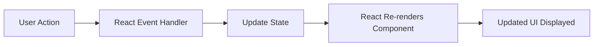

# QHO540 Web Application Development  
## Week 6 Seminar: Further React — Components, Props, State and Events

> **Student-facing seminar README**  
> This activity continues from the React introduction covered in Week 5.  
> Today we will build a small interactive React app from scratch and then complete challenges.

---

# 1. What are we learning today?

Today we are going further with React.

By the end of this seminar, you should be able to:

- create a React project using Vite
- understand JSX
- create reusable React components
- pass data into components using props
- type props using TypeScript interfaces
- use object destructuring with props
- use ternary expressions inside JSX
- use `useState()` to store changing data
- handle button clicks using `onClick`
- handle input changes using `onChange`
- create controlled inputs
- use inline styles in React
- build a small interactive student app

---

# 2. How this connects to previous weeks

```text
Week 2: Backend REST API
Week 3: AJAX + DOM frontend
Week 4: Modules, Vite and Leaflet
Week 5: Introduction to React
Week 6: Further React with components, props, state and events
```

Simple explanation:

```text
Before React, we manually updated the DOM.
With React, we describe what the UI should look like.
React updates the UI when state changes.
```

---

# 3. Today’s project idea

We will build a **Student Life React App**.

The app will include:

- a greeting component
- name and age props
- age-based messages
- voting eligibility checker
- train fare calculator
- dynamic background colours
- controlled input fields
- challenge tasks

This app is simple, but it covers the key React ideas needed for bigger applications.

---

# 4. Big picture: How React works



Explanation:

```text
The user types or clicks something.
React runs an event handler.
The event handler updates state.
React automatically refreshes the displayed component.
```

---

# 5. Quick Week 5 recap

## What is React?

React is a JavaScript user-interface library.

It helps us build complex user interfaces using small reusable pieces called **components**.

Example components:

```text
Navbar
SearchBox
SongCard
LoginForm
StudentCard
MapPanel
ProductCard
```

Teaching line:

> A React app is like Lego. Each component is one block. We combine blocks to build the full page.

---

# 6. React vs normal DOM coding

Before React, we did things like this:

```ts
document.getElementById("message")!.innerHTML = "Hello";
```

That means:

```text
Find this element manually.
Change its content manually.
```

In React, we normally do this:

```tsx
return <h1>Hello</h1>;
```

React handles the DOM update for us.

---

# 7. What is JSX?

JSX lets us write HTML-like code inside TypeScript/JavaScript.

Example:

```tsx
const message = <h1>Hello React!</h1>;
```

This looks like HTML, but it is JSX.

Important:

```text
Browsers do not directly understand JSX.
Vite converts JSX into browser-ready JavaScript.
```

---

# 8. Create a new React project from scratch

Open your terminal and run:

```bash
npm create vite@latest qho540-week6-react -- --template react-ts
```

Go into the project:

```bash
cd qho540-week6-react
```

Install dependencies:

```bash
npm install
```

Start the development server:

```bash
npm run dev
```

Open the link shown in the terminal, usually:

```text
http://localhost:5173
```

---

# 9. Clean the starter project

Open `src/App.tsx` and replace everything with:

```tsx
function App() {
  return (
    <div>
      <h1>QHO540 Week 6 React Seminar</h1>
      <p>React is working!</p>
    </div>
  );
}

export default App;
```

Now check your browser.

Expected output:

```text
QHO540 Week 6 React Seminar
React is working!
```

---

# 10. Component concept

A component is a reusable part of the UI.

Example:

```tsx
function WelcomeMessage() {
  return <h2>Welcome to React!</h2>;
}
```

Use it inside `App`:

```tsx
function WelcomeMessage() {
  return <h2>Welcome to React!</h2>;
}

function App() {
  return (
    <div>
      <h1>QHO540 Week 6 React Seminar</h1>
      <WelcomeMessage />
    </div>
  );
}

export default App;
```

Teaching point:

```text
Component names should start with a capital letter.
```

---

# 11. Create a components folder

Inside `src`, create a new folder:

```text
components
```

Now create this file:

```text
src/components/Greeting.tsx
```

Add this code:

```tsx
export default function Greeting() {
  return <h2>Hello from the Greeting component!</h2>;
}
```

Now open `src/App.tsx` and use it:

```tsx
import Greeting from './components/Greeting';

function App() {
  return (
    <div>
      <h1>QHO540 Week 6 React Seminar</h1>
      <Greeting />
    </div>
  );
}

export default App;
```

---

# 12. What are props?

Props are values passed into a component.

Simple explanation:

```text
Props customise a component.
```

Example:

```tsx
<Greeting firstname="James" lastname="Brown" />
```

Here:

```text
firstname is a prop
lastname is a prop
```

---

# 13. Props with TypeScript interface

Update `src/components/Greeting.tsx`:

```tsx
interface GreetingProps {
  firstname: string;
  lastname: string;
}

export default function Greeting(props: GreetingProps) {
  return (
    <h2>
      Hello {props.firstname} {props.lastname}!
    </h2>
  );
}
```

Update `src/App.tsx`:

```tsx
import Greeting from './components/Greeting';

function App() {
  return (
    <div>
      <h1>QHO540 Week 6 React Seminar</h1>
      <Greeting firstname="James" lastname="Brown" />
    </div>
  );
}

export default App;
```

Expected output:

```text
Hello James Brown!
```

---

# 14. Why do we need the interface?

Without a type, TypeScript may complain:

```text
props implicitly has an 'any' type
```

So we define the shape of the props:

```tsx
interface GreetingProps {
  firstname: string;
  lastname: string;
}
```

Teaching point:

> TypeScript wants to know what data the component expects.

---

# 15. Props using destructuring

Instead of writing:

```tsx
props.firstname
props.lastname
```

We can destructure props:

```tsx
interface GreetingProps {
  firstname: string;
  lastname: string;
}

export default function Greeting({ firstname, lastname }: GreetingProps) {
  return (
    <h2>
      Hello {firstname} {lastname}!
    </h2>
  );
}
```

This is cleaner.

---

# 16. Challenge 1: Add age prop

## Task

Add an `age` prop to the Greeting component.

The component should display:

```text
Hello James Brown, your age is 18!
```

## Solution

`src/components/Greeting.tsx`

```tsx
interface GreetingProps {
  firstname: string;
  lastname: string;
  age: number;
}

export default function Greeting({ firstname, lastname, age }: GreetingProps) {
  return (
    <h2>
      Hello {firstname} {lastname}, your age is {age}!
    </h2>
  );
}
```

`src/App.tsx`

```tsx
import Greeting from './components/Greeting';

function App() {
  return (
    <div>
      <h1>QHO540 Week 6 React Seminar</h1>
      <Greeting firstname="James" lastname="Brown" age={18} />
    </div>
  );
}

export default App;
```

Important:

```tsx
age={18}
```

Use curly braces for numbers.

---

# 17. Ternary operator in JSX

A ternary is a short if/else expression.

Syntax:

```tsx
condition ? valueIfTrue : valueIfFalse
```

Example:

```tsx
{age >= 18 ? 'You are an adult' : 'You are not an adult'}
```

---

# 18. Challenge 2: Adult message

## Task

Update the Greeting component to display:

```text
You are an adult
```

if age is 18 or above.

Otherwise display:

```text
You are not an adult
```

## Solution

```tsx
interface GreetingProps {
  firstname: string;
  lastname: string;
  age: number;
}

export default function Greeting({ firstname, lastname, age }: GreetingProps) {
  return (
    <div>
      <h2>
        Hello {firstname} {lastname}, your age is {age}!
      </h2>

      <p>{age >= 18 ? 'You are an adult' : 'You are not an adult'}</p>
    </div>
  );
}
```

---

# 19. Inline styles in React

In normal HTML:

```html
<p style="background-color: yellow;">Hello</p>
```

In React JSX:

```tsx
<p style={{ backgroundColor: 'yellow' }}>Hello</p>
```

Important differences:

```text
React style uses an object.
CSS property names use camelCase.
background-color becomes backgroundColor.
```

---

# 20. Challenge 3: Colour prop

## Task

Add a `colour` prop to Greeting.

Use it as the background colour of the component.

## Solution

`src/components/Greeting.tsx`

```tsx
interface GreetingProps {
  firstname: string;
  lastname: string;
  age: number;
  colour: string;
}

export default function Greeting({ firstname, lastname, age, colour }: GreetingProps) {
  return (
    <div style={{ backgroundColor: colour, padding: '15px', margin: '10px 0' }}>
      <h2>
        Hello {firstname} {lastname}, your age is {age}!
      </h2>

      <p>{age >= 18 ? 'You are an adult' : 'You are not an adult'}</p>
    </div>
  );
}
```

`src/App.tsx`

```tsx
import Greeting from './components/Greeting';

function App() {
  return (
    <div>
      <h1>QHO540 Week 6 React Seminar</h1>
      <Greeting firstname="James" lastname="Brown" age={18} colour="lightgreen" />
      <Greeting firstname="Sara" lastname="Khan" age={16} colour="lightyellow" />
    </div>
  );
}

export default App;
```

Teaching point:

```text
The same component can be reused with different data.
```

---

# 21. What is state?

State is data that can change while the app is running.

Examples:

```text
name typed by user
age typed by user
search result list
selected destination
train fare
whether a user is logged in
```

In React, when state changes, the UI updates automatically.

---

# 22. useState()

To use state, import `useState`:

```tsx
import { useState } from 'react';
```

Example:

```tsx
const [name, setName] = useState('No name');
```

This gives us two things:

```text
name = current state value
setName = function used to update name
```

Important:

```text
Never directly change the state variable.
Always use the setter function.
```

Correct:

```tsx
setName('Vishnu');
```

Wrong:

```tsx
name = 'Vishnu';
```

---

# 23. Create an interactive component

Create a new file:

```text
src/components/StudentChecker.tsx
```

Add:

```tsx
import { useState } from 'react';

export default function StudentChecker() {
  const [name, setName] = useState('No name');
  const [age, setAge] = useState(0);

  return (
    <div style={{ border: '1px solid black', padding: '15px', marginTop: '20px' }}>
      <h2>Student Checker</h2>

      <p>Your name is {name}</p>
      <p>Your age is {age}</p>
    </div>
  );
}
```

Use it in `src/App.tsx`:

```tsx
import Greeting from './components/Greeting';
import StudentChecker from './components/StudentChecker';

function App() {
  return (
    <div>
      <h1>QHO540 Week 6 React Seminar</h1>

      <Greeting firstname="James" lastname="Brown" age={18} colour="lightgreen" />
      <Greeting firstname="Sara" lastname="Khan" age={16} colour="lightyellow" />

      <StudentChecker />
    </div>
  );
}

export default App;
```

---

# 24. Add input fields and button

Update `StudentChecker.tsx`:

```tsx
import { useState } from 'react';

export default function StudentChecker() {
  const [name, setName] = useState('No name');
  const [age, setAge] = useState(0);

  function updateDetails() {
    const nameInput = document.getElementById('txtName') as HTMLInputElement;
    const ageInput = document.getElementById('txtAge') as HTMLInputElement;

    setName(nameInput.value);
    setAge(parseInt(ageInput.value));
  }

  return (
    <div style={{ border: '1px solid black', padding: '15px', marginTop: '20px' }}>
      <h2>Student Checker</h2>

      <input id="txtName" type="text" placeholder="Enter name" />
      <input id="txtAge" type="number" placeholder="Enter age" />
      <button onClick={updateDetails}>Update details</button>

      <p>Your name is {name}</p>
      <p>Your age is {age}</p>
    </div>
  );
}
```

Teaching point:

```tsx
onClick={updateDetails}
```

means:

```text
When the button is clicked, run updateDetails.
```

---

# 25. Add voting message

Update `StudentChecker.tsx`:

```tsx
import { useState } from 'react';

export default function StudentChecker() {
  const [name, setName] = useState('No name');
  const [age, setAge] = useState(0);

  function updateDetails() {
    const nameInput = document.getElementById('txtName') as HTMLInputElement;
    const ageInput = document.getElementById('txtAge') as HTMLInputElement;

    setName(nameInput.value);
    setAge(parseInt(ageInput.value));
  }

  function getVotingMessage() {
    if (age < 0) {
      return 'Invalid age';
    }

    if (age >= 18) {
      return 'You are old enough to vote';
    }

    return 'You are NOT old enough to vote';
  }

  return (
    <div style={{ border: '1px solid black', padding: '15px', marginTop: '20px' }}>
      <h2>Student Checker</h2>

      <input id="txtName" type="text" placeholder="Enter name" />
      <input id="txtAge" type="number" placeholder="Enter age" />
      <button onClick={updateDetails}>Update details</button>

      <p>Your name is {name}</p>
      <p>Your age is {age}</p>

      <p>{getVotingMessage()}</p>
    </div>
  );
}
```

---

# 26. Dynamic background colour

Now style the voting message.

```tsx
<p
  style={{
    backgroundColor: age >= 18 ? 'lightgreen' : 'lightcoral',
    padding: '10px'
  }}
>
  {getVotingMessage()}
</p>
```

Full return section:

```tsx
return (
  <div style={{ border: '1px solid black', padding: '15px', marginTop: '20px' }}>
    <h2>Student Checker</h2>

    <input id="txtName" type="text" placeholder="Enter name" />
    <input id="txtAge" type="number" placeholder="Enter age" />
    <button onClick={updateDetails}>Update details</button>

    <p>Your name is {name}</p>
    <p>Your age is {age}</p>

    <p
      style={{
        backgroundColor: age >= 18 ? 'lightgreen' : 'lightcoral',
        padding: '10px'
      }}
    >
      {getVotingMessage()}
    </p>
  </div>
);
```

---

# 27. Controlled inputs with onChange

React normally prefers controlled inputs.

A controlled input means:

```text
The input value is controlled by React state.
```

Example:

```tsx
<input value={name} onChange={(event) => setName(event.target.value)} />
```

When the user types:

```text
onChange runs
state updates
input displays latest state
```

---

# 28. Improve StudentChecker with controlled inputs

Replace `StudentChecker.tsx` with this cleaner React version:

```tsx
import { useState } from 'react';

export default function StudentChecker() {
  const [name, setName] = useState('');
  const [ageText, setAgeText] = useState('0');

  const age = parseInt(ageText);

  function getVotingMessage() {
    if (Number.isNaN(age) || age < 0) {
      return 'Invalid age';
    }

    if (age >= 18) {
      return 'You are old enough to vote';
    }

    return 'You are NOT old enough to vote';
  }

  function getMessageColour() {
    if (Number.isNaN(age) || age < 0) {
      return 'lightgray';
    }

    return age >= 18 ? 'lightgreen' : 'lightcoral';
  }

  return (
    <div style={{ border: '1px solid black', padding: '15px', marginTop: '20px' }}>
      <h2>Student Checker</h2>

      <label>Name: </label>
      <input
        type="text"
        value={name}
        onChange={(event) => setName(event.target.value)}
        placeholder="Enter name"
      />

      <br />
      <br />

      <label>Age: </label>
      <input
        type="number"
        value={ageText}
        onChange={(event) => setAgeText(event.target.value)}
        placeholder="Enter age"
      />

      <p>Your name is {name === '' ? 'No name entered' : name}</p>
      <p>Your age is {ageText}</p>

      <p
        style={{
          backgroundColor: getMessageColour(),
          padding: '10px'
        }}
      >
        {getVotingMessage()}
      </p>
    </div>
  );
}
```

Teaching point:

> In React, changing state is what changes the UI.

---

# 29. Main seminar challenge: Train Fare Calculator

Now we will build a challenge that uses:

```text
state
onChange
ternary/conditions
functions
controlled inputs
calculation
conditional messages
```

## Rules

The user selects a destination:

| Destination | Normal fare |
|---|---:|
| Winchester | £3 |
| Salisbury | £5 |
| London | £15 |

If the user is under 18, they get half fare.

If age is invalid, show:

```text
Invalid age
```

---

# 30. Create FareCalculator component

Create:

```text
src/components/FareCalculator.tsx
```

Add this starter:

```tsx
import { useState } from 'react';

export default function FareCalculator() {
  const [ageText, setAgeText] = useState('18');
  const [destination, setDestination] = useState('Winchester');

  return (
    <div style={{ border: '1px solid black', padding: '15px', marginTop: '20px' }}>
      <h2>Train Fare Calculator</h2>

      <label>Age: </label>
      <input
        type="number"
        value={ageText}
        onChange={(event) => setAgeText(event.target.value)}
      />

      <br />
      <br />

      <label>Destination: </label>
      <select value={destination} onChange={(event) => setDestination(event.target.value)}>
        <option value="Winchester">Winchester</option>
        <option value="Salisbury">Salisbury</option>
        <option value="London">London</option>
      </select>
    </div>
  );
}
```

Use it in `App.tsx`:

```tsx
import Greeting from './components/Greeting';
import StudentChecker from './components/StudentChecker';
import FareCalculator from './components/FareCalculator';

function App() {
  return (
    <div>
      <h1>QHO540 Week 6 React Seminar</h1>

      <Greeting firstname="James" lastname="Brown" age={18} colour="lightgreen" />
      <Greeting firstname="Sara" lastname="Khan" age={16} colour="lightyellow" />

      <StudentChecker />
      <FareCalculator />
    </div>
  );
}

export default App;
```

---

# 31. FareCalculator solution

Replace `FareCalculator.tsx` with:

```tsx
import { useState } from 'react';

export default function FareCalculator() {
  const [ageText, setAgeText] = useState('18');
  const [destination, setDestination] = useState('Winchester');

  const age = parseInt(ageText);

  function getBaseFare() {
    if (destination === 'Winchester') {
      return 3;
    }

    if (destination === 'Salisbury') {
      return 5;
    }

    if (destination === 'London') {
      return 15;
    }

    return 0;
  }

  function calculateFare() {
    if (Number.isNaN(age) || age < 0) {
      return 'Invalid age';
    }

    const baseFare = getBaseFare();
    const finalFare = age < 18 ? baseFare / 2 : baseFare;

    return `Your fare to ${destination} is £${finalFare.toFixed(2)}`;
  }

  return (
    <div style={{ border: '1px solid black', padding: '15px', marginTop: '20px' }}>
      <h2>Train Fare Calculator</h2>

      <label>Age: </label>
      <input
        type="number"
        value={ageText}
        onChange={(event) => setAgeText(event.target.value)}
      />

      <br />
      <br />

      <label>Destination: </label>
      <select value={destination} onChange={(event) => setDestination(event.target.value)}>
        <option value="Winchester">Winchester</option>
        <option value="Salisbury">Salisbury</option>
        <option value="London">London</option>
      </select>

      <p
        style={{
          backgroundColor: age < 18 ? 'lightyellow' : 'lightgreen',
          padding: '10px',
          fontWeight: 'bold'
        }}
      >
        {calculateFare()}
      </p>
    </div>
  );
}
```

---

# 32. Hook challenge: Fare badge

## Task

Show a badge that says:

```text
Child fare applied
```

if the user is under 18.

Otherwise show:

```text
Adult fare applied
```

## Solution

Add this inside the return:

```tsx
<p>
  {age < 18 ? 'Child fare applied' : 'Adult fare applied'}
</p>
```

Improved version:

```tsx
<p>
  {Number.isNaN(age) || age < 0
    ? 'No valid fare type'
    : age < 18
      ? 'Child fare applied'
      : 'Adult fare applied'}
</p>
```

---

# 33. Interesting challenge: Student Discount Card

## Task

Create a component called `StudentDiscountCard`.

It should accept props:

```text
studentName
course
discountPercent
isActive
```

If `isActive` is true, show:

```text
Discount active
```

If false, show:

```text
Discount inactive
```

## Solution

Create:

```text
src/components/StudentDiscountCard.tsx
```

```tsx
interface StudentDiscountCardProps {
  studentName: string;
  course: string;
  discountPercent: number;
  isActive: boolean;
}

export default function StudentDiscountCard({
  studentName,
  course,
  discountPercent,
  isActive
}: StudentDiscountCardProps) {
  return (
    <div style={{ border: '1px solid black', padding: '15px', marginTop: '20px' }}>
      <h2>Student Discount Card</h2>
      <p>Name: {studentName}</p>
      <p>Course: {course}</p>
      <p>Discount: {discountPercent}%</p>
      <p>{isActive ? 'Discount active' : 'Discount inactive'}</p>
    </div>
  );
}
```

Use it in `App.tsx`:

```tsx
import StudentDiscountCard from './components/StudentDiscountCard';

<StudentDiscountCard
  studentName="Alex"
  course="Web Application Development"
  discountPercent={20}
  isActive={true}
/>
```

---

# 34. HitTastic-style React challenge

This connects React back to the earlier music app.

## Task

Create a `SongCard` component.

It should accept:

```text
title
artist
price
quantity
```

It should display the song clearly.

If quantity is 0, show:

```text
Out of stock
```

Otherwise show:

```text
Available
```

## Solution

Create:

```text
src/components/SongCard.tsx
```

```tsx
interface SongCardProps {
  title: string;
  artist: string;
  price: number;
  quantity: number;
}

export default function SongCard({ title, artist, price, quantity }: SongCardProps) {
  return (
    <div style={{ border: '1px solid black', padding: '15px', marginTop: '20px' }}>
      <h2>{title}</h2>
      <p>Artist: {artist}</p>
      <p>Price: £{price.toFixed(2)}</p>
      <p>Stock: {quantity}</p>
      <p>{quantity > 0 ? 'Available' : 'Out of stock'}</p>
    </div>
  );
}
```

Use it:

```tsx
import SongCard from './components/SongCard';

<SongCard title="Wonderwall" artist="Oasis" price={0.99} quantity={10} />
<SongCard title="Hello" artist="Adele" price={1.09} quantity={0} />
```

---

# 35. Common errors and fixes

## Error 1: Component not showing

Check that you imported it:

```tsx
import Greeting from './components/Greeting';
```

Check that you used it:

```tsx
<Greeting firstname="James" lastname="Brown" age={18} colour="lightgreen" />
```

---

## Error 2: Component name starts lowercase

Wrong:

```tsx
function greeting() {
  return <h1>Hello</h1>;
}
```

Correct:

```tsx
function Greeting() {
  return <h1>Hello</h1>;
}
```

---

## Error 3: Props implicitly has any type

Fix by creating an interface:

```tsx
interface GreetingProps {
  firstname: string;
  lastname: string;
}
```

---

## Error 4: Number passed as string

Wrong:

```tsx
<Greeting age="18" />
```

Correct:

```tsx
<Greeting age={18} />
```

---

## Error 5: Input does not change

If using `value={name}`, you must also use `onChange`.

```tsx
<input value={name} onChange={(event) => setName(event.target.value)} />
```

---

## Error 6: State not updating

Wrong:

```tsx
name = 'John';
```

Correct:

```tsx
setName('John');
```

---

# 36. Final recap

Today we learned:

```text
React apps are made of components.
Components return JSX.
Props pass data into components.
TypeScript interfaces define prop types.
Destructuring makes props cleaner.
Ternary expressions allow conditional UI.
Inline styles use JavaScript objects.
State stores changing data.
useState returns a value and setter function.
onClick handles button clicks.
onChange handles input changes.
Controlled inputs are linked to state.
Changing state automatically updates the UI.
```

---

# 37. Final student challenge set

Try these after completing the main activities:

## Challenge A

Add a new destination to the fare calculator:

```text
Bristol = £20
```

## Challenge B

Add a message:

```text
Long distance journey
```

if the destination is London or Bristol.

## Challenge C

Create a `CourseCard` component with props:

```text
courseName
level
credits
isCore
```

Show whether the course is core or optional.

## Challenge D

Create a `Counter` component with:

```text
+ button
- button
reset button
```

Use state to update the count.

## Challenge E

Improve `SongCard` by adding a Buy button.

When clicked, reduce the quantity by 1 using state.

---

# 38. Final confidence message

If you completed this seminar, you have built the core foundation of React.

You now understand:

```text
components
props
state
events
conditional rendering
controlled inputs
```

These are the same ideas used in real React apps such as:

```text
dashboards
booking systems
shopping carts
student portals
music apps
admin panels
```
``` 

I’d teach it in this order: **Greeting props first**, then **state with StudentChecker**, then **fare calculator**, and finally let students choose between the **discount card** or **SongCard** challenge. This keeps the seminar practical and not too heavy. 信頼度: 高い
```     
