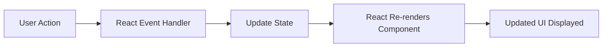

# QHO540 Web Application Development  
## Week 6 Seminar: Further React — Components, Props, State, Events and Hooks

> **Student-facing seminar README**  
> This seminar continues from the React introduction covered in Week 5.  
> Today we will build a small interactive React app from scratch and complete practical React challenges.

---

# 1. What are we learning today?

Today we are going further with React.

By the end of this seminar, you should be able to:

- create a React project using Vite
- understand JSX
- create reusable React components
- pass data into components using props
- type props using TypeScript interfaces
- use object destructuring with props
- use ternary expressions inside JSX
- use `useState()` to store changing data
- understand what hooks are
- use `useEffect()` to run code when a component loads
- handle button clicks using `onClick`
- handle input changes using `onChange`
- create controlled inputs
- use inline styles in React
- build a small interactive student app
- connect React ideas back to the previous HitTastic/API work

---

# 2. How this connects to previous weeks

```text
Week 2: Backend REST API
Week 3: AJAX + DOM frontend
Week 4: Modules, Vite and Leaflet
Week 5: Introduction to React
Week 6: Further React with components, props, state, events and hooks
```

Simple explanation:

```text
Before React, we manually updated the DOM.
With React, we describe what the UI should look like.
React updates the UI when state changes.
```

In Week 3, we wrote code like this:

```ts
document.getElementById("message")!.innerHTML = "Hello";
```

That means:

```text
Find an element manually.
Change the page manually.
```

In React, we usually avoid manually changing the DOM. Instead, we update **state**, and React updates the page for us.

---

# 3. Today’s project idea

We will build a **Student Life React App**.

The app will include:

- a greeting component
- name and age props
- age-based messages
- voting eligibility checker
- train fare calculator
- dynamic background colours
- controlled input fields
- reusable cards
- `useEffect()` backend loading challenge
- HitTastic-style song card challenge

This app is simple, but it covers the key React ideas needed for bigger applications.

---

# 4. Big picture: How React works



Explanation:

```text
The user types or clicks something.
React runs an event handler.
The event handler updates state.
React automatically refreshes the displayed component.
```

This is the core idea of React.

---

# 5. Quick Week 5 recap

## What is React?

React is a JavaScript user-interface library.

It helps us build complex user interfaces using small reusable pieces called **components**.

Example components:

```text
Navbar
SearchBox
SongCard
LoginForm
StudentCard
MapPanel
ProductCard
FareCalculator
```

Teaching line:

> A React app is like Lego. Each component is one block. We combine blocks to build the full page.

---

# 6. React vs normal DOM coding

Before React, we did things like this:

```ts
document.getElementById("message")!.innerHTML = "Hello";
```

That means:

```text
Find this element manually.
Change its content manually.
```

In React, we normally do this:

```tsx
return <h1>Hello</h1>;
```

React handles the DOM update for us.

---

# 7. What is JSX?

JSX lets us write HTML-like code inside TypeScript/JavaScript.

Example:

```tsx
const message = <h1>Hello React!</h1>;
```

This looks like HTML, but it is JSX.

Important:

```text
Browsers do not directly understand JSX.
Vite converts JSX into browser-ready JavaScript.
```

Example JSX inside a component:

```tsx
function App() {
  return (
    <div>
      <h1>Hello React</h1>
      <p>This is JSX.</p>
    </div>
  );
}
```

Important JSX rule:

```text
A component must return one parent element.
```

Correct:

```tsx
return (
  <div>
    <h1>Hello</h1>
    <p>Welcome</p>
  </div>
);
```

Wrong:

```tsx
return (
  <h1>Hello</h1>
  <p>Welcome</p>
);
```

---

# 8. Core React concepts before coding

Before we start building the app, we need to understand the main React ideas.

React is different from normal HTML, CSS and JavaScript because we do not manually update the page every time something changes.

Instead, we:

```text
break the UI into components
pass data using props
store changing data using state
update state using hooks
React re-renders the UI automatically
```

## 8.1 Components

A component is a reusable part of the user interface.

In React, components are usually written as functions.

Example:

```tsx
function WelcomeMessage() {
  return <h2>Welcome to React!</h2>;
}
```

This function returns JSX.

We can use the component like this:

```tsx
<WelcomeMessage />
```

Important rules:

```text
Component names should start with a capital letter.
A component should return JSX.
A component should usually focus on one clear job.
```

Good examples of components:

```text
Navbar
LoginForm
SearchBox
SongCard
StudentCard
FareCalculator
```

Bad idea:

```text
One huge component doing everything
```

Teaching line:

> React is not about writing one huge page. React is about building small reusable pieces and joining them together.

## 8.2 Why components are useful

Components help us:

```text
reuse code
organise the app
make the UI easier to understand
split big problems into smaller problems
work better in teams
```

Example:

Instead of writing three song cards manually, we create one `SongCard` component and reuse it.

```tsx
<SongCard title="Wonderwall" artist="Oasis" price={0.99} />
<SongCard title="Hello" artist="Adele" price={1.09} />
<SongCard title="Perfect" artist="Ed Sheeran" price={1.29} />
```

Same component, different data.

## 8.3 Props

Props are data passed into a component.

Simple explanation:

```text
Props customise a component.
```

Example:

```tsx
<Greeting firstname="James" lastname="Brown" age={18} />
```

Here:

```text
firstname, lastname and age are props.
```

The `Greeting` component receives these values and displays them.

```tsx
interface GreetingProps {
  firstname: string;
  lastname: string;
  age: number;
}

function Greeting({ firstname, lastname, age }: GreetingProps) {
  return (
    <h2>
      Hello {firstname} {lastname}, your age is {age}
    </h2>
  );
}
```

Teaching line:

> Props are like arguments passed into a function. They allow one component to behave differently depending on the data given to it.

## 8.4 Props are read-only

A component should not directly change its props.

Props are passed from parent to child.

```text
Parent component gives props
Child component receives props
Child component displays props
```

Example:

```tsx
<Greeting firstname="James" lastname="Brown" age={18} />
```

The parent component gives the values.

The `Greeting` component uses the values.

Teaching line:

> Props are for receiving data. State is for changing data.

## 8.5 State

State is data that can change while the app is running.

Examples of state:

```text
name typed by a user
age typed by a user
selected destination
train fare
search results
number of items in basket
login status
dark mode on/off
```

In normal JavaScript, if a variable changes, the page does not automatically update.

In React, when state changes, the component re-renders automatically.

```text
State changes
↓
React re-renders component
↓
UI updates
```

Teaching line:

> State is React’s memory for values that can change.

## 8.6 Hooks

React hooks are special functions that let components use React features.

Examples:

```text
useState   → lets a component remember changing data
useEffect  → lets a component run code after rendering
```

A hook usually starts with the word `use`.

```tsx
useState()
useEffect()
```

Teaching line:

> Hooks allow function components to have extra React powers.

## 8.7 useState hook

To create state, we use the `useState` hook.

First import it:

```tsx
import { useState } from 'react';
```

Example:

```tsx
const [name, setName] = useState('No name');
```

This creates two things:

```text
name    → current state value
setName → function used to update the state
```

Example:

```tsx
setName('Vishnu');
```

When `setName()` runs:

```text
state changes
component re-renders
new name appears on screen
```

Important:

Do not update state directly.

Wrong:

```tsx
name = 'John';
```

Correct:

```tsx
setName('John');
```

Teaching line:

> In React, never directly change the state variable. Always use the setter function.

## 8.8 Rendering and re-rendering

Rendering means showing the UI on the screen.

Re-rendering means React shows the UI again after something changes.

Example:

```tsx
const [count, setCount] = useState(0);
```

If the user clicks a button:

```tsx
setCount(count + 1);
```

React automatically re-renders the component and displays the new count.

Flow:

```text
User clicks button
↓
onClick runs
↓
setCount updates state
↓
React re-renders
↓
new count appears
```

This is why React is called reactive.

## 8.9 Event handling in React

In normal JavaScript, we used:

```ts
button.addEventListener('click', doSomething);
```

In React, we usually write the event directly in JSX:

```tsx
<button onClick={doSomething}>Click me</button>
```

Important:

```text
HTML uses onclick
React uses onClick
```

React event names use camelCase.

Examples:

```tsx
onClick
onChange
onSubmit
onMouseOver
```

Teaching line:

> In React, user actions are handled through event props like `onClick` and `onChange`.

## 8.10 Controlled inputs

A controlled input is an input field controlled by React state.

Example:

```tsx
const [name, setName] = useState('');

<input
  value={name}
  onChange={(event) => setName(event.target.value)}
/>
```

Here:

```text
value={name} connects the input to state
onChange updates the state when the user types
```

Flow:

```text
User types
↓
onChange runs
↓
setName updates state
↓
React re-renders
↓
input shows latest value
```

Teaching line:

> In controlled inputs, React is in charge of the input value.

This is better than repeatedly using:

```tsx
document.getElementById()
```

In React, we should try to avoid manually reading the DOM unless needed.

## 8.11 Conditional rendering

Conditional rendering means showing different UI depending on data.

Example:

```tsx
{age >= 18 ? 'You are an adult' : 'You are not an adult'}
```

This uses a ternary expression.

Simple meaning:

```text
if age is 18 or more
show adult message
otherwise
show not adult message
```

Example in JSX:

```tsx
<p>
  {age >= 18 ? 'You are old enough to vote' : 'You are NOT old enough to vote'}
</p>
```

Teaching line:

> React can show different content depending on state or props.

## 8.12 Inline styles in React

In normal HTML:

```html
<p style="background-color: yellow;">Hello</p>
```

In React:

```tsx
<p style={{ backgroundColor: 'yellow' }}>Hello</p>
```

Why double curly braces?

```text
Outer braces = JavaScript inside JSX
Inner braces = JavaScript object
```

Important:

```text
background-color becomes backgroundColor
font-size becomes fontSize
```

Example:

```tsx
<p
  style={{
    backgroundColor: age >= 18 ? 'lightgreen' : 'lightcoral',
    padding: '10px'
  }}
>
  Voting message here
</p>
```

## 8.13 useEffect

`useEffect` is another important React hook.

It is used when we want to run code after the component renders.

Common uses:

```text
fetch data from an API
load data when the page opens
update the document title
run code when a state value changes
set up timers
```

Example:

```tsx
import { useEffect, useState } from 'react';

function App() {
  const [message, setMessage] = useState('Loading...');

  useEffect(() => {
    setMessage('Component loaded!');
  }, []);

  return <h1>{message}</h1>;
}
```

The empty array:

```tsx
[]
```

means:

```text
Run this effect once when the component first loads.
```

Teaching line:

> useState stores changing data. useEffect runs side-effect code after rendering.

## 8.14 useEffect with fetch

Later, when React connects to a backend API, `useEffect` is commonly used with `fetch`.

Example:

```tsx
import { useEffect, useState } from 'react';

interface Song {
  id: number;
  title: string;
  artist: string;
  price: number;
  quantity_in_stock: number;
}

function SongList() {
  const [songs, setSongs] = useState<Song[]>([]);

  useEffect(() => {
    async function loadSongs() {
      const response = await fetch('http://localhost:3000/songs');
      const data = await response.json() as Song[];
      setSongs(data);
    }

    loadSongs();
  }, []);

  return (
    <div>
      <h2>Song List</h2>

      {songs.map((song) => (
        <p key={song.id}>
          {song.title} by {song.artist}
        </p>
      ))}
    </div>
  );
}
```

Simple flow:

```text
Component loads
↓
useEffect runs
↓
fetch gets songs from backend
↓
setSongs stores songs in state
↓
React re-renders
↓
songs appear on screen
```

Important:

```text
useEffect is useful when something should happen automatically when the component loads.
```

## 8.15 Props vs state

| Concept | Meaning | Can it change inside component? | Example |
|---|---|---|---|
| Props | Data passed into component | No, read-only | `firstname`, `price`, `title` |
| State | Data stored inside component | Yes, using setter | `name`, `age`, `count`, `songs` |

Simple explanation:

```text
Props come from outside.
State lives inside.
Props customise a component.
State makes a component interactive.
```

Example:

```tsx
<SongCard title="Wonderwall" artist="Oasis" />
```

Here, `title` and `artist` are props.

But if the SongCard has a Buy button and stock reduces, the stock count may be state.

## 8.16 React thinking pattern

When building React apps, think like this:

```text
1. What components do I need?
2. What props does each component need?
3. What data can change?
4. That changing data should become state.
5. What user actions happen?
6. Those actions need event handlers.
7. What should update automatically when state changes?
```

For today’s app:

```text
Greeting component
Props: firstname, lastname, age, colour

StudentChecker component
State: name, age
Events: onChange

FareCalculator component
State: age, destination
Events: onChange
Output: fare message
```

## 8.17 Mini recap before coding

Before we code, remember:

```text
Component = reusable UI block
Props = data passed into component
State = data that changes
useState = creates state
useEffect = runs code after render
onClick = handles button clicks
onChange = handles input changes
Controlled input = input linked to state
Conditional rendering = show different UI based on data
```

---

# 9. Create a new React project from scratch

Open your terminal and run:

```bash
npm create vite@latest qho540-week6-react -- --template react-ts
```

Go into the project:

```bash
cd qho540-week6-react
```

Install dependencies:

```bash
npm install
```

Start the development server:

```bash
npm run dev
```

Open the link shown in the terminal, usually:

```text
http://localhost:5173
```

---

# 10. Clean the starter project

Open `src/App.tsx` and replace everything with:

```tsx
function App() {
  return (
    <div>
      <h1>QHO540 Week 6 React Seminar</h1>
      <p>React is working!</p>
    </div>
  );
}

export default App;
```

Now check your browser.

Expected output:

```text
QHO540 Week 6 React Seminar
React is working!
```

---

# 11. Component concept

A component is a reusable part of the UI.

Example:

```tsx
function WelcomeMessage() {
  return <h2>Welcome to React!</h2>;
}
```

Use it inside `App`:

```tsx
function WelcomeMessage() {
  return <h2>Welcome to React!</h2>;
}

function App() {
  return (
    <div>
      <h1>QHO540 Week 6 React Seminar</h1>
      <WelcomeMessage />
    </div>
  );
}

export default App;
```

Teaching point:

```text
Component names should start with a capital letter.
```

---

# 12. Create a components folder

Inside `src`, create a new folder:

```text
components
```

Now create this file:

```text
src/components/Greeting.tsx
```

Add this code:

```tsx
export default function Greeting() {
  return <h2>Hello from the Greeting component!</h2>;
}
```

Now open `src/App.tsx` and use it:

```tsx
import Greeting from './components/Greeting';

function App() {
  return (
    <div>
      <h1>QHO540 Week 6 React Seminar</h1>
      <Greeting />
    </div>
  );
}

export default App;
```

---

# 13. What are props?

Props are values passed into a component.

Simple explanation:

```text
Props customise a component.
```

Example:

```tsx
<Greeting firstname="James" lastname="Brown" />
```

Here:

```text
firstname is a prop
lastname is a prop
```

---

# 14. Props with TypeScript interface

Update `src/components/Greeting.tsx`:

```tsx
interface GreetingProps {
  firstname: string;
  lastname: string;
}

export default function Greeting(props: GreetingProps) {
  return (
    <h2>
      Hello {props.firstname} {props.lastname}!
    </h2>
  );
}
```

Update `src/App.tsx`:

```tsx
import Greeting from './components/Greeting';

function App() {
  return (
    <div>
      <h1>QHO540 Week 6 React Seminar</h1>
      <Greeting firstname="James" lastname="Brown" />
    </div>
  );
}

export default App;
```

Expected output:

```text
Hello James Brown!
```

---

# 15. Why do we need the interface?

Without a type, TypeScript may complain:

```text
props implicitly has an 'any' type
```

So we define the shape of the props:

```tsx
interface GreetingProps {
  firstname: string;
  lastname: string;
}
```

Teaching point:

> TypeScript wants to know what data the component expects.

---

# 16. Props using destructuring

Instead of writing:

```tsx
props.firstname
props.lastname
```

We can destructure props:

```tsx
interface GreetingProps {
  firstname: string;
  lastname: string;
}

export default function Greeting({ firstname, lastname }: GreetingProps) {
  return (
    <h2>
      Hello {firstname} {lastname}!
    </h2>
  );
}
```

This is cleaner.

---

# 17. Challenge 1: Add age prop

## Task

Add an `age` prop to the Greeting component.

The component should display:

```text
Hello James Brown, your age is 18!
```

## Solution

`src/components/Greeting.tsx`

```tsx
interface GreetingProps {
  firstname: string;
  lastname: string;
  age: number;
}

export default function Greeting({ firstname, lastname, age }: GreetingProps) {
  return (
    <h2>
      Hello {firstname} {lastname}, your age is {age}!
    </h2>
  );
}
```

`src/App.tsx`

```tsx
import Greeting from './components/Greeting';

function App() {
  return (
    <div>
      <h1>QHO540 Week 6 React Seminar</h1>
      <Greeting firstname="James" lastname="Brown" age={18} />
    </div>
  );
}

export default App;
```

Important:

```tsx
age={18}
```

Use curly braces for numbers.

---

# 18. Ternary operator in JSX

A ternary is a short if/else expression.

Syntax:

```tsx
condition ? valueIfTrue : valueIfFalse
```

Example:

```tsx
{age >= 18 ? 'You are an adult' : 'You are not an adult'}
```

---

# 19. Challenge 2: Adult message

## Task

Update the Greeting component to display:

```text
You are an adult
```

if age is 18 or above.

Otherwise display:

```text
You are not an adult
```

## Solution

```tsx
interface GreetingProps {
  firstname: string;
  lastname: string;
  age: number;
}

export default function Greeting({ firstname, lastname, age }: GreetingProps) {
  return (
    <div>
      <h2>
        Hello {firstname} {lastname}, your age is {age}!
      </h2>

      <p>{age >= 18 ? 'You are an adult' : 'You are not an adult'}</p>
    </div>
  );
}
```

---

# 20. Inline styles in React

In normal HTML:

```html
<p style="background-color: yellow;">Hello</p>
```

In React JSX:

```tsx
<p style={{ backgroundColor: 'yellow' }}>Hello</p>
```

Important differences:

```text
React style uses an object.
CSS property names use camelCase.
background-color becomes backgroundColor.
```

---

# 21. Challenge 3: Colour prop

## Task

Add a `colour` prop to Greeting.

Use it as the background colour of the component.

## Solution

`src/components/Greeting.tsx`

```tsx
interface GreetingProps {
  firstname: string;
  lastname: string;
  age: number;
  colour: string;
}

export default function Greeting({ firstname, lastname, age, colour }: GreetingProps) {
  return (
    <div style={{ backgroundColor: colour, padding: '15px', margin: '10px 0' }}>
      <h2>
        Hello {firstname} {lastname}, your age is {age}!
      </h2>

      <p>{age >= 18 ? 'You are an adult' : 'You are not an adult'}</p>
    </div>
  );
}
```

`src/App.tsx`

```tsx
import Greeting from './components/Greeting';

function App() {
  return (
    <div>
      <h1>QHO540 Week 6 React Seminar</h1>
      <Greeting firstname="James" lastname="Brown" age={18} colour="lightgreen" />
      <Greeting firstname="Sara" lastname="Khan" age={16} colour="lightyellow" />
    </div>
  );
}

export default App;
```

Teaching point:

```text
The same component can be reused with different data.
```

---

# 22. What is state?

State is data that can change while the app is running.

Examples:

```text
name typed by user
age typed by user
search result list
selected destination
train fare
whether a user is logged in
```

In React, when state changes, the UI updates automatically.

---

# 23. useState()

To use state, import `useState`:

```tsx
import { useState } from 'react';
```

Example:

```tsx
const [name, setName] = useState('No name');
```

This gives us two things:

```text
name = current state value
setName = function used to update name
```

Important:

```text
Never directly change the state variable.
Always use the setter function.
```

Correct:

```tsx
setName('Vishnu');
```

Wrong:

```tsx
name = 'Vishnu';
```

---

# 24. Create an interactive component

Create a new file:

```text
src/components/StudentChecker.tsx
```

Add:

```tsx
import { useState } from 'react';

export default function StudentChecker() {
  const [name, setName] = useState('No name');
  const [age, setAge] = useState(0);

  return (
    <div style={{ border: '1px solid black', padding: '15px', marginTop: '20px' }}>
      <h2>Student Checker</h2>

      <p>Your name is {name}</p>
      <p>Your age is {age}</p>
    </div>
  );
}
```

Use it in `src/App.tsx`:

```tsx
import Greeting from './components/Greeting';
import StudentChecker from './components/StudentChecker';

function App() {
  return (
    <div>
      <h1>QHO540 Week 6 React Seminar</h1>

      <Greeting firstname="James" lastname="Brown" age={18} colour="lightgreen" />
      <Greeting firstname="Sara" lastname="Khan" age={16} colour="lightyellow" />

      <StudentChecker />
    </div>
  );
}

export default App;
```

---

# 25. Add input fields and button

Update `StudentChecker.tsx`:

```tsx
import { useState } from 'react';

export default function StudentChecker() {
  const [name, setName] = useState('No name');
  const [age, setAge] = useState(0);

  function updateDetails() {
    const nameInput = document.getElementById('txtName') as HTMLInputElement;
    const ageInput = document.getElementById('txtAge') as HTMLInputElement;

    setName(nameInput.value);
    setAge(parseInt(ageInput.value));
  }

  return (
    <div style={{ border: '1px solid black', padding: '15px', marginTop: '20px' }}>
      <h2>Student Checker</h2>

      <input id="txtName" type="text" placeholder="Enter name" />
      <input id="txtAge" type="number" placeholder="Enter age" />
      <button onClick={updateDetails}>Update details</button>

      <p>Your name is {name}</p>
      <p>Your age is {age}</p>
    </div>
  );
}
```

Teaching point:

```tsx
onClick={updateDetails}
```

means:

```text
When the button is clicked, run updateDetails.
```

---

# 26. Add voting message

Update `StudentChecker.tsx`:

```tsx
import { useState } from 'react';

export default function StudentChecker() {
  const [name, setName] = useState('No name');
  const [age, setAge] = useState(0);

  function updateDetails() {
    const nameInput = document.getElementById('txtName') as HTMLInputElement;
    const ageInput = document.getElementById('txtAge') as HTMLInputElement;

    setName(nameInput.value);
    setAge(parseInt(ageInput.value));
  }

  function getVotingMessage() {
    if (age < 0) {
      return 'Invalid age';
    }

    if (age >= 18) {
      return 'You are old enough to vote';
    }

    return 'You are NOT old enough to vote';
  }

  return (
    <div style={{ border: '1px solid black', padding: '15px', marginTop: '20px' }}>
      <h2>Student Checker</h2>

      <input id="txtName" type="text" placeholder="Enter name" />
      <input id="txtAge" type="number" placeholder="Enter age" />
      <button onClick={updateDetails}>Update details</button>

      <p>Your name is {name}</p>
      <p>Your age is {age}</p>

      <p>{getVotingMessage()}</p>
    </div>
  );
}
```

---

# 27. Dynamic background colour

Now style the voting message.

```tsx
<p
  style={{
    backgroundColor: age >= 18 ? 'lightgreen' : 'lightcoral',
    padding: '10px'
  }}
>
  {getVotingMessage()}
</p>
```

Full return section:

```tsx
return (
  <div style={{ border: '1px solid black', padding: '15px', marginTop: '20px' }}>
    <h2>Student Checker</h2>

    <input id="txtName" type="text" placeholder="Enter name" />
    <input id="txtAge" type="number" placeholder="Enter age" />
    <button onClick={updateDetails}>Update details</button>

    <p>Your name is {name}</p>
    <p>Your age is {age}</p>

    <p
      style={{
        backgroundColor: age >= 18 ? 'lightgreen' : 'lightcoral',
        padding: '10px'
      }}
    >
      {getVotingMessage()}
    </p>
  </div>
);
```

---

# 28. Controlled inputs with onChange

React normally prefers controlled inputs.

A controlled input means:

```text
The input value is controlled by React state.
```

Example:

```tsx
<input value={name} onChange={(event) => setName(event.target.value)} />
```

When the user types:

```text
onChange runs
state updates
input displays latest state
```

---

# 29. Improve StudentChecker with controlled inputs

Replace `StudentChecker.tsx` with this cleaner React version:

```tsx
import { useState } from 'react';

export default function StudentChecker() {
  const [name, setName] = useState('');
  const [ageText, setAgeText] = useState('0');

  const age = parseInt(ageText);

  function getVotingMessage() {
    if (Number.isNaN(age) || age < 0) {
      return 'Invalid age';
    }

    if (age >= 18) {
      return 'You are old enough to vote';
    }

    return 'You are NOT old enough to vote';
  }

  function getMessageColour() {
    if (Number.isNaN(age) || age < 0) {
      return 'lightgray';
    }

    return age >= 18 ? 'lightgreen' : 'lightcoral';
  }

  return (
    <div style={{ border: '1px solid black', padding: '15px', marginTop: '20px' }}>
      <h2>Student Checker</h2>

      <label>Name: </label>
      <input
        type="text"
        value={name}
        onChange={(event) => setName(event.target.value)}
        placeholder="Enter name"
      />

      <br />
      <br />

      <label>Age: </label>
      <input
        type="number"
        value={ageText}
        onChange={(event) => setAgeText(event.target.value)}
        placeholder="Enter age"
      />

      <p>Your name is {name === '' ? 'No name entered' : name}</p>
      <p>Your age is {ageText}</p>

      <p
        style={{
          backgroundColor: getMessageColour(),
          padding: '10px'
        }}
      >
        {getVotingMessage()}
      </p>
    </div>
  );
}
```

Teaching point:

> In React, changing state is what changes the UI.

---

# 30. Main seminar challenge: Train Fare Calculator

Now we will build a challenge that uses:

```text
state
onChange
ternary/conditions
functions
controlled inputs
calculation
conditional messages
```

## Rules

The user selects a destination:

| Destination | Normal fare |
|---|---:|
| Winchester | £3 |
| Salisbury | £5 |
| London | £15 |

If the user is under 18, they get half fare.

If age is invalid, show:

```text
Invalid age
```

---

# 31. Create FareCalculator component

Create:

```text
src/components/FareCalculator.tsx
```

Add this starter:

```tsx
import { useState } from 'react';

export default function FareCalculator() {
  const [ageText, setAgeText] = useState('18');
  const [destination, setDestination] = useState('Winchester');

  return (
    <div style={{ border: '1px solid black', padding: '15px', marginTop: '20px' }}>
      <h2>Train Fare Calculator</h2>

      <label>Age: </label>
      <input
        type="number"
        value={ageText}
        onChange={(event) => setAgeText(event.target.value)}
      />

      <br />
      <br />

      <label>Destination: </label>
      <select value={destination} onChange={(event) => setDestination(event.target.value)}>
        <option value="Winchester">Winchester</option>
        <option value="Salisbury">Salisbury</option>
        <option value="London">London</option>
      </select>
    </div>
  );
}
```

Use it in `App.tsx`:

```tsx
import Greeting from './components/Greeting';
import StudentChecker from './components/StudentChecker';
import FareCalculator from './components/FareCalculator';

function App() {
  return (
    <div>
      <h1>QHO540 Week 6 React Seminar</h1>

      <Greeting firstname="James" lastname="Brown" age={18} colour="lightgreen" />
      <Greeting firstname="Sara" lastname="Khan" age={16} colour="lightyellow" />

      <StudentChecker />
      <FareCalculator />
    </div>
  );
}

export default App;
```

---

# 32. FareCalculator solution

Replace `FareCalculator.tsx` with:

```tsx
import { useState } from 'react';

export default function FareCalculator() {
  const [ageText, setAgeText] = useState('18');
  const [destination, setDestination] = useState('Winchester');

  const age = parseInt(ageText);

  function getBaseFare() {
    if (destination === 'Winchester') {
      return 3;
    }

    if (destination === 'Salisbury') {
      return 5;
    }

    if (destination === 'London') {
      return 15;
    }

    return 0;
  }

  function calculateFare() {
    if (Number.isNaN(age) || age < 0) {
      return 'Invalid age';
    }

    const baseFare = getBaseFare();
    const finalFare = age < 18 ? baseFare / 2 : baseFare;

    return `Your fare to ${destination} is £${finalFare.toFixed(2)}`;
  }

  function getFareType() {
    if (Number.isNaN(age) || age < 0) {
      return 'No valid fare type';
    }

    return age < 18 ? 'Child fare applied' : 'Adult fare applied';
  }

  return (
    <div style={{ border: '1px solid black', padding: '15px', marginTop: '20px' }}>
      <h2>Train Fare Calculator</h2>

      <label>Age: </label>
      <input
        type="number"
        value={ageText}
        onChange={(event) => setAgeText(event.target.value)}
      />

      <br />
      <br />

      <label>Destination: </label>
      <select value={destination} onChange={(event) => setDestination(event.target.value)}>
        <option value="Winchester">Winchester</option>
        <option value="Salisbury">Salisbury</option>
        <option value="London">London</option>
      </select>

      <p
        style={{
          backgroundColor: age < 18 ? 'lightyellow' : 'lightgreen',
          padding: '10px',
          fontWeight: 'bold'
        }}
      >
        {calculateFare()}
      </p>

      <p>{getFareType()}</p>
    </div>
  );
}
```

---

# 33. Interesting challenge: Student Discount Card

## Task

Create a component called `StudentDiscountCard`.

It should accept props:

```text
studentName
course
discountPercent
isActive
```

If `isActive` is true, show:

```text
Discount active
```

If false, show:

```text
Discount inactive
```

## Solution

Create:

```text
src/components/StudentDiscountCard.tsx
```

```tsx
interface StudentDiscountCardProps {
  studentName: string;
  course: string;
  discountPercent: number;
  isActive: boolean;
}

export default function StudentDiscountCard({
  studentName,
  course,
  discountPercent,
  isActive
}: StudentDiscountCardProps) {
  return (
    <div style={{ border: '1px solid black', padding: '15px', marginTop: '20px' }}>
      <h2>Student Discount Card</h2>
      <p>Name: {studentName}</p>
      <p>Course: {course}</p>
      <p>Discount: {discountPercent}%</p>
      <p>{isActive ? 'Discount active' : 'Discount inactive'}</p>
    </div>
  );
}
```

Use it in `App.tsx`:

```tsx
import StudentDiscountCard from './components/StudentDiscountCard';

<StudentDiscountCard
  studentName="Alex"
  course="Web Application Development"
  discountPercent={20}
  isActive={true}
/>
```

---

# 34. HitTastic-style React challenge

This connects React back to the earlier music app.

## Task

Create a `SongCard` component.

It should accept:

```text
title
artist
price
quantity
```

It should display the song clearly.

If quantity is 0, show:

```text
Out of stock
```

Otherwise show:

```text
Available
```

## Solution

Create:

```text
src/components/SongCard.tsx
```

```tsx
interface SongCardProps {
  title: string;
  artist: string;
  price: number;
  quantity: number;
}

export default function SongCard({ title, artist, price, quantity }: SongCardProps) {
  return (
    <div style={{ border: '1px solid black', padding: '15px', marginTop: '20px' }}>
      <h2>{title}</h2>
      <p>Artist: {artist}</p>
      <p>Price: £{price.toFixed(2)}</p>
      <p>Stock: {quantity}</p>
      <p>{quantity > 0 ? 'Available' : 'Out of stock'}</p>
    </div>
  );
}
```

Use it:

```tsx
import SongCard from './components/SongCard';

<SongCard title="Wonderwall" artist="Oasis" price={0.99} quantity={10} />
<SongCard title="Hello" artist="Adele" price={1.09} quantity={0} />
```

---

# 35. Extra challenge: SongCard with Buy button and state

## Task

Improve `SongCard` by adding a Buy button.

When clicked, reduce the quantity by 1 using state.

If quantity becomes 0, show `Out of stock` and disable the button.

## Solution

Replace `SongCard.tsx` with:

```tsx
import { useState } from 'react';

interface SongCardProps {
  title: string;
  artist: string;
  price: number;
  quantity: number;
}

export default function SongCard({ title, artist, price, quantity }: SongCardProps) {
  const [stock, setStock] = useState(quantity);

  function buySong() {
    if (stock > 0) {
      setStock(stock - 1);
    }
  }

  return (
    <div style={{ border: '1px solid black', padding: '15px', marginTop: '20px' }}>
      <h2>{title}</h2>
      <p>Artist: {artist}</p>
      <p>Price: £{price.toFixed(2)}</p>
      <p>Stock: {stock}</p>
      <p>{stock > 0 ? 'Available' : 'Out of stock'}</p>

      <button onClick={buySong} disabled={stock === 0}>
        Buy
      </button>
    </div>
  );
}
```

Teaching point:

```text
The original quantity comes from props.
The changing stock is stored in state.
```

---

# 36. Extra challenge: Load songs automatically with useEffect

This challenge connects React back to the HitTastic backend.

## Task

Create a component called `SongList`.

When the component loads, it should automatically fetch songs from the backend.

Endpoint:

```text
http://localhost:3000/songs
```

The songs should be displayed on the page.

## Solution

Create:

```text
src/components/SongList.tsx
```

```tsx
import { useEffect, useState } from 'react';

interface Song {
  id: number;
  title: string;
  artist: string;
  price: number;
  quantity_in_stock: number;
}

export default function SongList() {
  const [songs, setSongs] = useState<Song[]>([]);
  const [message, setMessage] = useState('Loading songs...');

  useEffect(() => {
    async function loadSongs() {
      try {
        const response = await fetch('http://localhost:3000/songs');

        if (!response.ok) {
          setMessage('Could not load songs');
          return;
        }

        const data = await response.json() as Song[];
        setSongs(data);
        setMessage('');
      } catch {
        setMessage('Backend is not running');
      }
    }

    loadSongs();
  }, []);

  return (
    <div style={{ border: '1px solid black', padding: '15px', marginTop: '20px' }}>
      <h2>Song List from Backend</h2>

      {message !== '' && <p>{message}</p>}

      {songs.map((song) => (
        <div key={song.id} style={{ border: '1px solid gray', padding: '10px', marginTop: '10px' }}>
          <h3>{song.title}</h3>
          <p>Artist: {song.artist}</p>
          <p>Price: £{song.price.toFixed(2)}</p>
          <p>Stock: {song.quantity_in_stock}</p>
        </div>
      ))}
    </div>
  );
}
```

Use it in `App.tsx`:

```tsx
import SongList from './components/SongList';

<SongList />
```

## What this teaches

```text
useEffect runs when the component loads.
fetch gets data from the backend.
setSongs stores the data in state.
React re-renders and displays the songs.
```

Important:

If your React app runs on port `5173` and backend runs on port `3000`, the backend must allow CORS.

---

# 37. Final App.tsx example

Your `App.tsx` can look like this:

```tsx
import Greeting from './components/Greeting';
import StudentChecker from './components/StudentChecker';
import FareCalculator from './components/FareCalculator';
import StudentDiscountCard from './components/StudentDiscountCard';
import SongCard from './components/SongCard';
import SongList from './components/SongList';

function App() {
  return (
    <div style={{ padding: '20px', fontFamily: 'Arial' }}>
      <h1>QHO540 Week 6 React Seminar</h1>
      <p>Further React: components, props, state, events and hooks.</p>

      <Greeting firstname="James" lastname="Brown" age={18} colour="lightgreen" />
      <Greeting firstname="Sara" lastname="Khan" age={16} colour="lightyellow" />

      <StudentChecker />
      <FareCalculator />

      <StudentDiscountCard
        studentName="Alex"
        course="Web Application Development"
        discountPercent={20}
        isActive={true}
      />

      <SongCard title="Wonderwall" artist="Oasis" price={0.99} quantity={10} />
      <SongCard title="Hello" artist="Adele" price={1.09} quantity={0} />

      <SongList />
    </div>
  );
}

export default App;
```

If you do not have the backend running, you can temporarily remove:

```tsx
<SongList />
```

---

# 38. Common errors and fixes

## Error 1: Component not showing

Check that you imported it:

```tsx
import Greeting from './components/Greeting';
```

Check that you used it:

```tsx
<Greeting firstname="James" lastname="Brown" age={18} colour="lightgreen" />
```

## Error 2: Component name starts lowercase

Wrong:

```tsx
function greeting() {
  return <h1>Hello</h1>;
}
```

Correct:

```tsx
function Greeting() {
  return <h1>Hello</h1>;
}
```

## Error 3: Props implicitly has any type

Fix by creating an interface:

```tsx
interface GreetingProps {
  firstname: string;
  lastname: string;
}
```

## Error 4: Number passed as string

Wrong:

```tsx
<Greeting age="18" />
```

Correct:

```tsx
<Greeting age={18} />
```

## Error 5: Input does not change

If using `value={name}`, you must also use `onChange`.

```tsx
<input value={name} onChange={(event) => setName(event.target.value)} />
```

## Error 6: State not updating

Wrong:

```tsx
name = 'John';
```

Correct:

```tsx
setName('John');
```

## Error 7: useEffect keeps running again and again

Make sure you added the dependency array:

```tsx
useEffect(() => {
  // code here
}, []);
```

The empty array means:

```text
Run once when the component loads.
```

## Error 8: Backend fetch not working

Check:

```text
Is backend running on http://localhost:3000?
Is the endpoint /songs working?
Does the backend allow CORS from http://localhost:5173?
```

---

# 39. Final recap

Today we learned:

```text
React apps are made of components.
Components return JSX.
Props pass data into components.
TypeScript interfaces define prop types.
Destructuring makes props cleaner.
Ternary expressions allow conditional UI.
Inline styles use JavaScript objects.
State stores changing data.
useState returns a value and setter function.
Hooks give function components React features.
useEffect runs code after rendering.
onClick handles button clicks.
onChange handles input changes.
Controlled inputs are linked to state.
Changing state automatically updates the UI.
```

---

# 40. Final student challenge set

Try these after completing the main activities.

## Challenge A

Add a new destination to the fare calculator:

```text
Bristol = £20
```

## Challenge B

Add a message:

```text
Long distance journey
```

if the destination is London or Bristol.

## Challenge C

Create a `CourseCard` component with props:

```text
courseName
level
credits
isCore
```

Show whether the course is core or optional.

## Challenge D

Create a `Counter` component with:

```text
+ button
- button
reset button
```

Use state to update the count.

## Challenge E

Improve `SongList` so each song has a Buy button.

When clicked:

```text
send POST request to /songs/:id/buy
reload the songs after successful purchase
show an error if backend is not running
```

---

# 41. Final confidence message

If you completed this seminar, you have built the core foundation of React.

You now understand:

```text
components
props
state
hooks
useState
useEffect
events
conditional rendering
controlled inputs
```

These are the same ideas used in real React apps such as:

```text
dashboards
booking systems
shopping carts
student portals
music apps
admin panels
```
